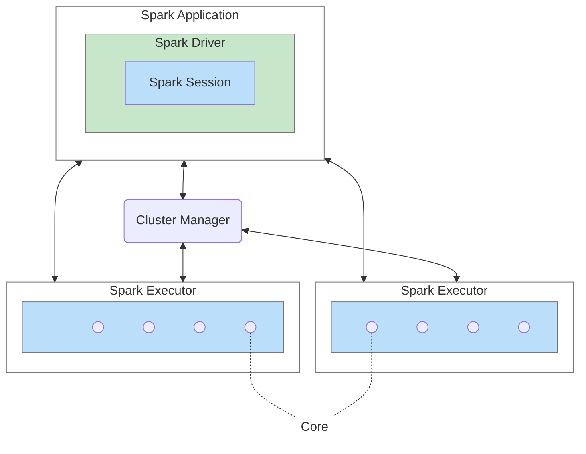

# Apache Spark

## Trước khi bắt đầu

Khi bắt đầu viết những dòng ghi chú này, tớ đã làm việc với Spark khoảng hai năm - “làm việc” chứ không hẳn là hai năm kinh nghiệm. Tớ từng đọc sơ qua kiến trúc Spark, từng viết Spark Application để xử lý các tác vụ cơ bản, và cũng từng tự xây dựng một framework cho Data Engineer định nghĩa logic của luồng stateless streaming từ Kafka sang TiDB/HDFS bằng DSL, kèm theo automation deploy & monitoring những pipelines này.

Tớ cũng đã vận hành Spark Standalone trên bare-metal, triển khai Spark trên K8S master, và cả chạy Spark bằng Spark Operator (thậm chí tớ còn viết Airflow plugin để đóng gói logic tạo Custom Resources qua UI, dynamic configure environment với PyPi/Maven/Packaged Env/Jars,... ). Ngoài ra, việc đóng gói virtual environment, dependencies gửi kèm vào Spark jobs, chỉ định Python cũng không còn xa lạ với tớ.

Nhưng dù đã chạm vào khá nhiều thứ, tớ vẫn thấy “**mình chưa thực sự hiểu Spark**”. Những buổi phỏng vấn hỏi kiểu “Lazy Evaluation là gì?” hay “Shuffle hoạt động như thế nào?” khiến tớ nhận ra mình thiếu những mảnh ghép quan trọng. Khi gặp sự cố do job tối ưu chưa tốt, tớ biết rằng cần đọc Spark UI và Execution Plan để phân tích vấn đề, nhưng lại không thật sự hiểu phải đọc _như thế nào_.

Sau nhiều lần nhờ AI lập roadmap, thử đi thử lại hàng chục lần rồi lại bỏ giữa chừng, tớ quyết định quay lại học từ đầu với cái notes này. Tớ coi đây như một cách để buộc bản thân kiên trì hơn với hành trình dài hơi này. Nhưng mới đọc vài phần thôi là tớ đã thấy “ngợp” - và cũng nhờ vậy mà nhận ra nền tảng của mình chưa đủ vững. Tớ chưa nắm chắc các khái niệm về distributed processing và distributed systems. Thế nên, trước khi đi xa hơn với Spark, tớ muốn quay lại củng cố nền tảng trước đã - xây cho chắc cái móng rồi mới dựng được phần còn lại.


[distributed-system-fundamental](../distributed-system-fundamental/)


## What is Apache Spark?

Apache Spark là unified computing engine và tập hợp các thư viện cho việc parallel data processing (xử lý dữ liệu song song) trên một machine clusters (VMs).

* **Unified**: Spark hỗ trợ nhiều loại tasks khác nhau, từ Data Analytics, Data Loading và SQL Queries đến Machine Learning và Stream Processing.
* **Computing Engine:** Spark chỉ hỗ trợ loading data và xử lý data chứ không hỗ trợ data storage, nhưng Spark có thể thao tác với nhiều loại storage khác nhau, như HDFS, Cloud Storage (Amazon S3, Azure Storage, Google Cloud Storage), Apache Cassandra, etc.
* **Libraries:** Spark hỗ trợ thư viện cho nhiều loại ngôn ngữ như SQL, Java, Scala, Python, etc; cho những mục đích như Machine Learning, Stream Processing, etc.

## Overview Architecture

Spark là một framework điều phối hoạt động của một nhóm machines (quản lý và điều phối quá trình thực thi các tasks trong toàn bộ cluster). Lưu lý rằng Spark chỉ quản lý task trên cluster, không quản lý cluster, nhiệm vụ này được tổ chức bởi Cluster Manager.

### **Spark Application**

Code của người dùng sử dụng Spark API (Python, Java, Scala, hoặc Spark SQL) được đóng gói thành Spark Application. Chúng ta submit application này tới Cluster Manager thông qua câu lệnh `spark-submit`. Spark Application bao gồm một Spark Driver chịu trách nhiệm điều phối các hoạt động song song trên Spark cluster. Driver này truy cập các thành phần phân tán (Spark Executor và Cluster Manager) thông qua SparkSession.

### **Cluster Manager**

Cluster Manager hay Spark Master chịu trách nhiệm phân phối tài nguyên để thực thi các Spark Application. Master có thể là built-in standalone cluster manager, Hadoop YARN, Apache Mesos hoặc Kubernetes.

### **Spark Driver**

Spark Driver chịu trách nhiệm khởi tạo SparkSession; giao tiếp với Cluster Manager để yêu cầu tài nguyên (CPU, memory) cho Spark Executor ; chuyển đổi các Spark operations thành DAG computations, lập lịch và phân phối thành các tasks cho các Spark Executors.

### **Spark Session**

Spark Session là entry point cho các Spark Application kể từ Spark 2.0. Nó gần như là bản nâng cấp của Spark Context, bằng việc kết hợp Spark Context, SQL Context, Hive Context, và Streamin gContext, trong khi với Spark 1.x, ta phải tạo từng Context một.

### **Spark Executor**

Spark Executor là JVMs process chạy trên các Worker Node (đối với Spark in K8S thì executor chạy trong các Pod), chịu trách nhiệm thực thi các tasks. Trong hầu hết deployments modes, thì chỉ có 1 executor trên 1 node.

### Deployment Mode

| Mode           | Spark Driver                                     | Spark Executor                                          | Cluster Manager                                                                                                      |
| -------------- | ------------------------------------------------ | ------------------------------------------------------- | -------------------------------------------------------------------------------------------------------------------- |
| Local          | Chạy trên một JVM                                | Chạy trên cùng JVM với driver                           | Chạy trên cùng host                                                                                                  |
| Standard Alone | Có thể chạy trên bất cứ node nào của cụm         | Mỗi node đều chạy 1 JVM và launch executor của chính nó | Một host sẽ chịu trách nhiệm làm master → subm                                                                       |
| YARN (client)  | Chạy trên Client (không phải thành phần của cụm) | YARN’s NodeManager’s container                          | YARN’s Resource Manager kết hợp với YARN’s Application Master để chỉ định containers trên NodeManagers cho executors |
| YARN (cluster) | Chạy cùng với YARN Applcation Master             | YARN’s NodeManager’s container                          | YARN’s Resource Manager kết hợp với YARN’s Application Master để chỉ định containers trên NodeManagers cho executors |
| Kubernetes     | Chạy trên một K8S Pod                            | Mỗi workers chạy trong 1 K8S Pod                        | Kubernetes Master                                                                                                    |

### **Distributed Data and Partitions**

Trong thực tế, physical data được lưu trữ và phân bố thành nhiều partition trên HDFS hoặc các Cloud Storage. Tuy nhiên, khi xử lý, Spark không làm việc trực tiếp với các partition vật lý này. Thay vào đó, Spark trừu tượng hoá mỗi partition thành một đơn vị logic trong bộ nhớ - tức một DataFrame.

Khi lập lịch thực thi, Spark **ưu tiên** giao nhiệm vụ cho executor đọc những partition “gần” nó nhất trong topology mạng (data locality). Điều này giúp giảm chi phí truyền dữ liệu qua mạng, dù không phải lúc nào Spark cũng đảm bảo được sự gần nhất này.
