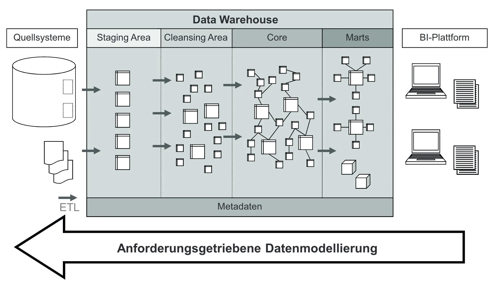
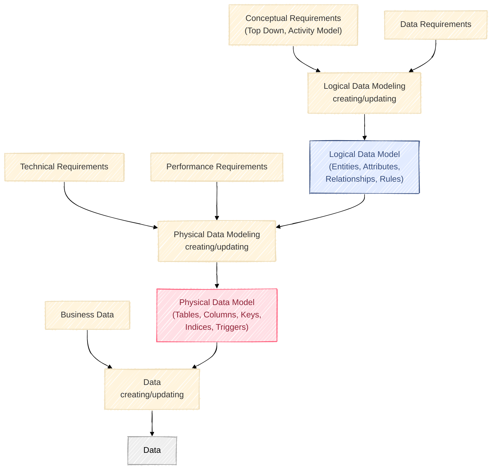

---
layout:
  width: wide
  title:
    visible: true
  description:
    visible: true
  tableOfContents:
    visible: true
  outline:
    visible: true
  pagination:
    visible: true
  metadata:
    visible: true
---

# Data Modeling

## Mục tiêu của Data Warehousing & Business Intelligence (DW/BI)

### Mục tiêu tổng thể

Hệ thống DW/BI được xây dựng để giải quyết các vấn đề và nhu cầu của người dùng doanh nghiệp, chứ không phải chỉ để sử dụng công nghệ.

Các pain-point phổ biến từ phía business users:

> “Chúng tôi **có nhiều dữ liệu nhưng không truy cập được**.”
>
> “Chúng tôi cần **phân tích dữ liệu theo nhiều chiều khác nhau**.”
>
> “Người làm kinh doanh **cần tiếp cận dữ liệu dễ dàng**.”
>
> “**Chỉ cho tôi thấy điều gì quan trọng.**”
>
> “Chúng tôi mất thời gian để tranh cãi **ai có số liệu đúng**.”
>
> “Chúng tôi muốn **ra quyết định dựa trên dữ liệu, không cảm tính.**”

### Các mục tiêu hệ thống DW/BI cần đạt

#### 1. Dễ truy cập (Accessible)

* Thông tin phải dễ tiếp cận cho tất cả người dùng doanh nghiệp.
* Không cần kỹ năng kỹ thuật cao.

#### Phân tích đa chiều (Slice & Dice)

* Cho phép phân tích dữ liệu theo nhiều chiều: theo thời gian, sản phẩm, khu vực, v.v.
* Hỗ trợ drill-down và pivot.

#### Thân thiện với người dùng (Usable)

* Giao diện đơn giản, dễ hiểu.
* Người không biết SQL vẫn dùng được.

#### Chỉ ra điều quan trọng (Highlight Insights)

* Tập trung vào điều thực sự quan trọng trong dữ liệu.
* Giảm “noise”, tăng “signal”.

#### Là  Single Version of the Truth

* Đảm bảo mọi người nhìn cùng một số liệu.
* Giảm tranh cãi nội bộ về độ chính xác.

#### Hỗ trợ quyết định dựa trên bằng chứng (Data-Driven Decisions)

* Giúp ra quyết định nhanh và đúng dựa trên dữ liệu thực tế.
* Là mục tiêu tối thượng của BI.

<i class="fa-note">:note:</i> <strong>Không bắt đầu từ công nghệ.</strong>

Bắt đầu từ business requirements → xác định metrics/process → thiết kế data model → xây dựng ETL/data platform → cung cấp insight.

### Data Warehouse Architecture

<figure><figcaption></figcaption></figure>

#### **1. Staging Area**

Dữ liệu từ nhiều nguồn đầu tiên sẽ được load vào Staging Area.

* Trong layer này, dữ liệu được lưu trữ như khi được load vào, cấu trúc các bảng y hệt interface của sources.
* Không có relationship giữa các bảng.
* Mỗi bảng chỉ lưu dữ liệu của lần nhận mới nhất, và sẽ được xoá trước khi tải batch tiếp theo.


Bạn có thể hình dung nó giống khu nhận hàng ở siêu thị: nhà cung cấp (source systems) giao hàng (data) vào đây tạm thời trước khi được đưa vào bên trong kho để xử lý.


#### **2. Cleansing Area**

Trước khi dữ liệu được đưa vào Core, nó sẽ được làm sạch tại lớp Cleansing.

* Bao gồm việc lọc bỏ dữ liệu sai, sửa lỗi, hoặc bổ sung các giá trị mặc định.
* Dữ liệu từ nhiều nguồn khác nhau sẽ được chuyển đổi và chuẩn hoá về một dạng thống nhất.
* Giống như Staging, lớp này chỉ giữ batch dữ liệu mới nhất.


Có thể hình dung nơi này giống khu sơ chế hàng hóa trong siêu thị, nơi sản phẩm được kiểm tra chất lượng và gắn nhãn trước khi đưa ra trưng bày.


#### **3. Core**

Core là nơi dữ liệu từ các nguồn khác nhau được hợp nhất sau khi đi qua Staging và Cleansing, và được lưu trữ dài hạn — thường là nhiều năm.

* Nhiệm vụ chính của Core là tích hợp dữ liệu từ nhiều nguồn và tổ chức theo từng chủ đề (subject area), thay vì chia theo nơi xuất phát.
* Đây là nguồn dữ liệu chính cho các Data Mart.
* Người dùng không nên truy cập trực tiếp vào Core, hạn chế tối đa.

#### **4. Data Marts**

Data Mart là nơi chứa các tập dữ liệu được trích từ Core, tối ưu cho nhu cầu truy vấn của người dùng.

* Mỗi Data Mart phục vụ một nhóm người dùng hoặc ứng dụng cụ thể.
* Giúp đơn giản hóa truy vấn và tăng khả năng sử dụng hệ thống.


Có thể xem chúng như các quầy hàng chuyên biệt trong siêu thị, mỗi quầy bày bán một danh mục mặt hàng phù hợp cho từng nhu cầu.


#### **5. Metadata**

Metadata là nền tảng của toàn bộ hệ thống DWH và cực kỳ quan trọng cho việc vận hành trơn tru.

* **Business metadata:** mô tả các thuộc tính, drill paths, aggregation rules, … phục vụ cho front-end applications.
* **Technical metadata:** định nghĩa cấu trúc dữ liệu, quy tắc mapping, tham số ETL.
* **Operational metadata:** gồm log tables, error messages, ETL process logs, và các thông tin vận hành khác — nói cách khác là “hạ tầng” hỗ trợ cho DWH hoạt động.

## Data Modeling là gì?

Data Modeling là quá trình biểu diễn trực quan về dữ liệu của hệ thống/tổ chức, bao gồm cấu trúc, quan hệ và ràng buộc của dữ liệu. Data Model thường được biểu diễn bởi một entity-relationship diagram (ERD). Biểu đồ này giúp chúng ta hiểu thêm về mối quan hệ, constraints và patterns của dữ liệu, đồng thời nó được cung cấp như một bản thiết kế giúp gaining business value trong việc thiết kế data systems, ví dụ warehouses, lakes, hoặc bất cứ giải pháp phân tích nào.

Đơn giản hơn, data modeling là cách chúng ta thiết kế flow of data sao cho dữ liệu được lưu trữ, cung cấp hiệu quả và theo cách có cấu trúc, với chất lượng dữ liệu tốt và càng ít dư thừa càng tốt.

### Data Modeling Multi-dimensional

#### Các cấp độ của Modeling

Data modeling có thể được áp dụng ở nhiều cấp độ khác nhau và không chỉ đơn thuần là việc vẽ mô hình. Bên cạnh mô hình conceptual, logical và physical, bạn còn có thể mô hình hóa:

* Cơ sở dữ liệu OLTP (source),
* Data warehouse,
* Công cụ BI,
* Và cả các feature phục vụ Machine Learning.

Mỗi lớp trong Data Engineering Lifecycle đều có thể được mô hình hóa. Ví dụ:

1. Generation hoặc source database:  Mô hình hoá các entities trong application database (source database), thông thường sẽ được normalize dưới dạng 3NF.
2. Data integration và ETL processes: Xác định source-to-target mappings, transformations và cleansing rules để gom và hợp nhất data từ nhiều nguồn tới một data warehouse hoặc storage tập trung. Yêu cầu trong giai đoạn này là đảm bảo tính toàn vẹn và nhất quán của dữ liệu.
3. Data warehouse (Analytical level):  Modeling ra các mô hình denormalized hoặc multi-dimensional như star schema hoặc snowflake, giúp truy vấn và tổng hợp dữ liệu hiệu quả hơn.
4. Data lake: Modeling để tạo ra cấu trúc thống nhất, chiến lược catalog và quản lý metadata, nhằm cải thiện khả năng tìm kiếm dữ liệu, quản trị, và khả năng truy cập — đặc biệt khi dữ liệu đa dạng hoặc không cấu trúc.
5. BI tools và reporting (Presentation level): Thiết kế cấu trúc dữ liệu, các phép tổng hợp, và phép tính dùng trong báo cáo / dashboard. Việc xây presentation layer có thể bao gồm tạo semantic layer như data cubes, giúp người dùng business truy cập dữ liệu dễ hơn mà không cần hiểu cấu trúc gốc.
6. Machine learning và AI: Thực hiện feature engineering, normalization, encoding… để dữ liệu phù hợp với các thuật toán và công cụ ML.

Với các cấp độ khác nhau như vậy, điều quan trọng là mô hình hóa yêu cầu nghiệp vụ từ đầu đến cuối.

Đôi khi logic nghiệp vụ còn được mô tả trong Business Rules, nơi chứa các công thức và quy trình vận hành.\
Việc tích hợp business logic vào data modeling giúp tổ chức đảm bảo kiến trúc dữ liệu luôn gắn với mục tiêu hoạt động và hỗ trợ ra quyết định hiệu quả.

#### Các loại Data Model

Khi thiết kế dữ liệu, ta thường phân chia thành ba loại mô hình:

<strong>Conceptual Data Model</strong>

Cung cấp một bức tranh tổng thể về hệ thống: bao gồm cái gì, được tổ chức như thế nào, những business rules nào có liên quan. Conceptual models thường được tạo ra như là một phần thu thập các yêu cầu ban đầu của dự án. Chúng bao gồm các đối tượng, đặc trưng và ràng buộc của chúng, mối quan hệ và yêu cầu về bảo mật cũng như toàn vẹn dữ liệu.

* **Key Features của Conceptual Data Models**
  * **High-Level Overview**: Là bức tranh tổng thể, tập trung vào tại sao dữ liệu quan trọng và liên quan tới nhau như thế nào.
  * **Business-Oriented:** Chỉ tập trung vào các đối tượng mà bussiness muốn giữ lại thông tin và mối quan hệ giữa chúng. Đồng thời đảm bảo data model tuân thủ yêu cầu và quy tắc của business.
* **Các bước khởi tạo Conceptual Data Model**
  * **Xác định Entities**
  * **Định nghĩa Relationships**
  * **Validate với Stakeholders**

<strong>Logical Data Model</strong>

Logical Model mô tả dữ liệu **chi tiết hơn** so với conceptual, bao gồm các thuộc tính, kiểu dữ liệu logic, quan hệ giữa các bảng, khóa chính – khóa ngoại, và các quy tắc dữ liệu. Nó vẫn chưa phụ thuộc vào một hệ quản trị cơ sở dữ liệu cụ thể.\
Logical Model đảm bảo rằng thiết kế dữ liệu **chính xác, nhất quán**, và phản ánh đúng logic nghiệp vụ trước khi đi vào triển khai vật lý.

* **Key Features của Logical Data Models**
  * **More Detailed Structure:** Mô tả attributes, primary keys (PK), foreign keys (FK), unique constraints, cardinality,… Và vẫn không gắn với một loại database cụ thể (Snowflake, PostgreSQL, BigQuery…).
  * **Normalization & Business Logic:** Định rõ mức độ chuẩn hóa dữ liệu (3NF, 2NF, hoặc denormalized). Đồng thời áp dụng các business logic quan trọng như: dùng business key hay surrogate key, chiến lược lưu lịch sử (SCD Type 1, Type 2), cách quản lý quan hệ giữa các entity.
  * **Consistency Across Sources:** Đây là nơi tích hợp các quy tắc dữ liệu từ nhiều nguồn khác nhau thành một mô hình thống nhất.
* **Các bước khởi tạo Logical Data Model**
  * **Xác định Attributes:** Thêm các cột cụ thể cho từng entity: ID, name, status, timestamps,…
  * **Định nghĩa Keys & Constraints:** Quyết định PK, FK, uniqueness, cardinality.
  * **Chọn Chiến lược Normalization / Denormalization:** Chọn cách tách bảng hoặc gộp bảng tuỳ mục đích phân tích hay lưu trữ.
  * **Xác định Rules xử lý Lịch sử Dữ liệu:** Chọn SCD Type 1, Type 2, hoặc snapshot.
  * **Validate với Business & Data Team:** Đảm bảo mô hình hợp lý, đúng nghiệp vụ, sẵn sàng chuyển sang Physical.

<strong>Physical Data Model</strong>

Physical Model mô tả cách dữ liệu được lưu trữ, triển khai và tối ưu trong một hệ quản trị cơ sở dữ liệu cụ thể. Nó bao gồm tên bảng thật, kiểu dữ liệu chính xác của cột, index, partition, clustering, file format, storage engine,…\
Physical Model phụ thuộc hoàn toàn vào DBMS (PostgreSQL, Snowflake, BigQuery, DuckDB, Oracle, MySQL,…).

* **Key Features của Physical Data Models**
  * **Database-Specific Implementation:** Kiểu dữ liệu cụ thể (`VARCHAR`, `INT`, `TIMESTAMP`, `DECIMAL`…), cú pháp và giới hạn phụ thuộc DBMS.
  * **Performance Optimization:** Index, partition, clustering, distribution keys, sort keys,… & quyết định mức độ denormalization để tối ưu phân tích.
  * **Storage & Infrastructure Details:** Chọn file format (Parquet, ORC…), compression, tablespace,… & áp dụng security: masking, encryption, access control.
  * **Ready for Deployment:** Đây là blueprint để DBA hoặc data engineer triển khai bảng thật trong hệ thống.
* **Các bước khởi tạo Physical Data Model**
  * **Mapping Logical → Physical:** Từ attributes logic, chuyển thành kiểu dữ liệu thật và tên cột/bảng thật.
  * **Tối ưu hóa theo Database:** Chọn index, partitioning, clustering,… dựa trên workload truy vấn.
  * **Định nghĩa Security & Governance:** Masking, ACL, row-level security, column-level security,…
  * **Triển khai (Create Tables):** Viết DDL chính xác cho từng object tables, views, sequences, indexes, materialized views, ...
  * **Kiểm thử & Validate với DBA / Analytics / Platform Team:** Đảm bảo mô hình hoạt động tốt trên hệ thống thực tế.

#### **Quy trình Conceptual → Logical → Physical**



**Bắt đầu với Conceptual Model**

* Xác định các thực thể quan trọng trong doanh nghiệp.
* Mô hình hóa bằng ERD ở mức khái quát, dễ hiểu.



**Chuyển sang Logical Model**

* Thêm chi tiết kỹ thuật nhưng chưa ràng buộc bởi một database cụ thể.
* Quyết định cách chuẩn hoá, kiểu khóa, chiến lược lưu lịch sử,…



**Cuối cùng Physical Model**

* Triển khai mô hình vào hệ quản trị dữ liệu thực tế.
* Tối ưu theo cú pháp và đặc tính của từng database.



### Key Concepts trong Data Modeling

#### **Metrics/KPI**

**Metrics**: Là các phép đo được tính từ dữ liệu (ví dụ: số đơn hàng, tổng doanh thu, số user active), dùng để theo dõi hoạt động và phân tích.

**KPI**: Là _metrics quan trọng nhất_, gắn trực tiếp với mục tiêu kinh doanh (ví dụ: MRR, MAU, churn rate), có target và là thứ các đội business cần theo dõi hàng ngày/tháng.

#### **Normalization - Normalized vs Denormalized**

Normalization là một khái niệm cơ bản trong relational data modeling nhằm mục tiêu tối thiếu hoá sự dư thừa dữ liệu và đảm bảo tính nhất quán của dữ liệu.

Trong hệ thống OLTP, dữ liệu thường được normalized một cách tối đa dưới các dạng chuẩn hoá (1NF, 2NF, 3NF, BCNF).

<i class="fa-lightbulb">:lightbulb:</i> <strong>1NF:</strong> Mỗi cột trong bảng chỉ chứa một giá trị duy nhất và một data type.

Ở ví dụ dưới đây, cột `Phone` có nhận nhiều hơn một giá trị.&#x20;

| ID | Name  | Phone            |
| -- | ----- | ---------------- |
| 1  | John  | 123-456, 789-012 |
| 2  | Alice | 345-678          |

Để giải quyết vấn đề này, dạng 1NF nhân bản bản ghi đó với nhiều giá trị `Phone` khác nhau.

| ID | Name  | Phone   |
| -- | ----- | ------- |
| 1  | John  | 123-456 |
| 1  | John  | 789-012 |
| 2  | Alice | 345-678 |

1NF là ràng buộc về cách lưu trữ.

<i class="fa-lightbulb">:lightbulb:</i> <strong>2NF:</strong> Mọi cột phải phụ thuộc <em>toàn phần</em> vào khóa chính, chứ không phải một phần của khóa chính. 

Điều kiện để đạt 2NF:

1. Bảng đã ở 1NF.
2. Mọi cột phải phụ thuộc _toàn phần_ vào khóa chính, chứ không phải một phần của khóa chính.&#x20;

Ở ví dụ dưới đây, bảng mô tả một tiết học được tổ chức, có khoá chính là `(RoomID, TeacherID)` , tuy nhiên `TeacherName` chỉ phụ thuộc vào `TeacherID` mà không phụ thuộc vào `RoomID` .&#x20;

| RoomID | TeacherID | TeacherName | NumOfAttendedStudent |
| ------ | --------- | ----------- | -------------------- |
| 1      | 1         | John Doe    | 10                   |
| 1      | 2         | Marry       | 5                    |
| 2      | 1         | John Doe    | 15                   |

Hơn nữa, dữ liệu ở dạng 1NF sẽ bị dư thừa đồng thời khi cần thay đổi giá trị này, ta cần thay đổi nhiều record hơn trong database (`John Doe` bị duplicate và phải thay đổi 2 bản ghi nếu mình muốn đổi `TeacherName` của `TeacherID=1` ).&#x20;

Giải quyết cho vấn đề này, dạng 2NF chia nhỏ bảng thành nhiều bảng khác nhau, các cột trong mỗi bảng sẽ phụ thuộc hoàn toàn vào khoá chính.

| RoomID | TeacherID | NumOfAttendedStudent |
| ------ | --------- | -------------------- |
| 1      | 1         | 10                   |
| 1      | 2         | 5                    |
| 2      | 1         | 15                   |

| TeacherID | TeacherName |
| --------- | ----------- |
| 1         | John Doe    |
| 2         | Marry       |
| 1         | John Doe    |

2NF là ràng buộc về cấu trúc.

<i class="fa-lightbulb">:lightbulb:</i> <strong>3NF: Mọi cột chỉ được phụ thuộc </strong><em><strong>trực tiếp</strong></em><strong> vào khóa chính</strong>, không phụ thuộc thông qua một cột khác.

2NF không hề cấm một cột phụ thuộc vào cột khác (miễn nếu cột được/bị phụ thuộc là một phần của khoá chính thì cột phụ thuộc phải phụ thuộc vào toàn bộ khoá chính) và 3NF sinh ra để làm điều này.&#x20;

Điều kiện để đạt 3NF:

1. Bảng đã ở 2NF.
2. Mọi cột chỉ được phụ thuộc _trực tiếp_ vào khóa chính, không phụ thuộc thông qua một cột khác.

Ví dụ dưới đây, bảng đã đạt 2NF vì mọi cột đều phụ thuộc trực tiếp vào `CustomerID` nhưng cột `City` , `ZipCode`  phụ thuộc vào `CustomerID`  thông qua `CityID`.

| CustomerID | CustomerName | CityID | ZipCode | City     |
| ---------- | ------------ | ------ | ------- | -------- |
| 1          | Alice        | 1001   | 10001   | New York |
| 2          | Bob          | 1002   | 94105   | SF       |

3NF tách bảng theo đúng quan hệ:

| CustomerID | CustomerName | CityID |
| ---------- | ------------ | ------ |
| 1          | Alice        | 1001   |
| 2          | Bob          | 1002   |

| CityID | ZipCode | City     |
| ------ | ------- | -------- |
| 1001   | 10001   | New York |
| 1002   | 94105   | SF       |

→ Mọi thuộc tính không-key giờ phụ thuộc trực tiếp vào khóa chính.

3NF là ràng buộc về data logic.

<i class="fa-lightbulb">:lightbulb:</i> <strong>BCNF (Boyce-Codd Normal Form):</strong> Mọi determinant phải là candidate key.

Determinant là cột (hoặc tập cột) quyết định giá trị của cột khác. Nếu có một cột quyết định cột khác nhưng nó không phải [candidate key](#user-content-fn-1)[^1], bảng không đạt BCNF, kể cả khi nó đạt 3NF.

Hiểu đơn giản, BCNF yêu cầu tập những cột có khả năng xác định giá trị của các cột khác thì phải unique trên bảng đó.

Giả sử ta có ràng buộc về mặt business "Mỗi giáo viên (Teacher) chỉ dạy một môn duy nhất (Course) trong toàn bộ học kỳ"**.**

Nhưng trong bảng `ClassSessions` ta lại lưu với khoá chính `(Teacher, Room, TimeSlot)` như sau:

| Teacher | Room | TimeSlot | Course  |
| ------- | ---- | -------- | ------- |
| Alice   | R1   | 9AM      | Math    |
| Alice   | R3   | 2PM      | Math    |
| Bob     | R2   | 10AM     | Physics |

Điều này đảm bảo hoàn toàn 3NF nhưng không vi phạm BCNF vì cột `Teacher` quyết định `Course` nhưng nó lại không unique.

Và BCNF tách thành 2 bảng:

| Teacher | Course  |
| ------- | ------- |
| Alice   | Math    |
| Bob     | Physics |

| Teacher | Room | TimeSlot |
| ------- | ---- | -------- |
| Alice   | R1   | 9AM      |
| Alice   | R3   | 2PM      |
| Bob     | R2   | 10AM     |

BCNF là ràng buộc về business semantic nhưng thồng thường trong OLTP chỉ dừng lại ở 3NF là đủ.

Ngược lại, OLAP cubes và các giải pháp analytic thường sử dụng dimensional modeling với dimensions và facts nhằm tối ưu các câu truy vấn.

Một kĩ thuật đang được nổi lên gần đây cùng với “big data” là One Big Table (OBT). Kĩ thuật này denormalize bằng cách tạo ra một bảng duy nhất chứa các trường dữ liệu (1NF). Tuy nhiên OBT gặp thách thức khi thay đổi dimension (vấn đề của 1NF), điều này đã và đang được giải quyết bởi Open Table Formats (Apache Iceberg, Delta Lake, Apache Hudi).

#### **Slowly Changing Dimension (SCD)**

Slowly Changing Dimension (SCD) là một loại dimension dùng để lưu trữ và quản lý cả dữ liệu hiện tại lẫn dữ liệu lịch sử theo thời gian trong Data Warehouse. SCD được xem là một trong những nhiệm vụ ETL quan trọng nhất vì nó đảm bảo khả năng theo dõi lịch sử thay đổi của các bản ghi dimension.

#### **Entity Relationship Diagram (ERD)**

ERD (Entity Relationship Diagram) là sơ đồ dùng để mô tả các thực thể (entities) trong hệ thống và mối quan hệ (relationships) giữa chúng. ERD giúp ta nhìn trực quan cấu trúc dữ liệu ở mức logic hoặc conceptual, thường được sử dụng khi phân tích và thiết kế database.

### Data Modeling Techniques

#### Relational Modeling

Relational Model là một phương pháp quản lý dữ liệu dựa trên cấu trúc và ngôn ngữ nhất quán với _first-order predicate logic_. Mô hình này được giới thiệu vào năm 1969 bởi nhà khoa học máy tính người Anh Edgar F. Codd, trong bài báo nổi tiếng _“A Relational Model of Data for Large Shared Data Banks”_. Trong mô hình này, toàn bộ dữ liệu được biểu diễn dưới dạng tuple và được nhóm thành relation (bảng).

So với các kỹ thuật mô hình dữ liệu dành cho phân tích như dimensional modeling, relational model thường được áp dụng cho OLTP (hệ thống giao dịch), còn dimensional model áp dụng cho OLAP và các giải pháp phân tích khác.

Relational Model chính là nền tảng lý thuyết của toàn bộ hệ cơ sở dữ liệu quan hệ (Relational Databases).

**Các thuật ngữ quan trọng**

| **Thuật ngữ**             | **Mô tả**                                                                |
| ------------------------- | ------------------------------------------------------------------------ |
| **Relation**              | Tương đương với một bảng; là tập các tuple có cùng tập thuộc tính.       |
| **Tuple**                 | Một dòng trong bảng, biểu diễn một thực thể hoặc mục dữ liệu.            |
| **Attribute**             | Một cột trong bảng, có kiểu dữ liệu cụ thể.                              |
| **Domain**                | Tập các giá trị hợp lệ mà một thuộc tính có thể nhận.                    |
| **Primary Key**           | Khóa duy nhất để nhận diện từng tuple; không được phép trùng lặp.        |
| **Foreign Key**           | Thuộc tính dùng để liên kết hai bảng, trỏ đến Primary Key của bảng khác. |
| **Schema**                | Mô tả chính thức về cấu trúc database: bảng, cột, quan hệ, view, index,… |
| **Cardinality**           | Số lượng phần tử trong một tập; trong bảng là số lượng tuple (số dòng).  |
| **Degree**                | Số lượng thuộc tính (số cột) trong một relation.                         |
| **Integrity Constraints** | Các quy tắc đảm bảo độ chính xác và nhất quán của dữ liệu.               |
| **View**                  | Bảng ảo tạo ra từ query; không lưu dữ liệu vật lý.                       |

#### [**Dimensional Modeling**](dimensional-modeling-techniques/)

Dimensional Modeling là một cách tiếp cận cụ thể của data modeling, chủ yếu phù hợp cho data warehousing, business intelligence (BI) và một số data models ngày nay.

Dimensional Modeling tập trung vào việc tạo ra cấu trúc đơn giản và trực giác cho dữ liệu bằng cách tổ chức dữ liệu dưới dạng facts và dimensions dễ dàng cho end-users truy vấn và phân tích dữ liệu.

Trong dimensional modeling, dữ liệu thường được lưu trữ dưới dạng star schema và snowflake schema có trung tâm là fact table, chứa dữ liệu định lượng và kết nối tới nhiều dimension tables, phản ánh một khía cạnh cụ thể của data’s context.

#### **Data Vault Modeling**

Data Vault Modeling là phương pháp giải quyết thách thức của modern data warehousing, đặc biệt là khi làm việc với big data và fast-changing data. Ưu điểm của phương pháp này là kết hợp những khía cạnh tốt nhất của 3NF và Star Schema, tạo ra một phương án scalable, flexible và aglie cho việc xây dựng data warehouse và data mart.

Các components chính của Data Vault model là Hubs, Statellites và Links.

* **Hubs**: Business Key
* **Statellites**: Attributes
* **Links**: Relationships between Hubs

#### **Anchor Modeling**

Anchor Modeling là một kỹ thuật mô hình dữ liệu linh hoạt, được thiết kế để xử lý những hệ thống dữ liệu có cấu trúc thay đổi thường xuyên, tương tự như Data Vault.\
Phương pháp này xây dựng mô hình bằng cách lưu từng thuộc tính (attribute) trong các bảng riêng biệt, giúp dễ dàng thích ứng khi schema thay đổi. Điều này đặc biệt hữu ích khi mô hình dữ liệu cần liên tục mở rộng hoặc điều chỉnh theo yêu cầu mới. Anchor Modeling nổi tiếng với khả năng xử lý thay đổi schema hiệu quả và giảm trùng lặp dữ liệu.

So với Data Vault, Anchor Modeling tập trung nhiều hơn vào sự thay đổi của thông tin, cả về cấu trúc lẫn nội dung.\
Mô hình chia dữ liệu thành bốn loại thành phần:

* **Anchors** – mô tả các thực thể (identities)
* **Attributes** – mô tả ngữ cảnh hoặc đặc điểm của thực thể
* **Ties** – mô tả các mối quan hệ
* **Knots** – các giá trị hữu hạn dùng lặp lại (domain values)

Điểm nhấn chính là khả năng linh hoạt và xử lý biến đổi theo thời gian, giúp mô hình ghi lại đầy đủ các thay đổi của thông tin trong suốt vòng đời dữ liệu.

#### **Bitemporal Modeling**

Bitemporal Modeling là một kỹ thuật mô hình dữ liệu chuyên biệt, dùng để quản lý dữ liệu lịch sử theo hai dòng thời gian khác nhau.\
Phương pháp này cho phép tổ chức xem dữ liệu từ nhiều góc độ thời gian:

* dữ liệu tại thời điểm nó được ghi nhận, và
* dữ liệu theo trạng thái đúng nhất sau khi được điều chỉnh hoặc sửa lỗi.

Nhờ vậy, ta có thể tái tạo các báo cáo trong quá khứ đúng y như lúc đó, hoặc đúng như lẽ ra phải như vậy nếu xét các chỉnh sửa được thực hiện sau này. Kỹ thuật này đặc biệt hữu ích trong các lĩnh vực như tài chính, nơi việc giữ lại lịch sử chính xác là cực kỳ quan trọng.

Bằng cách coi các cấu trúc bitemporal là thành phần cốt lõi, mô hình này giúp database có tính thời gian thống nhất cho toàn bộ dữ liệu. Tập trung vào tính đầy đủ và chính xác, bitemporal modeling cho phép tạo ra audit trail toàn diện:

* mọi dữ liệu đều bất biến (immutable),
* có thể truy vấn dữ liệu chính xác nhất hiện tại,
* dữ liệu như nó đã được biết ở bất kỳ thời điểm nào,
* và cả thông tin tại sao và khi nào giá trị đúng nhất đã thay đổi.

Bitemporal modeling có thể được triển khai trên cả relational database lẫn graph database.\
Mặc dù nó khác với dimensional modeling, kỹ thuật này bổ sung tốt cho normal form (chuẩn hóa).\
SQL:2011 cũng đã bổ sung cú pháp hỗ trợ dữ liệu bitemporal, nhưng nhiều giải pháp hiện nay vẫn phụ thuộc vào từng nhà cung cấp.

#### **Entity-Centric Data Modeling (ECM)**

Entity-Centric Data Modeling (ECM) là một kỹ thuật mô hình dữ liệu tương đối mới, được giới thiệu bởi Maxime Beauchemin.\
ECM đặt entity (như user, customer, product, business unit, ad campaign, v.v.) lên vị trí trung tâm trong toàn bộ mô hình dữ liệu phục vụ phân tích.

Điểm thú vị là ECM dựa trên những ưu điểm cốt lõi mà dimensional modeling từng cung cấp. Tuy nhiên, vì dimensional modeling đã khá cũ, nó thiếu một số đặc tính cần có trong bối cảnh hiện đại. Do đó Maxime đã cập nhật, mở rộng và kết hợp ECM với Feature Engineering — thứ thường được dùng trong các dự án Machine Learning.

## Data Modeling nằm ở đâu?

### **Mục tiêu cuối cùng**

Data Platform, Data Lake, Data Warehouse, hay Data LakeHouse suy cho cùng đều nhằm giải quyết một hoặc nhiều bài toán cho business/user — thường là dưới dạng:

* Ra quyết định nhanh hơn.
* Dự báo chính xác hơn.
* Giảm chi phí, tăng doanh thu.
* Giám sát, phát hiện bất thường, ...

### **Gốc rễ đến từ Pain Point**

* DA/BA sẽ làm việc với stakeholders để:
  * Hiểu các quy trình nghiệp vụ nào cần được phân tích (business process).
  * Xác định các metrics quan trọng (KPIs).
  * Xác định mức granularity (chi tiết đến từng đơn hàng, từng sản phẩm, ...).
  * Yêu cầu thời gian: ngày, giờ, tháng, ...

Từ đây sinh ra yêu cầu cho việc xây dựng mô hình dữ liệu – Data Modeling.

### **Vai trò của Data Engineer**

* DE không chỉ code pipeline, mà còn phải:
  * Thiết kế Data Model phù hợp (dimensional model).
  * Dựa trên yêu cầu + dữ liệu hiện có để xác định được:
    * Fact tables (mỗi bảng cho một business process).
    * Dimension tables.
    * Surrogate key, lịch sử (SCD), ...
  * Đảm bảo model hỗ trợ tốt:
    * Hiệu suất truy vấn.
    * Khả năng mở rộng (scalable).
    * Dễ bảo trì, dễ thay đổi.

Đây là phần lõi của Data Warehouse.

### **Data Platform xoay quanh Data Model**

Một khi data model đã được xác định, Data Platform mới bắt đầu phát triển các phần còn lại xoay quanh nó:

| **Layer**                  | **Vai trò**                                               |
| -------------------------- | --------------------------------------------------------- |
| Ingestion Layer            | Lấy dữ liệu từ nhiều nguồn (DB, API, file, event,...)     |
| Raw Zone (Data Lake)       | Lưu dữ liệu thô (raw), không đụng chạm gì cả              |
| Staging/Processing Layer   | Làm sạch, chuẩn hóa, enrich                               |
| **Modeling Layer**         | Dùng DBT hoặc SQL để transform thành các bảng Fact/Dim    |
| Serving/Presentation Layer | Tạo Materialized View, Data Mart, hoặc expose cho BI Tool |
| Orchestration              | Airflow, Dagster,... để điều khiển toàn bộ pipeline       |
| Monitoring/Quality         | Kiểm soát chất lượng, lineage, bảo mật                    |

## Tài liệu tham khảo

1. Simon Späti - [Data Modeling](https://www.ssp.sh/brain/data-modeling) & [Classical Architecture of Data Warehouse](https://www.ssp.sh/brain/classical-architecture-of-data-warehouse/)
2. Airbyte -  Data Modeling – The Unsung Hero of Data Engineering- An Introduction to Data Modeling [Part 1](https://airbyte.com/blog/data-modeling-unsung-hero-data-engineering-introduction) & [Part 2](https://airbyte.com/blog/data-modeling-unsung-hero-data-engineering-approaches-and-techniques).
3. Reddit r/dataengineering Community - [Data Engineering Wiki](https://dataengineering.wiki/Concepts/Data+Modeling)

[^1]: 

    Candidate key là tập cột có thể dùng để xác định _duy nhất_ mỗi hàng trong bảng. Nói đơn giản:

    * Một bảng có thể có nhiều candidate keys.
    * Trong số đó, bạn chọn 1 cái làm primary key (PK).
    * Những cái còn lại vẫn là candidate key, chỉ là không được chọn làm PK.
