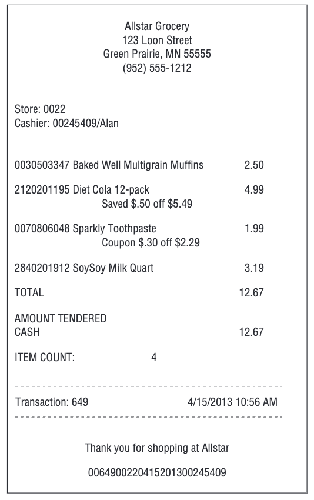
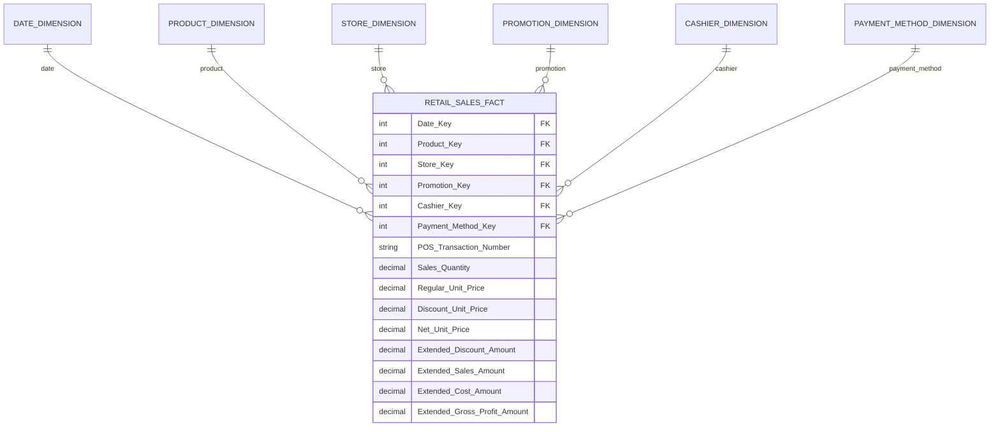
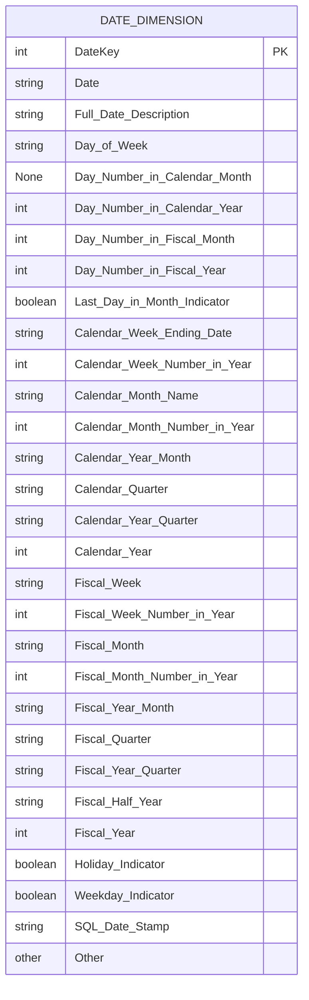

# Retail Sales

## Bối cảnh

Hãy tưởng tượng bạn làm việc tại headquaters của một chuỗi cửa hàng tiện lợi lớn.Doanh nghiệp này có 100 cửa hàng khắp năm tiểu bang. Mỗi cửa hàng có đầy đủ các gian hàng, bao gồm hàng tạp hóa, thực phẩm đông lạnh, sữa, thịt, nông sản, bánh mì, đồ uống và các sản phẩm hỗ trợ sức khỏe/sắc đẹp. Mỗi cửa hàng có khoảng 60.000 sản phẩm riêng lẻ, được gọi là _stock keeping units_ (SKU), trên kệ.

Dữ liệu được thu thập chủ yếu tại hai điểm: quầy thu ngân, nơi hệ thống POS quét mã vạch từng sản phẩm để ghi nhận giao dịch bán hàng; và cửa sau, nơi nhà cung cấp giao hàng vào kho.

<figure><figcaption><p>Mẫu biên lai thu ngân</p></figcaption></figure>

Mục tiêu kinh doanh xoay quanh việc dự báo nhu cầu, tối ưu tồn kho, bán được nhiều hàng nhất và tối đa hóa lợi nhuận. Pricing và promotion là hai yếu tố tác động mạnh đến doanh số: giảm giá tạm thời, quảng cáo, trưng bày hàng, hoặc coupon đều có thể đẩy volume bán tăng mạnh, nhưng cũng dễ khiến biên lợi nhuận giảm. Vì vậy, khả năng phân tích tác động của giá và các hình thức khuyến mãi là trọng tâm với cả cửa hàng lẫn trụ sở.

## Quy trình 4 bước

### 1. Lựa chọn Business Process

Trong case study này, ban quản lý muốn hiểu rõ hơn về hoạt động mua hàng của khách hàng, được ghi nhận bởi hệ thống máy POS. Vì vậy business process cần modeling là **POS retail sales transactions**. Dữ liệu này cho phép business users phân tích **sản phẩm nào** đang bán ở **cửa hàng nào**, vào **ngày nào**, điều kiện **khuyến mại nào**, **giao dịch nào**.

### 2. Xác định Grain

Sau khi xác định business process, việc quan trọng nhất là quyết định grain - mức độ chi tiết của dữ liệu trong fact table.

Kimball khuyến nghị luôn dùng **atomic grain**, tức mức chi tiết nhỏ nhất mà hệ thống ghi nhận, vì nó mở ra nhiều dimension và cho khả năng phân tích linh hoạt tối đa. Lý do như sau:

* Atomic data có thể dễ dàng tổng hợp lên các mức cao hơn, nhưng dữ liệu tổng hợp thì không thể tái tạo lại chi tiết; chọn grain cao quá sẽ khiến người dùng bị hạn chế khi cần drill-down.
* Mô hình dùng aggregated grain có thể hỗ trợ performance, nhưng không bao giờ thay thế được atomic fact vì nó mất thông tin, mất dimension và dễ không đáp ứng yêu cầu phân tích bất ngờ.
* Một hiểu lầm phổ biến là dimensional modeling chỉ phù hợp với dữ liệu summary; thực tế, mô hình hoạt động tốt nhất khi chứa dữ liệu chi tiết nhất.

Trong case này, dữ liệu chi tiết nhất là **một sản phẩm riêng lẻ trong một POS transaction**, giả định rằng POS transaction sẽ tổng hợp tất cả doanh số của một sản phẩm trên một item line. Cho dù nhu cầu phân tích của business user không tới mức đó, nhưng bạn cũng không thể dự đoán được tương lai người ta có mong muốn phân tích theo chiều này hay không.

### 3. Nhận dạng Dimensions

Khi grain đã chốt rõ ràng, việc xác định dimension trở nên khá tự nhiên. Từ grain “POS line item”, các dimension chính như **product**, **transaction**, **date**, **store**, **promotion**, **cashier**, và **payment method** xuất hiện gần như ngay lập tức vì chúng mô tả trực tiếp sự kiện bán hàng.  Các dimension này đại diện cho các góc mô tả quen thuộc của một event: **what** (product), **where** (store), **when** (date), **who** (cashier/customer), **why** (promotion), và **how** (payment method).

Một nguyên tắc quan trọng: grain quy định “độ phân giải” của fact table, và chỉ những  dimension nào **mang duy nhất một giá trị** cho mỗi sự kiện ở grain đó mới được phép gắn vào fact. Nếu một dimension tiềm năng gây ra việc phải nhân đôi fact row để gắn dữ liệu, nghĩa là dimension đó vi phạm grain.  Trong trường hợp như vậy, có hai lựa chọn: (1) loại bỏ dimension đó khỏi fact, hoặc (2) quay lại xem lại grain vì có thể grain ban đầu chưa phản ánh đúng sự kiện thực tế.


## Ví dụ: Promotion dimension gây nhân đôi fact row.

Một order có 2 dòng:

```
| order_id | line_no | product | qty |
| -------- | ------- | ------- | --- |
| 1001     | 1       | A       | 1   |
| 1001     | 2       | B       | 2   |
```

Với grain là một item line trong hóa đơn thì những dimension chỉ mang 01 giá trị duy nhất cho mỗi line như:

* Product: mỗi line có 1 product
* Date: mỗi line có 1 sale date
* Store: mỗi line thuộc 1 store
* Cashier: mỗi line là do 1 cashier xử lý&#x20;

&#x20;Chúng là các dimension phù hợp với grain.

Ngược lại, giả sử dòng sản phẩm này áp dụng 2 promotion đồng thời là Black Friday và Coupon giảm 10%. Khi đó việc đưa promotion dimension vào đây sẽ làm duplicate facts row:

```
| order_id | line_no | product | promotion |
| -------- | ------- | ------- | --------- |
| 1001     | 1       | A       | Promo 1   |
| 1001     | 1       | A       | Promo 2   |
```

Do đó promotion dimension trong trường hợp này là không phù hợp với grain, nên được loại bỏ khỏi facts. Và phương án có thể là  xử lý bằng Bridge table, hoặc Fact phụ về promotion, hoặc tách promotion thành attribute khác phù hợp với grain,... hoặc quay lại xem lại grain đã chọn đúng hay chưa.


Sau khi đã chốt danh sách dimension hợp lệ, mới bắt đầu bước “fleshing out” - liệt kê toàn bộ các thuộc tính mô tả bên trong từng dimension. Nhưng trước khi làm điều này, cần hoàn tất bước chọn fact để không bị sa đà vào chi tiết mà quên tổng thể mô hình.


## &#x20;`transaction_number` là [degenerate dimension](../basic-dimension-techniques.md#degenerate-dimensions).

Trong các dimension tương ứng lúc này, `transaction_number` là dimension chỉ lưu thông tin của order mà không có attribute đi kèm. Nó sẽ được lưu trực tiếp vào bảng fact dưới dạng degenerate dimension.


### 4. Xác định Facts

Bước thứ 4 và là bước cuối cùng trong quy trình 4 bước là xác định cẩn thận những facts nào sẽ xuất hiện trong bảng fact. Một lần nữa, cần bám sát grain và facts cũng cần phải phù hợp vơi grain - item line trong trường hợp này.

Facts thu thập được từ hệ thống POS là **số lượng bán** (Sales Quantity), **giá niêm yết trên mỗi đơn vị** (Regular Unit Price), **mức giảm giá trên mỗi đơn vị (**&#x44;iscount Unit Price), **giá thực trả sau giảm trên mỗi đơn vị (**&#x4E;et Unit Price), cùng với các giá trị “extended”, bao gồm:

*   **Extended Sales Amount** — tổng tiền bán của line item, được tính bằng:

    `Sales Quantity × Net Unit Price` .
*   **Extended Discount Amount** — tổng tiền giảm giá, được tính bằng:

    `Sales Quantity × Discount Unit Price` .
* **Extended Cost Amount** — tổng chi phí của line item, nếu hệ thống POS hoặc hệ thống inventory cung cấp được đơn giá cost chuẩn. Giá trị này được tính bằng: `Sales Quantity × Unit Cost` . Nếu dữ liệu cost không có sẵn hoặc yêu cầu một quy trình tính toán phức tạp (activity-based costing), thì nên bỏ qua. Tuy nhiên, nếu đã có sẵn trong nguồn dữ liệu, đây là một additive fact quan trọng cần đưa vào fact table.
* **Extended Gross Profit Amount** - lợi nhuận gộp của line item, được tính bằng: `Extended Sales Amount − Extended Cost Amount`. Mặc dù đây là derived fact, Kimball khuyến nghị nên lưu trực tiếp vào fact table để đảm bảo tính nhất quán trong ETL và tránh sai sót khi người dùng tự tính toán.

Các giá trị “extended” này là những con số đã được nhân với số lượng, nên chúng trở thành các **additive facts**, có thể cộng dồn theo mọi dimension.

Kết hợp 4 bước trên, ta có thể mô hình hoá mô hình theo diagram dưới đây:



Trong phần này, tác giả mô tả thêm 3 concepts quan trọng về facts: Derived Facts, Non-Additive Facts và Transaction Fact Tables.

#### **Derived Facts**

Là các fact có thể tính toán từ những fact khác trong cùng một dòng dữ liệu, chẳng hạn `Gross Profit = Extended Sales − Extended Cost`. Mặc dù có thể tính tại thời điểm truy vấn, Kimball khuyến nghị nên lưu trực tiếp derived fact vào fact table để đảm bảo tính nhất quán, tránh người dùng tự tính sai và giảm phụ thuộc vào công cụ BI.

#### **Non-Additive Facts**

Là các fact không thể cộng dồn theo bất kỳ dimension nào, ví dụ Gross Margin hoặc Unit Price. Với các tỷ lệ hoặc phần trăm, nên lưu numerator và denominator trong fact table; bản thân ratio sẽ được tính tại BI layer vì không thể precalculate.

#### **Transaction Fact Tables**

Các fact table giao dịch thường có grain rõ ràng (một dòng trên mỗi transaction hoặc mỗi transaction line), sparsely populated nhưng có thể rất lớn, giàu dimension, và phần lớn fact là additive miễn là đã được “extended” theo quantity. Đây cũng là loại fact table chiếm dung lượng lớn nhất trong data warehouse.

## Dimension Table Details

### Date Dimension

Date Dimension là một dimension gần như luôn xuất hiện trong mọi dimensional model vì hầu hết business process đều ghi nhận metrics theo thời gian. Trong hệ thống data warehouse, date thường được dùng làm trường partition chính, giúp dữ liệu nạp theo từng ngày được đặt vào vùng lưu trữ  và tối ưu cho việc scan.

<table data-full-width="true"><thead><tr><th>Date Key</th><th>Date</th><th>Full Date Description</th><th>Day of Week</th><th>Calendar Month</th><th>Calendar Quarter</th><th>Calendar Year</th><th>Fiscal Year-Month</th><th>Holiday Indicator</th><th>Weekday Indicator</th></tr></thead><tbody><tr><td>20130101</td><td>01/01/2013</td><td>January 1, 2013</td><td>Tuesday</td><td>January</td><td>Q1</td><td>2013</td><td>F2013-01</td><td>Holiday</td><td>Weekday</td></tr><tr><td>20130102</td><td>01/02/2013</td><td>January 2, 2013</td><td>Wednesday</td><td>January</td><td>Q1</td><td>2013</td><td>F2013-01</td><td>Non-Holiday</td><td>Weekday</td></tr><tr><td>20130103</td><td>01/03/2013</td><td>January 3, 2013</td><td>Thursday</td><td>January</td><td>Q1</td><td>2013</td><td>F2013-01</td><td>Non-Holiday</td><td>Weekday</td></tr><tr><td>20130104</td><td>01/04/2013</td><td>January 4, 2013</td><td>Friday</td><td>January</td><td>Q1</td><td>2013</td><td>F2013-01</td><td>Non-Holiday</td><td>Weekday</td></tr><tr><td>20130105</td><td>01/05/2013</td><td>January 5, 2013</td><td>Saturday</td><td>January</td><td>Q1</td><td>2013</td><td>F2013-01</td><td>Non-Holiday</td><td>Weekday</td></tr><tr><td>20130106</td><td>01/06/2013</td><td>January 6, 2013</td><td>Sunday</td><td>January</td><td>Q1</td><td>2013</td><td>F2013-01</td><td>Non-Holiday</td><td>Weekday</td></tr><tr><td>20130107</td><td>01/07/2013</td><td>January 7, 2013</td><td>Monday</td><td>January</td><td>Q1</td><td>2013</td><td>F2013-01</td><td>Non-Holiday</td><td>Weekday</td></tr><tr><td>20130108</td><td>01/08/2013</td><td>January 8, 2013</td><td>Tuesday</td><td>January</td><td>Q1</td><td>2013</td><td>F2013-01</td><td>Non-Holiday</td><td>Weekday</td></tr></tbody></table>

Khác với các dimension khác, date dimension có thể build trước toàn bộ vì chúng ta biết trước lịch trong nhiều năm. Ngay cả 20 năm dữ liệu cũng chỉ khoảng 7.300 dòng - cực kỳ nhỏ và ổn định. Mỗi row biểu diễn một ngày duy nhất và các thuộc tính đều được suy ra từ ngày đó, bao gồm calendar/fiscal day, month, quarter, year, holiday flag, weekday flag, v.v. Các thuộc tính dạng số hỗ trợ date arithmetic, còn các nhãn dạng text phục vụ hiển thị trong báo cáo.



SQL chỉ hỗ trợ các thao tác thời gian cơ bản và không cung cấp được các thuộc tính kinh doanh như weekday/weekend, holiday, fiscal period, week number hay season. Những logic này phải nằm trong một Date Dimension đầy đủ. Join sang date dimension cũng rất nhẹ và được tối ưu tốt, nên mọi dimensional model đều cần một bảng Date Dimension riêng thay vì phụ thuộc vào SQL date semantics.

#### Flags and Indicators as Textual Attributes

Các flags trong dimension nên được lưu bằng giá trị mô tả thay vì kiểu mã hoá Y/N hay 0/1. Ví dụ: Holiday/Non-holiday hoặc Weekday/Weekend. Điều này giúp báo cáo rõ ràng, nhất quán và không phụ thuộc vào BI tool để giải mã. Các thuộc tính dạng text trong dimension là phương án chuẩn trong dimensional modeling.

Chi tiết bạn có thể xem tại [#flags-and-indicators-as-textual-attributes](../basic-dimension-techniques.md#flags-and-indicators-as-textual-attributes "mention").

#### Current and Relative Date Attributes

Hầu hết các thuộc tính trong bảng Date Dimension sẽ không phải cập nhật hoặc thay đổi. Tuy nhiên bạn cũng có thể thêm các cột “current/relative” như `IsCurrentDay`, `IsCurrentMonth` hoặc `IsPrior60Days` hoặc một số thuộc tính đặc thù doanh nghiệp như `IsFiscalMonthEnd` để hỗ trợ các báo cáo chạy theo ngày hiện tại. Các giá trị này phải được cập nhật định kỳ (thường mỗi ngày).

Ngoài ra, có thể bổ sung các cột lag/lead (ví dụ `lag day` là 0 cho hôm nay, –1 cho hôm qua…), nhưng nhiều BI tool đã hỗ trợ sẵn nên không phải lúc nào cũng cần lưu trực tiếp trong dimension.

#### Time-of-Day as a Dimension or Fact

Date Dimension sẽ chỉ dừng ở grain là ngày. Nếu đổi grain của Date Dimension từ ngày sang giờ, số dòng sẽ nâng lên từ 7300 thành 175K, 10M nếu thành phút và 630M nếu thành giây.&#x20;

Hơn nữa, Date Dimension là dimension được sử dụng rộng rãi và hầu hết business users đôi khi không thực sự cần drill-down tới level như thế.

Và trong trường hợp users thực sự muốn phân tích theo các khoảng thời gian trong ngày như mỗi 15 phút, theo giờ, theo ca, trong giờ trưa,... thì lúc đó cần một bảng Time Dimension với grain theo phút/giờ. Bảng Time Dimension này sẽ có khoảng 1440 dòng (hoặc 86400 dòng), khá tốt để join.

Còn nếu người dùng thường quan tâm duration hơn là timestamp như thời lượng giao dịch, thời gian giữa hai hoạt động, hãy lưu trực tiếp time stamp ngay trong facts. Các chỉ số này cần tính bằng chênh lệnh giữa 2 timestamp chứ không cần dimension.

### Product Dimension

Product Dimension mô tả mỗi **Đơn vị lưu kho (SKU)** trong các cửa hàng tiện lợi. Mặc dù một cửa hàng điển hình có khoảng 60,000 SKUs và trong toàn bộ quá trình hoạt động, với những chương trình bán hàng khác nhau, những sản phẩm không còn được bán nữa thì số SKUs này cũng khoảng 300,000 hoặc hơn. Headquarters sẽ chịu trách nhiệm cập nhật SKUs cho các sản phẩm mới, giữ một master file gồm các sản phẩm đang được bán (subset của Product Dimension này), định kì phân phối xuống các hệ thống POS của các cửa hàng.

#### Flatten Many-to-One Hierarchies

Product Dimension bao gồm các thuộc tính mô tả cho mỗi SKU. Hệ thống phân cấp hàng hóa (merchandise hierarchy) là một nhóm thuộc tính quan trọng trong những thuộc tính đó. Thông thường, các SKU riêng lẻ sẽ được xếp vào các thương hiệu (**brands**), các thương hiệu sẽ được xếp vào các danh mục (**categories**) và các danh mục sẽ được xếp vào các ngành hàng (**departments**). Mỗi quan hệ trong số các quan hệ này là một mối quan hệ nhiều-một (**Many-to-One**).

<table data-full-width="true"><thead><tr><th>Product Key</th><th>Product Description</th><th>Brand Description</th><th>Subcategory Description</th><th>Category Description</th><th>Department Description</th><th>Fat Content</th></tr></thead><tbody><tr><td>1</td><td>Baked Well Light Sourdough Fresh Bread</td><td>Baked Well</td><td>Fresh</td><td>Bread</td><td>Bakery</td><td>Reduced Fat</td></tr><tr><td>2</td><td>Fluffy Sliced Whole Wheat</td><td>Fluffy</td><td>Pre-Packaged</td><td>Bread</td><td>Bakery</td><td>Regular Fat</td></tr><tr><td>3</td><td>Fluffy Light Sliced Whole Wheat</td><td>Fluffy</td><td>Pre-Packaged</td><td>Bread</td><td>Bakery</td><td>Reduced Fat</td></tr><tr><td>4</td><td>Light Mini Cinnamon Rolls</td><td>Light</td><td>Pre-Packaged</td><td>Sweetened Bread</td><td>Bakery</td><td>Non-Fat</td></tr><tr><td>5</td><td>Diet Lovers Vanilla 2 Gallon</td><td>Coldpack</td><td>Ice Cream</td><td>Frozen Desserts</td><td>Frozen Foods</td><td>Non-Fat</td></tr><tr><td>6</td><td>Light and Creamy Butter Pecan 1 Pint</td><td>Freshlike</td><td>Ice Cream</td><td>Frozen Desserts</td><td>Frozen Foods</td><td>Reduced Fat</td></tr><tr><td>7</td><td>Chocolate Lovers 1/2 Gallon</td><td>Frigid</td><td>Ice Cream</td><td>Frozen Desserts</td><td>Frozen Foods</td><td>Regular Fat</td></tr><tr><td>8</td><td>Strawberry Ice Creamy 1 Pint</td><td>Icy</td><td>Ice Cream</td><td>Frozen Desserts</td><td>Frozen Foods</td><td>Regular Fat</td></tr><tr><td>9</td><td>Icy Ice Cream Sandwiches</td><td>Icy</td><td>Novelties</td><td>Frozen Desserts</td><td>Frozen Foods</td><td>Regular Fat</td></tr></tbody></table>

Kimball khuyến nghị không cần normalize hay tách riêng các thuộc tính lặp lại trong Product Dimension. Dù một số attributes có cardinality rất thấp (như department, category, brand), việc giữ chúng trong cùng một dimension vẫn hoàn toàn ổn. Dimensional modeling chấp nhận dữ liệu lặp để duy trì mô hình star schema đơn giản, dễ dùng và tối ưu hiệu năng truy vấn; việc tách nhỏ theo 2NF/3NF chỉ làm mô hình phức tạp hơn mà không mang lại lợi ích thiết thực.

Ngoài merchandise hierarchy, Product Dimension còn có nhiều thuộc tính mô tả khác (như package type), và người dùng có thể kết hợp bất kỳ thuộc tính nào để phân tích linh hoạt - không cần chúng phải thuộc cùng một hierarchy.

#### Attributes with Embedded Meaning

Một số mã sản phẩm (natural key) trong hệ thống vận hành có chứa ý nghĩa bên trong trong. Trong dimensional modeling, cần lưu cả mã đầy đủ và đồng thời tách các phần mang ý nghĩa ra thành các thuộc tính riêng.&#x20;

Ví dụ: nếu ký tự 5–9 trong mã thể hiện nhà sản xuất, thì Product Dimension nên có cả mã gốc lẫn trường Manufacturer tách riêng.

Chi tiết bạn có thể tham khảo tại [#flags-and-indicators-as-textual-attributes](../basic-dimension-techniques.md#flags-and-indicators-as-textual-attributes "mention").

#### Numeric Values as Attributes or Facts

Một số giá trị số không dễ phân loại ngay vào fact hay dimension. Nếu giá trị dùng chủ yếu để tính toán trong các phép đo (như nhân với quantity để tạo extended amount), thì nên đặt trong fact. Nếu giá trị dùng chủ yếu để lọc, nhóm, hoặc mô tả sản phẩm, thì nên đặt trong dimension.

Trường hợp giá trị phục vụ cả hai mục đích, mô hình tốt nhất là lưu ở cả hai nơi: fact lưu giá trị tại thời điểm giao dịch, còn dimension lưu giá trị hiện hành. Điều này đảm bảo mô hình vừa chính xác vừa đơn giản, nhất quán đúng với nguyên tắc của dimensional modeling.

#### Drilling Down on Dimension Attributes

Một Product Dimension đầy đủ thường có 50+ thuộc tính mô tả. Mỗi thuộc tính đều có thể dùng để lọc, nhóm hoặc hiển thị trên báo cáo.&#x20;

Drill-down đơn giản chỉ là thêm một attribute khác vào row header; drill-up là bỏ bớt attribute. Người dùng có thể drill-down theo bất kỳ thuộc tính nào, không cần thuộc cùng hierarchy (ví dụ: drill từ department → brand hoặc từ department → fat content). Càng có nhiều descriptive attributes trong dimension, khả năng phân tích của business users càng phong phú.

