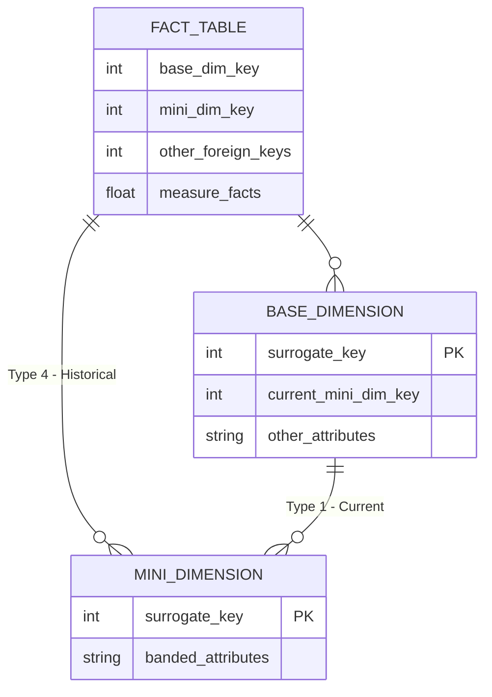

# Slowly Changing Dimension Techniques

Khi đi qua các kỹ thuật của Kimball, ta đã biết rằng fact là nơi lưu giữ các chỉ số đo lường, còn dimension cung cấp ngữ cảnh để diễn giải những con số đó. Một fact chỉ thực sự có ý nghĩa khi được đặt vào đúng dimension tương ứng, giúp xác định rõ ràng sự kiện diễn ra ở đâu, với ai và trong trạng thái nào. Nói cách khác, mỗi bản ghi trong fact luôn gắn với một điểm cụ thể trong không gian và thời gian thông qua các dimension.

Tuy nhiên, dimension không phải là thứ bất biến. Những thuộc tính mô tả bối cảnh — như địa chỉ khách hàng, cấp bậc thành viên, chức danh nhân viên hay phân loại sản phẩm — có thể thay đổi theo thời gian. Nếu dimension chỉ lưu giá trị hiện tại và không có cơ chế ghi lại lịch sử, thì khi phân tích, fact sẽ bị diễn giải bằng ngữ cảnh mới, thay vì ngữ cảnh tại thời điểm sự kiện thực sự xảy ra. Điều này gây ra nhiều hệ quả: KPI bị thay đổi, các báo cáo quá khứ mất tính nhất quán, và việc audit hoặc phân tích xu hướng theo thời gian gần như không thể chính xác.

Chính vì lý do này, Slowly Changing Dimensions (SCD) ra đời như một nhóm kỹ thuật giúp quản lý và lưu trữ sự thay đổi của dimension theo thời gian. SCD cho phép tạo ra các phiên bản lịch sử cho dimension, đảm bảo mỗi fact luôn được gắn với đúng bối cảnh tại thời điểm nó phát sinh. Nhờ đó, toàn bộ hệ thống phân tích có thể duy trì tính chính xác, ổn định và nhất quán theo thời gian, đồng thời phản ánh đầy đủ những thay đổi diễn ra trong thế giới thực.

## Type 0: Retain Original

Với Type 0, giá trị của thuộc tính trong bảng dimension được giữ nguyên vẹn và không bao giờ thay đổi sau khi đã được ghi nhận. Type 0 được sử dụng khi thuộc tính mang tính chất bất biến hoặc có ý nghĩa lịch sử mà hệ thống phân tích không được phép thay đổi. Điều này thường áp dụng cho các giá trị “original”, các creating timestamp, hoặc những thuộc tính được xem là trụ cột nhận dạng trong phân tích. Type 0 cũng được chọn khi việc thay đổi attribute có thể làm sai lệch kết quả phân tích hoặc gây mâu thuẫn về mặt ý nghĩa.


## Ví dụ

`original_credit_score` của khách hàng khi lần đầu được đánh giá, `customer_since_date` biểu diễn thời điểm tài khoản được tạo lần đầu, hoặc các thuộc tính trong date dimension như `year`, `month` hay `quarter` vốn không bao giờ thay đổi theo thời gian.


### SCD Type 0 và Durable Keys

[Durable keys](basic-dimension-techniques.md#natural-durable-and-supernatural-keys) là các định danh tự nhiên có tính bền vững, được kỳ vọng không thay đổi trong suốt vòng đời của entity. Những durable keys này, khi được đưa vào dimension như một attribute, mặc định trở thành Type 0 vì tính chất bất biến của chúng. Tuy nhiên, Type 0 không chỉ áp dụng cho key; nó còn áp dụng cho mọi thuộc tính khác có tính ổn định lâu dài. Sự liên hệ ở đây là: mọi durable keys đều là Type 0, nhưng không phải mọi Type 0 đều là durable keys.

## Type 1: Overwrite

Với Type 1, giá trị của thuộc tính trong bảng dimension sẽ được ghi đè nếu có bất cứ sự thay đổi nào, không có lịch sử nào được lưu lại. Đây là cách xử lý đơn giản nhất và nó chỉ phản ánh chỉ phản ánh trạng thái hiện tại, phù hợp khi giá trị cũ không còn ý nghĩa phân tích hoặc hoàn toàn không cần được giữ lại.

### SCD Type 1 không giữ lại lịch sử

Vì Type 1 không lưu lại lịch sử nên mọi báo cáo join fact với dimension đều dựa trên giá trị mới nhất. Điều này khá hiệu quả cho các thuộc tính không ảnh hưởng đến diễn giải quá khứ. Tuy nhiên, nếu vô tình áp dụng Type 1 cho attribute mà business thực sự cần theo dõi theo thời gian, việc phân tích sẽ bị sai lệch vì các fact cũ sẽ phản ánh bối cảnh mới thay vì bối cảnh lúc sự kiện diễn ra. Do đó Type 1 phải được dùng có chủ đích và chỉ cho những thuộc tính mà giá trị cũ là không quan trọng.

## Type 2: Add New Row

Thay vì ghi đè giá trị cũ như Type 1, Type 2 giữ lại bản ghi cũ như một phiên bản lịch sử và bổ sung bản ghi mới thể hiện trạng thái hiện tại. Do đó, một entity trong dimension có thể có nhiều phiên bản khác nhau theo thời gian, và mỗi phiên bản này phản ánh đúng bối cảnh tại thời điểm fact xảy ra.

### Cấu trúc bảng Dimension&#x20;

Một bảng dimension theo chuẩn SCD Type 2 luôn có:

| Column               | Vai trò                              |
| -------------------- | ------------------------------------ |
| **surrogate\_key**   | Khóa chính, phân biệt từng phiên bản |
| **natural\_key**     | Định danh logic của entity           |
| **attributes**       | Các thông tin mô tả                  |
| **effective\_date**  | Thời điểm bắt đầu có hiệu lực        |
| **expiration\_date** | <p>Thời điểm</p><p> hiệu lực</p>     |
| **current\_flag**    | Đánh dấu bản ghi hiện tại            |

Cấu trúc này cho phép phân biệt từng phiên bản theo thời gian và đảm bảo fact luôn join vào đúng phiên bản.

### Triển khai như thế nào?

Để triển khai được SCD Type 2, ETL phải thực hiện ba bước chuẩn hoá:



**Detect thay đổi**

* So sánh record mới từ source với record hiện tại trong dimension.
* So sánh theo từng attribute thuộc nhóm SCD2.
* Nếu không thay đổi thì bỏ qua.
* Nếu thay đổi, chuyển sang bước insert version mới.



**Close phiên bản cũ**

* Update bản ghi hiện tại, set `expiration_date = ngày phát hiện thay đổi`  & `current_row_flag = 0` .



**Tạo phiên bản mới**

* Insert một bản ghi mới với giá trị attribute mới, `effective_date = ngày phát hiện` , `expiration_date = ∞` (hoặc null), `current_row_flag = 1`  và sử dụng surrogate key mới.




## Bạn có thể triển khai SCD Type 2 bằng nhiều cách khác nhau.

* **Change Data Capture (CDC):** Bộ đôi CDC & SCD Type 2 gần như ăn khớp với nhau khi CDC trigger các event khi có thay đổi. CDC giúp detect thay đổi chính xác từng field, cho timestamp chính xác để set `effective_date` , support near-realtime và giảm cost vì tránh full table scan. <a href="https://aws.amazon.com/blogs/big-data/implement-historical-record-lookup-and-slowly-changing-dimensions-type-2-using-apache-iceberg/" class="button secondary" data-icon="up-right-from-square"></a>
* **DBT snapshot:** Hỗ trợ SCD Type 2 vì nó tự động detect thay đổi, tự tạo version mới, tự đóng version cũ, tự gắn `valid_from`/`valid_to`, và append-only tất cả các phiên bản. <a href="https://medium.com/@wajahatullah.k/using-dbt-snapshots-to-implement-scd-type-2-a-step-by-step-guide-7f2c521cc927" class="button secondary" data-icon="up-right-from-square"></a>
*   **Tự triển khai trong ETL/ELT:** Cái này chắc không cần nói nhiều, và cũng tuỳ thuộc công cụ bạn dùng để xem support như thế nào. Dưới đây là một ví dụ dùng SQL:

    ```sql
    MERGE INTO dim_customer AS d
    USING incoming AS i
    ON d.customer_id = i.customer_id AND d.current_flag = 1
    WHEN MATCHED AND (d.city <> i.city OR d.segment <> i.segment)
        THEN UPDATE SET 
            d.current_flag = 0,
            d.expiration_date = current_date()
    WHEN MATCHED AND ... no-change ...
        THEN <skip>
    WHEN NOT MATCHED
        THEN INSERT (... new surrogate key ...)
    ```


### Vai trò của Surrogate Key

SCD Type 2 có thể hoạt động được, phần lớn nhờ tác dụng quả surrogate key. Lý do là:&#x20;

1. **Surrogate key cho phép nhiều phiên bản cùng natural key:** Surrogate key giúp tạo nhiều bản ghi cho cùng một natural key. Mỗi bản ghi mang một bộ attribute khác nhau theo từng giai đoạn, giữ lại lịch sử mà không ghi đè.
2. **Mỗi lần thay đổi được xem như một “object mới”:** Khi attribute đổi, hệ thống tạo một surrogate key mới. Về mặt DW, đây được coi là một phiên bản khác của cùng entity, tách biệt hoàn toàn với phiên bản cũ.
3. **Fact refer đúng phiên bản theo thời điểm xảy ra sự kiện:** Trong fact, foreign key trỏ đến surrogate key cụ thể. Nhờ vậy, các fact cũ vẫn join vào phiên bản cũ, fact mới join vào phiên bản mới nên không bị nhầm lẫn giữa hiện tại và quá khứ.
4. **Lịch sử luôn được bảo toàn:** Không có surrogate key thì mọi thay đổi sẽ ghi đè lên nhau. Có surrogate key thì mỗi thay đổi trở thành một version riêng, không rewrite history

### Liệu OLAP/BI phải thay đổi?

Với Type 2 thì BI không thể nghĩ đơn giản kiểu “dimension lúc nào cũng là giá trị mới nhất” nữa. Thay vào đó phải quen với chuyện mỗi fact gắn với một phiên bản cụ thể của dimension, không phải bản hiện tại. Nói cách khác: phân tích Type 2 là phân tích theo context của quá khứ, không phải context của bây giờ. Vì thế mindset phía phân tích cũng phải thay đổi và hiểu rẳng

1. **Một entity có nhiều phiên bản là bình thường.:** BI phải quen rằng _customer A không chỉ có 1 dòng trong dimension_. Nó có thể có 3–5 phiên bản khác nhau theo thời gian, và tất cả đều “đúng”.
2. **JOIN theo phiên bản, không JOIN theo entity:** BI phải hiểu rằng fact đang join vào một phiên bản cụ thể, không phải “current version” hay “latest info”. Nó phản ánh _context tại thời điểm fact xảy ra_, chứ không phải context bây giờ.
3. **Không được tự ép fact về trạng thái hiện tại:** Không được lấy bản dim mới nhất rồi gán vào báo cáo lịch sử. Fact nào, refer phiên bản nào, BI phải giữ nguyên.
4. **Duplicates trong dimension không phải lỗi:** Trong Type 2, nhìn thấy 1 khách hàng xuất hiện nhiều dòng là chuyện đúng. Mỗi dòng là _một version_, không phải duplicate.
5. **Khi phân tích theo thời gian, luôn hiểu rằng attribute có thể thay đổi**\
   Nghĩa là tháng trước user thuộc segment A, tháng sau segment B. BI phải chấp nhận sự thay đổi đó là bản chất, không cố ép về một giá trị duy nhất.

### Một số điểm cần lưu ý

1. **Late arriving facts:** Fact đến muộn so với thời điểm nó xảy ra. Khi lookup dimension phải chọn phiên bản hiệu lực đúng ngày fact, chứ không phải phiên bản hiện tại. Nếu lookup “latest version” thì lịch sử lệch hết.
2. **Late arriving dimensions**: Dimension thay đổi nhưng cập nhật lên DW chậm hơn fact. Lúc này phải backfill hoặc reprocess fact để gán lại surrogate key cho đúng phiên bản.
3. **Out-of-order updates:** Nguồn gửi update lộn xộn (ví dụ event cũ tới sau event mới). ETL cần logic mạnh hơn, nhìn `ts_ns` hoặc `effective_date` để xác định phiên bản nào thực sự đến trước.
4. **Overlapping `effective_date`:** Hai phiên bản của cùng natural key có khoảng thời gian hiệu lực chồng lên nhau dẫn đến sai chuẩn SCD2. Cần detect và sửa (validate định kỳ trong ETL hoặc dùng test trong dbt).

## Type 3: Add New Attribute

Type 2 giữ lịch sử rất đầy đủ, nhưng nó hỗ trợ việc xem dữ liệu theo logic cũ và logic mới cùng lúc khá kém, khả năng là bạn phải self join trên cùng natural key. Một số business cần so sánh “trước–sau” nhanh, hoặc xem số liệu với giả định "chưa từng thay đổi". Type 3 sinh ra để phục vụ đúng nhu cầu này.

Thay vì tạo thêm các dòng như Type 2,  Type 3 chỉ giữ đúng một dòng duy nhất cho mỗi entity, nhưng có một số cột cho thuộc tính thay đổi, ví dụ `value_current` và `value_previous`. Khi load lần đầu, hệ thống điền giá trị hiện tại vào `value_current` và để `value_previous` là NULL. Khi thuộc tính thay đổi, ETL chỉ cần chuyển giá trị hiện tại sang cột previous, sau đó overwrite giá trị mới vào cột current.

### Hạn chế của Type 3

Chính vì Type 3 được triển khai theo kiểu “chiều ngang” – tức là bổ sung thêm các cột như `current_value`, `previous_value` (và nếu cần thì thêm `value_2022`, `value_2021`, …) - nên nó chỉ giữ được một lượng lịch sử rất giới hạn. Điều này dẫn tới hai hạn chế rõ rệt:

1. **Bị giới hạn về số lần thay đổi:** Nếu thay đổi xảy ra nhiều hoặc không theo chu kỳ rõ ràng thì bảng dimension sẽ phình to rất nhanh và khó quản lý.
2. **Không thể hiện được thời điểm thay đổi:** Vì Type 3 không có `valid_from`, `valid_to`, cũng không dùng surrogate key version. Bạn chỉ biết “giá trị hiện tại” và “giá trị trước đó”, chứ không biết chúng thay đổi lúc nà


Không biết bạn có giống mình không, đọc đến đây mình tự đặt ra câu hỏi: "Tại sao không hybrid cả Type 2 lẫn Type 3 để tận dụng hết ưu điểm? Ví dụ thêm một số cột trên bảng dimension để phục vụ so sánh, nhưng vẫn tạo thêm dòng để lưu trữ lại toàn bộ lịch sử." Hình như đó là Type 6 hay sao ấy, chắc chắn là có phương án này, đọc tiếp nhé.


## Type 4: Add Mini-Dimension

Ban đầu đọc tới phần kĩ thuật này, mình đã tự đặt câu hỏi ở chữ "Slowly"? Thế "Rapidly" hay "Quickly" thì sao? Và khi đọc tới đây mình nhận ra, Type 4 sinh ra dành cho điều đó:

Type 4 được dùng khi một nhóm thuộc tính trong dimension thay đổi quá nhanh hoặc quá phình khiến việc dùng Type 2 trở nên nặng nề và không hiệu quả. Kimball có gọi là _rapidly changing monster dimension_ - một dimension to, nhiều thuộc tính, và một số thuộc tính trong đó thay đổi liên tục.

Cụ thể Type 4 tách các thuộc tính hay thay đổi sang một dimension khác (mini-dimension) và thêm trực tiếp foreign key tới surrogate key lên bảng facts. Nghĩa là nó đẩy trách nhiệm tracking history của dimension về cho một thứ thay đổi nhanh hơn là bảng facts. Tuy nhiên "nghịch lý" ở chỗ thuộc tính mô tả cho một dimension lại là một dimension nằm trong bảng fact.


## Nghe khó hiểu thế, cùng đi vào ví dụ nào!

Giả sử công ty đang theo dõi hành vi mua hàng của khách. Trong hệ thống có:

* bảng `customer_dimension` vài triệu dòng
* nhiều thuộc tính ổn định và ít thay đổi:  `name`, `address`, `gender`,…
* nhưng cũng có vài thuộc tính hay thay đổi theo thời gian:
  * `age_band`: thay đổi mỗi năm; 21-25, 26-30, 31-35
  * `credit_score_band` : thay đổi mỗi kỳ chấm lại điểm; 1, 2, 4, 5, 6, 7
  * `purchase_freq_score_band`: điểm tần suất mua thay đổi liên tục theo hành vi mua; Low, Medium, High

Nếu để các thuộc tính này trong `customer_dimension` và dùng Type 2, bảng 5 triệu dòng sẽ tăng lên hàng chục triệu dòng rất nhanh - ví dụ mỗi kì chấm điểm tín dụng sẽ lại tạo thêm hàng triệu dòng để lưu lại lịch sử lên hạng của customer. Điều này dẫn đến join chậm và BI, dashboard lên rất chậm.

Thay vào đó Type 4 tách các thuộc tính hay thay đổi sang mini-dimension, ở đây là `age_band`, `credit_score_band`,  `purchase_freq_score_band`  vào một `customer_demographics_dimension` và giữ các thuộc tính ít đổi trong `customer_dimension`  cũ.

<pre class="language-markdown"><code class="lang-markdown"><strong>customer_dimension
</strong>--------------
| customer_key | customer_id | customer_name | gender | city     |
|--------------|-------------|---------------|--------|----------|
| 10           | CUST001     | John Smith    | M      | Miami    |
| 11           | CUST002     | Lisa Wong     | F      | Seattle  |
</code></pre>

<pre class="language-markdown"><code class="lang-markdown"><strong>customer_demographics_dimension
</strong>--------------
| demographics_key | age_band | credit_score_band | purchase_freq_score  |
|------------------|----------|-------------------|----------------------|
| 1                | 21–25    | 2                 | Low                  |
| 142              | 26–30    | 4                 | Low                  |
| 233              | 26–30    | 7                 | Medium               |
</code></pre>

Và trong bảng facts, tại mỗi dòng sẽ có foreign key tham chiếu tới mini-dimension

<pre class="language-markdown"><code class="lang-markdown"><strong>order_facts
</strong>--------------
| order_date_key | order_id | customer_key | demographics_key | quantity | amount |
|----------------|----------|--------------|------------------|----------|--------|
| 20240101       | ORD1001  | 10           | 1                | 1        | 100    |
| 20240201       | ORD1102  | 10           | 142              | 2        | 150    |
| 20240501       | ORD1340  | 10           | 233              | 1        | 200    |
</code></pre>

Khi đó mỗi order sẽ lưu giữ lại thông tin mô tả customer tại thời điểm nó xảy ra. Đây là chỗ "phi logic" mà mình đề cập, thông tin mô tả customer lại nằm trong 1 dimension khác :joy:, nhưng nếu nhìn theo phương diện đẩy trách nhiệm lưu giữ lịch sử về cho facts thì nó lại hợp lý.


### Nhược điểm của Type 4

Type 4 rất mạnh trong việc giảm phình dimension và tăng tốc truy vấn, nhưng nó đi kèm một số nhược điểm rõ ràng:

1. **Thuộc tính của Type 4 phải chia band**: Mini-dimension chỉ hoạt động hiệu quả nếu các thuộc tính được gộp thành nhóm (band). Lý do mini-dimension chứa một dòng cho mỗi tổ hợp, nếu để raw value, tổ hợp có thể thành hàng triệu dòng bà ảng mini-dimension sẽ nổ tung, mất ý nghĩa “mini.
2. **Không phải thuộc tính nào cũng chia band được:** Rất nhiều thuộc tính không thể chia band, ví dụ free-text, và thường là định lượng mới có thể. Hơn nữa việc chia band cũng làm mất độ chi tiết của thuộc tính.
3. **Khó bảo trì nếu band thay đổi theo thời gian:** Nếu business thay đổi định nghĩa thì phải rebuild mini-dimension ảnh hưởng tất cả fact join bằng surrogate key.
4. **Lịch sử chỉ được lưu qua Fact, dẫn tới ETL phức tạp hơn:** Như mô tả, Type 4 đẩy lịch sử về lưu ở facts. Điều này có nghĩa là, khi ingest data cần tính toán chia nhóm, lookup lấy surrogate tương ứng, đồng thời không thể backfill lịch sử profile nếu không có dữ liệu fact.

## Type 5: Add Mini-Dimension and Type 1 Outrigger

Type 5, như tên gọi của nó, dựa trên ý tưởng của Type 4 và Type 1. Khi đó Type 5 tách nhóm thuộc tính hay thay đổi thành mini-dimension. Sau đó, thêm một khoá ngoại tham chiếu đến mini-dimension này như một [outrigger dimension](basic-dimension-techniques.md#outrigger-dimensions) từ base dimension, đồng thời luôn overwrite theo giá trị hiện tại như Type 1.

Mô hình triển khai Type 5, có thể minh hoạ thông qua ERD như sau:




## Lý do cần Type 5 thay vì chỉ Type 4

Ở ví dụ trên, khi BI cần lookup trạng thái hiện tại của customer:

* "Có bao nhiêu khách _hiện tại_ ở `credit_score_band` 2?"
* "Danh sách customer hiện tại thuộc nhóm `High` loyalty?"
* "Marketing muốn phân khúc khách hàng theo profile hiện tại để chạy chiến dịch."

Nếu chỉ dùng Type 4, muốn trả lời mấy câu này phải JOIN FACT, ất nặng, rất chậm, và không hợp lý.

Với Type 5 base dimension có `current_customer_demographics_key`, query dimension là biết ngay.




Và rõ ràng, Type 5 là "bản mở rộng của Type 4", nó thừa kế tất cả ưu điểm, nhược điểm của Type 4. Tuy nhiên "mở rộng" ở đây chưa hẳn đã tốt, Type 5 kéo theo mô hình phức tạp hơn và ETL cũng phức tạp hơn.

## Type 6: Add Type 1 Attributes to Type 2 Dimension

Ý tưởng của Type 6 là kết hợp của Type 1, Type 2, Type 3. Cụ thể, Type 6 phần chính dựa trên Type 2, vẫn tạo thêm dòng mới khi dimension thay đổi. Tuy nhiên, Type 6 thêm cột lưu lại giá trị hiện tại - overwrite theo Type 1 và (các) cột lưu các giá trị trước đó trên cùng một dòng - Type 3.

Type 6 khi business muốn có đủ 3 góc nhìn dữ liệu cùng lúc:

1. **Historical view:** join theo phiên bản Type 2.
2. **Current view:** join theo giá trị mới nhất (Type 1).
3. **Before–after comparison:** bằng cách lưu cả giá trị cũ và hiện tại trong cùng row (Type 3).

So với các loại còn lại thì Type 6 có ETL phức tạp và khó maintain nhất.


## Cấu trúc ví dụ của một type-6 dimension table.

Bảng `product_dim` ban đâu:

```markdown
| Product Key | SKU (NK)  | Product Description | Historic Department Name  | Current Department Name  | Row Effective Date  | Row Expiration Date  | Current Row Indicator  |
|-------------|-----------|---------------------|---------------------------|--------------------------|---------------------|----------------------|------------------------|
| 12345       | ABC922-Z  | IntelliKidz         | Education                 | Education                | 2012-01-01          | 9999-12-31           | Current                |
```

Sau khi có thay đổi lần đầu:

```marko
| Product Key | SKU (NK)  | Product Description | Historic Department Name  | Current Department Name | Row Effective Date  | Row Expiration Date  | Current Row Indicator  |
|-------------|-----------|---------------------|---------------------------|-------------------------|---------------------|----------------------|------------------------|
| 12345       | ABC922-Z  | IntelliKidz         | Education                 | Strategy                | 2012-01-01          | 2013-01-31           | Expired                |
| 25984       | ABC922-Z  | IntelliKidz         | Strategy                  | Strategy                | 2013-02-01          | 9999-12-31           | Current                |
```

Thêm một lần thay đổi nữa:

```markdown
| Product Key | SKU (NK)  | Product Description | Historic Department Name  | Current Department Name  | Row Effective Date  | Row Expiration Date  | Current Row Indicator  |
|-------------|-----------|---------------------|---------------------------|--------------------------|---------------------|----------------------|------------------------|
| 12345       | ABC922-Z  | IntelliKidz         | Education                 | Critical Thinking        | 2012-01-01          | 2013-01-31           | Expired                |
| 25984       | ABC922-Z  | IntelliKidz         | Strategy                  | Critical Thinking        | 2013-02-01          | 2013-06-30           | Expired                |
| 31726       | ABC922-Z  | IntelliKidz         | Critical Thinking         | Critical Thinking        | 2013-07-01          | 9999-12-31           | Current                |
```


## Type 7: Dual Type 1 and Type 2 Dimensions

Với Type 7, bảng dimension giữ nguyên cấu trúc Type 2: có `surrogate_key`, `durable_key`, `valid_from`, `valid_to` và `current_flag`.\
Điểm khác biệt duy nhất là bảng fact được bổ sung thêm một cột tham chiếu tới `durable_key` của dimension.

Hiệu quả mang lại là:

* **Truy vấn lịch sử (as-was)**: BI join fact và dimension dựa trên `surrogate_key`, nhờ đó lấy đúng phiên bản dimension tương ứng với thời điểm fact xảy ra.
* **Truy vấn trạng thái hiện tại (as-is)**: BI join fact và dimension dựa trên `durable_key`, đồng thời filter `current_flag = true` để lấy đúng giá trị hiện tại của dimension.

### Hai biến thể bổ sung của Type 7

Ngoài cách triển khai “chuẩn” của Type 7 (đưa cả surrogate key và durable key vào fact table), Kimball còn mô tả thêm hai biến thể khác. Chúng đều nhằm đạt được mục tiêu giống nhau: cung cấp cả góc nhìn lịch sử và góc nhìn hiện tại, nhưng thay đổi cách bố trí bảng để phù hợp với từng hệ thống.

Type 7 hỗ trợ historical view và current view bằng hai foreign key hoặc hai hướng join khác nhau, nhưng nó không hỗ trợ so sánh “giá trị cũ vs giá trị mới” trong cùng một dòng dimension như Type 3 hay Type 6.

#### **Biến thể 1 — Tách riêng một bảng Type 1 “current dimension”**

Ở biến thể này, ta vẫn giữ nguyên bảng dimension Type 2 như cũ, nhưng tạo thêm một bảng thứ hai chỉ chứa giá trị hiện tại của dimension. Bảng này có một dòng duy nhất cho mỗi durable key, không chứa lịch sử, không có surrogate key và các cột được đặt tên theo dạng `current_*` để tránh nhầm lẫn.

* Fact table sẽ có hai foreign key:
  * `surrogate_key_fk`  dùng để truy vấn lịch sử (Type 2)
  * `durable_key_fk`  join sang bảng current dimension để lấy giá trị hiện tại

Lợi ích của cách này là bảng Type 1 luôn nhỏ gọn và nhẹ hơn Type 2, vì nó không chứa các phiên bản lịch sử. Do đó các truy vấn dựa trên context hiện tại thường chạy nhanh hơn và dễ tối ưu hơn so với Type 6 (vốn nhúng hết mọi thứ vào một bảng).

#### **Biến thể 2 — Dùng một view để map giá trị hiện tại vào tất cả version Type 2**

Thay vì tạo một bảng Type 1 riêng, biến thể thứ hai tạo một view từ bảng Type 2. View này sao chép tất cả các dòng Type 2 và thay thế các attribute bằng giá trị _current_ tương ứng với từng durable key. Kết quả là:

* Số dòng trong view bằng đúng số dòng Type 2
* Mỗi dòng trong view luôn phản ánh giá trị hiện tại, không phải giá trị tại thời điểm nó hiệu lực

Với cách làm này:

* Fact table không cần lưu `durable_key_fk`
* BI có thể join thẳng fact và view bằng `surrogate_key_fk` để lấy giá trị hiện tại

Điểm trừ là view sẽ lớn bằng Type 2, và các truy vấn current view phải đọc nhiều dòng hơn so với bảng Type 1 tách riêng. Vì thế cách này thường chậm hơn biến thể 1, nhưng đổi lại fact table không phải phình thêm một cột.


## Current view được tạo ra như thế nào?

Với ví dụ trên, ta có thể tạo ra `product_dim_current_view` qua truy vấn

```sql
CREATE VIEW product_dim_current_view AS
SELECT
    d.surrogate_key,
    d.durable_key,
    d.product_description AS product_description_type2,
    d.department_name    AS department_type2,
    c.product_description AS current_product_description,
    c.department_name    AS current_department_name
FROM product_dim d
JOIN product_dim c
    ON d.durable_key = c.durable_key
   AND c.current_flag = 1;
```

Và với sample data, mọi thứ sẽ như sau:

<pre class="language-markdown"><code class="lang-markdown"><strong>product_dim
</strong>-------------
| Product Key | SKU (NK) | Durable Product Key  | Product Description  | Department Name      | Row Effective Date   | Row Expiration Date | Current Row Indicator   |
|-------------|----------|----------------------|----------------------|----------------------|----------------------|---------------------|-------------------------|
| 12345       | ABC922-Z | 12345                | IntelliKidz          | Education            | 2012-01-01           | 2013-01-31          | Expired                 |
| 25984       | ABC922-Z | 12345                | IntelliKidz          | Strategy             | 2013-02-01           | 2013-06-30          | Expired                 |
| 31726       | ABC922-Z | 12345                | IntelliKidz          | Critical Thinking    | 2013-07-01           | 9999-12-31          | Current                 |
</code></pre>

```
product_dim_current_view
-------------
| Product Key | SKU (NK) | Durable Product Key  | Current Product Description  | Current Department Name  |
|-------------|----------|----------------------|------------------------------|--------------------------|
| 12345       | ABC922-Z | 12345                | IntelliKidz                  | Critical Thinking        |
| 25984       | ABC922-Z | 12345                | IntelliKidz                  | Critical Thinking        |
| 31726       | ABC922-Z | 12345                | IntelliKidz                  | Critical Thinking        |

```


### Type 7 cho phép truy vấn “as-of” tại bất kỳ thời điểm nào

Type 7 đặc biệt mạnh ở chỗ nó cho phép BI lấy đúng bối cảnh của dimension tại một thời điểm X tùy chọn. Cách làm rất trực tiếp: dùng durable key của fact, lọc bảng Type 2 theo ngày X để tìm ra phiên bản (surrogate key) có hiệu lực vào thời điểm đó, rồi join fact với phiên bản này để khôi phục lại đúng context tại ngày X.

Tuy nhiên, Kimball nhấn mạnh rằng cách truy vấn này dễ gây nhầm lẫn và đòi hỏi người dùng hiểu sâu về SCD. Do đó, khả năng “as-of” nên được cung cấp cho nhóm người dùng nâng cao, thay vì mở rộng cho toàn bộ BI.

## My Summary

Mặc dù sách liệt kê đầy đủ các kỹ thuật từ Type 1 đến Type 7, cách áp dụng thực tế lại phụ thuộc hoàn toàn vào bài toán. Đừng cố dùng “dao mổ trâu để giết gà” chỉ vì kỹ thuật nghe có vẻ mạnh. Thậm chí, dù Kimball không nhắc tới, cá nhân mình nhận thấy việc kết hợp Type 6 và Type 7 cũng hoàn toàn khả thi nếu hệ thống thực sự cần cả khả năng so sánh trước - sau lẫn nhiều góc nhìn phân tích.

Cuối cùng, chọn kỹ thuật SCD luôn là một quyết định thiết kế. Bạn cần cân nhắc:

* Thuộc tính thay đổi nhanh hay chậm?
* Business có cần lưu lịch sử hay không?
* Có yêu cầu so sánh trước–sau không?
* Fact table lớn đến mức nào?
* Đội BI có đủ kỹ năng join đúng hay không?
* Hiệu năng có phải ưu tiên hàng đầu không?
* Có thể chấp nhận snowflake hay không?
* Mô hình có dễ duy trì lâu dài không?

Nói cách khác: hãy chọn giải pháp phù hợp nhất với nhu cầu, không phải giải pháp nhiều tính năng nhất.


