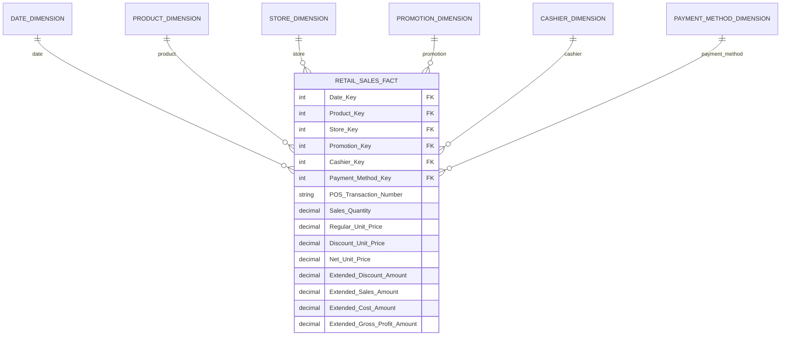
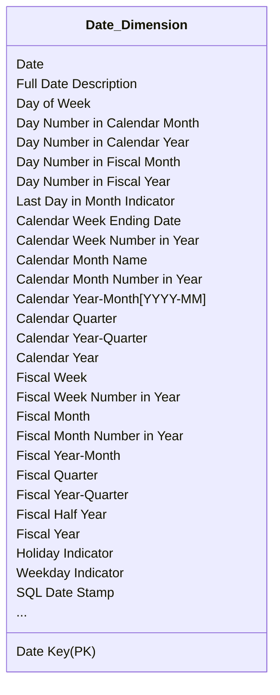
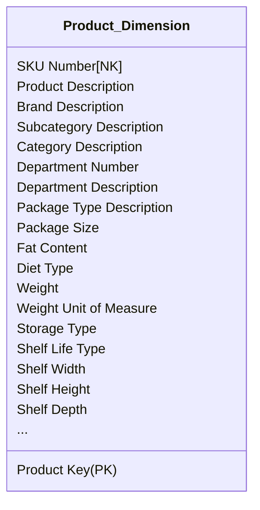
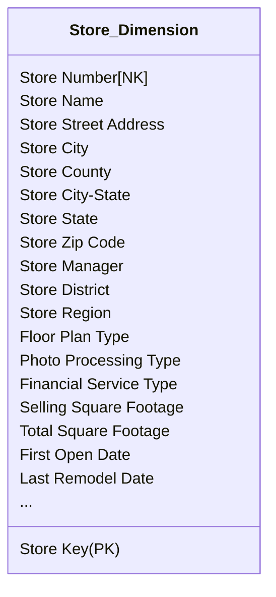
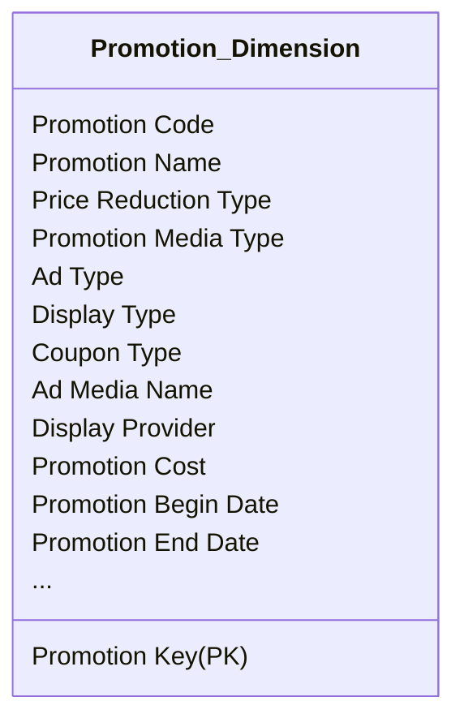

# Retail Sales

## Bối cảnh

Hãy tưởng tượng bạn làm việc tại headquaters của một chuỗi cửa hàng tiện lợi lớn.Doanh nghiệp này có 100 cửa hàng khắp năm tiểu bang. Mỗi cửa hàng có đầy đủ các gian hàng, bao gồm hàng tạp hóa, thực phẩm đông lạnh, sữa, thịt, nông sản, bánh mì, đồ uống và các sản phẩm hỗ trợ sức khỏe/sắc đẹp. Mỗi cửa hàng có khoảng 60.000 sản phẩm riêng lẻ, được gọi là _stock keeping units_ (SKU), trên kệ.

Dữ liệu được thu thập chủ yếu tại hai điểm: quầy thu ngân, nơi hệ thống POS quét mã vạch từng sản phẩm để ghi nhận giao dịch bán hàng; và cửa sau, nơi nhà cung cấp giao hàng vào kho.

<figure><figcaption><p>Mẫu biên lai thu ngân</p></figcaption></figure>

Mục tiêu kinh doanh xoay quanh việc dự báo nhu cầu, tối ưu tồn kho, bán được nhiều hàng nhất và tối đa hóa lợi nhuận. Pricing và promotion là hai yếu tố tác động mạnh đến doanh số: giảm giá tạm thời, quảng cáo, trưng bày hàng, hoặc coupon đều có thể đẩy volume bán tăng mạnh, nhưng cũng dễ khiến biên lợi nhuận giảm. Vì vậy, khả năng phân tích tác động của giá và các hình thức khuyến mãi là trọng tâm với cả cửa hàng lẫn trụ sở.

## Quy trình 4 bước

### 1. Lựa chọn Business Process

Trong case study này, ban quản lý muốn hiểu rõ hơn về hoạt động mua hàng của khách hàng, được ghi nhận bởi hệ thống máy POS. Vì vậy business process cần modeling là **POS retail sales transactions**. Dữ liệu này cho phép business users phân tích **sản phẩm nào** đang bán ở **cửa hàng nào**, vào **ngày nào**, điều kiện **khuyến mại nào**, **giao dịch nào**.

### 2. Xác định Grain

Sau khi xác định business process, việc quan trọng nhất là quyết định grain - mức độ chi tiết của dữ liệu trong fact table.

Kimball khuyến nghị luôn dùng **atomic grain**, tức mức chi tiết nhỏ nhất mà hệ thống ghi nhận, vì nó mở ra nhiều dimension và cho khả năng phân tích linh hoạt tối đa. Lý do như sau:

* Atomic data có thể dễ dàng tổng hợp lên các mức cao hơn, nhưng dữ liệu tổng hợp thì không thể tái tạo lại chi tiết; chọn grain cao quá sẽ khiến người dùng bị hạn chế khi cần drill-down.
* Mô hình dùng aggregated grain có thể hỗ trợ performance, nhưng không bao giờ thay thế được atomic fact vì nó mất thông tin, mất dimension và dễ không đáp ứng yêu cầu phân tích bất ngờ.
* Một hiểu lầm phổ biến là dimensional modeling chỉ phù hợp với dữ liệu summary; thực tế, mô hình hoạt động tốt nhất khi chứa dữ liệu chi tiết nhất.

Trong case này, dữ liệu chi tiết nhất là **một sản phẩm riêng lẻ trong một POS transaction**, giả định rằng POS transaction sẽ tổng hợp tất cả doanh số của một sản phẩm trên một item line. Cho dù nhu cầu phân tích của business user không tới mức đó, nhưng bạn cũng không thể dự đoán được tương lai người ta có mong muốn phân tích theo chiều này hay không.

### 3. Nhận dạng Dimensions

Khi grain đã chốt rõ ràng, việc xác định dimension trở nên khá tự nhiên. Từ grain “POS line item”, các dimension chính như **product**, **transaction**, **date**, **store**, **promotion**, **cashier**, và **payment method** xuất hiện gần như ngay lập tức vì chúng mô tả trực tiếp sự kiện bán hàng.  Các dimension này đại diện cho các góc mô tả quen thuộc của một event: **what** (product), **where** (store), **when** (date), **who** (cashier/customer), **why** (promotion), và **how** (payment method).

Một nguyên tắc quan trọng: grain quy định “độ phân giải” của fact table, và chỉ những  dimension nào **mang duy nhất một giá trị** cho mỗi sự kiện ở grain đó mới được phép gắn vào fact. Nếu một dimension tiềm năng gây ra việc phải nhân đôi fact row để gắn dữ liệu, nghĩa là dimension đó vi phạm grain.  Trong trường hợp như vậy, có hai lựa chọn: (1) loại bỏ dimension đó khỏi fact, hoặc (2) quay lại xem lại grain vì có thể grain ban đầu chưa phản ánh đúng sự kiện thực tế.


## Ví dụ: Promotion dimension gây nhân đôi fact row.

Một order có 2 dòng:

```
| order_id | line_no | product | qty |
| -------- | ------- | ------- | --- |
| 1001     | 1       | A       | 1   |
| 1001     | 2       | B       | 2   |
```

Với grain là một item line trong hóa đơn thì những dimension chỉ mang 01 giá trị duy nhất cho mỗi line như:

* Product: mỗi line có 1 product
* Date: mỗi line có 1 sale date
* Store: mỗi line thuộc 1 store
* Cashier: mỗi line là do 1 cashier xử lý&#x20;

&#x20;Chúng là các dimension phù hợp với grain.

Ngược lại, giả sử dòng sản phẩm này áp dụng 2 promotion đồng thời là Black Friday và Coupon giảm 10%. Khi đó việc đưa promotion dimension vào đây sẽ làm duplicate facts row:

```
| order_id | line_no | product | promotion |
| -------- | ------- | ------- | --------- |
| 1001     | 1       | A       | Promo 1   |
| 1001     | 1       | A       | Promo 2   |
```

Do đó promotion dimension trong trường hợp này là không phù hợp với grain, nên được loại bỏ khỏi facts. Và phương án có thể là  xử lý bằng Bridge table, hoặc Fact phụ về promotion, hoặc tách promotion thành attribute khác phù hợp với grain,... hoặc quay lại xem lại grain đã chọn đúng hay chưa.


Sau khi đã chốt danh sách dimension hợp lệ, mới bắt đầu bước “fleshing out” - liệt kê toàn bộ các thuộc tính mô tả bên trong từng dimension. Nhưng trước khi làm điều này, cần hoàn tất bước chọn fact để không bị sa đà vào chi tiết mà quên tổng thể mô hình.


## &#x20;`transaction_number` là [degenerate dimension](../basic-dimension-techniques.md#degenerate-dimensions).

Trong các dimension tương ứng lúc này, `transaction_number` là dimension chỉ lưu thông tin của order mà không có attribute đi kèm. Nó sẽ được lưu trực tiếp vào bảng fact dưới dạng degenerate dimension.


### 4. Xác định Facts

Bước thứ 4 và là bước cuối cùng trong quy trình 4 bước là xác định cẩn thận những facts nào sẽ xuất hiện trong bảng fact. Một lần nữa, cần bám sát grain và facts cũng cần phải phù hợp vơi grain - item line trong trường hợp này.

Facts thu thập được từ hệ thống POS là **số lượng bán** (Sales Quantity), **giá niêm yết trên mỗi đơn vị** (Regular Unit Price), **mức giảm giá trên mỗi đơn vị (**&#x44;iscount Unit Price), **giá thực trả sau giảm trên mỗi đơn vị (**&#x4E;et Unit Price), cùng với các giá trị “extended”, bao gồm:

*   **Extended Sales Amount** — tổng tiền bán của line item, được tính bằng:

    `Sales Quantity × Net Unit Price` .
*   **Extended Discount Amount** — tổng tiền giảm giá, được tính bằng:

    `Sales Quantity × Discount Unit Price` .
* **Extended Cost Amount** — tổng chi phí của line item, nếu hệ thống POS hoặc hệ thống inventory cung cấp được đơn giá cost chuẩn. Giá trị này được tính bằng: `Sales Quantity × Unit Cost` . Nếu dữ liệu cost không có sẵn hoặc yêu cầu một quy trình tính toán phức tạp (activity-based costing), thì nên bỏ qua. Tuy nhiên, nếu đã có sẵn trong nguồn dữ liệu, đây là một additive fact quan trọng cần đưa vào fact table.
* **Extended Gross Profit Amount** - lợi nhuận gộp của line item, được tính bằng: `Extended Sales Amount − Extended Cost Amount`. Mặc dù đây là derived fact, Kimball khuyến nghị nên lưu trực tiếp vào fact table để đảm bảo tính nhất quán trong ETL và tránh sai sót khi người dùng tự tính toán.

Các giá trị “extended” này là những con số đã được nhân với số lượng, nên chúng trở thành các **additive facts**, có thể cộng dồn theo mọi dimension.

Kết hợp 4 bước trên, ta có thể mô hình hoá mô hình theo diagram dưới đây:



Trong phần này, tác giả mô tả thêm 3 concepts quan trọng về facts: Derived Facts, Non-Additive Facts và Transaction Fact Tables.

#### **Derived Facts**

**Derived Facts** là các fact **có thể tính toán từ những fact khác** trong cùng một dòng dữ liệu, chẳng hạn `Gross Profit = Extended Sales − Extended Cost`.&#x20;

Mặc dù có thể tính tại thời điểm truy vấn, Kimball khuyến nghị nên lưu trực tiếp derived fact vào fact table để đảm bảo tính nhất quán, tránh người dùng tự tính sai và giảm phụ thuộc vào công cụ BI.

#### **Non-Additive Facts**

**Non-Additive Facts** là các fact **không thể cộng dồn theo bất kỳ dimension nào**, ví dụ Gross Margin hoặc Unit Price. Với các tỷ lệ hoặc phần trăm, nên lưu numerator và denominator trong fact table; bản thân ratio sẽ được tính tại BI layer vì không thể precalculate.

Chi tiết bạn tham khảo tại [#additive-semi-additive-non-additive-facts](../basic-fact-techniques.md#additive-semi-additive-non-additive-facts "mention").

#### **Transaction Fact Tables**

Các fact table giao dịch thường có grain rõ ràng (một dòng trên mỗi transaction hoặc mỗi transaction line), sparsely populated nhưng có thể rất lớn, giàu dimension, và phần lớn fact là additive miễn là đã được “extended” theo quantity. Đây cũng là loại fact table chiếm dung lượng lớn nhất trong data warehouse.

Chi tiết bạn tham khảo tại [#transaction-fact-tables](../basic-fact-techniques.md#transaction-fact-tables "mention").

## Dimension Table Details

### Date Dimension



Date Dimension là một dimension gần như luôn xuất hiện trong mọi dimensional model vì hầu hết business process đều ghi nhận metrics theo thời gian. Trong hệ thống data warehouse, date thường được dùng làm trường partition chính, giúp dữ liệu nạp theo từng ngày được đặt vào vùng lưu trữ  và tối ưu cho việc scan.

<table data-full-width="true"><thead><tr><th>Date Key</th><th>Date</th><th>Full Date Description</th><th>Day of Week</th><th>Calendar Month</th><th>Calendar Quarter</th><th>Calendar Year</th><th>Fiscal Year-Month</th><th>Holiday Indicator</th><th>Weekday Indicator</th></tr></thead><tbody><tr><td>20130101</td><td>01/01/2013</td><td>January 1, 2013</td><td>Tuesday</td><td>January</td><td>Q1</td><td>2013</td><td>F2013-01</td><td>Holiday</td><td>Weekday</td></tr><tr><td>20130102</td><td>01/02/2013</td><td>January 2, 2013</td><td>Wednesday</td><td>January</td><td>Q1</td><td>2013</td><td>F2013-01</td><td>Non-Holiday</td><td>Weekday</td></tr><tr><td>20130103</td><td>01/03/2013</td><td>January 3, 2013</td><td>Thursday</td><td>January</td><td>Q1</td><td>2013</td><td>F2013-01</td><td>Non-Holiday</td><td>Weekday</td></tr><tr><td>20130104</td><td>01/04/2013</td><td>January 4, 2013</td><td>Friday</td><td>January</td><td>Q1</td><td>2013</td><td>F2013-01</td><td>Non-Holiday</td><td>Weekday</td></tr><tr><td>20130105</td><td>01/05/2013</td><td>January 5, 2013</td><td>Saturday</td><td>January</td><td>Q1</td><td>2013</td><td>F2013-01</td><td>Non-Holiday</td><td>Weekday</td></tr><tr><td>20130106</td><td>01/06/2013</td><td>January 6, 2013</td><td>Sunday</td><td>January</td><td>Q1</td><td>2013</td><td>F2013-01</td><td>Non-Holiday</td><td>Weekday</td></tr><tr><td>20130107</td><td>01/07/2013</td><td>January 7, 2013</td><td>Monday</td><td>January</td><td>Q1</td><td>2013</td><td>F2013-01</td><td>Non-Holiday</td><td>Weekday</td></tr><tr><td>20130108</td><td>01/08/2013</td><td>January 8, 2013</td><td>Tuesday</td><td>January</td><td>Q1</td><td>2013</td><td>F2013-01</td><td>Non-Holiday</td><td>Weekday</td></tr></tbody></table>

Khác với các dimension khác, date dimension có thể build trước toàn bộ vì chúng ta biết trước lịch trong nhiều năm. Ngay cả 20 năm dữ liệu cũng chỉ khoảng 7.300 dòng - cực kỳ nhỏ và ổn định. Mỗi row biểu diễn một ngày duy nhất và các thuộc tính đều được suy ra từ ngày đó, bao gồm calendar/fiscal day, month, quarter, year, holiday flag, weekday flag, v.v. Các thuộc tính dạng số hỗ trợ date arithmetic, còn các nhãn dạng text phục vụ hiển thị trong báo cáo.

SQL chỉ hỗ trợ các thao tác thời gian cơ bản và không cung cấp được các thuộc tính kinh doanh như weekday/weekend, holiday, fiscal period, week number hay season. Những logic này phải nằm trong một Date Dimension đầy đủ. Join sang date dimension cũng rất nhẹ và được tối ưu tốt, nên mọi dimensional model đều cần một bảng Date Dimension riêng thay vì phụ thuộc vào SQL date semantics.

#### Flags and Indicators as Textual Attributes

Các flags trong dimension nên được lưu bằng giá trị mô tả thay vì kiểu mã hoá Y/N hay 0/1. Ví dụ: Holiday/Non-holiday hoặc Weekday/Weekend. Điều này giúp báo cáo rõ ràng, nhất quán và không phụ thuộc vào BI tool để giải mã. Các thuộc tính dạng text trong dimension là phương án chuẩn trong dimensional modeling.

Chi tiết bạn có thể xem tại [#flags-and-indicators-as-textual-attributes](../basic-dimension-techniques.md#flags-and-indicators-as-textual-attributes "mention").

#### Current and Relative Date Attributes

Hầu hết các thuộc tính trong bảng Date Dimension sẽ không phải cập nhật hoặc thay đổi. Tuy nhiên bạn cũng có thể thêm các cột “current/relative” như `IsCurrentDay`, `IsCurrentMonth` hoặc `IsPrior60Days` hoặc một số thuộc tính đặc thù doanh nghiệp như `IsFiscalMonthEnd` để hỗ trợ các báo cáo chạy theo ngày hiện tại. Các giá trị này phải được cập nhật định kỳ (thường mỗi ngày).

Ngoài ra, có thể bổ sung các cột lag/lead (ví dụ `lag day` là 0 cho hôm nay, –1 cho hôm qua…), nhưng nhiều BI tool đã hỗ trợ sẵn nên không phải lúc nào cũng cần lưu trực tiếp trong dimension.

#### Time-of-Day as a Dimension or Fact

Date Dimension sẽ chỉ dừng ở grain là ngày. Nếu đổi grain của Date Dimension từ ngày sang giờ, số dòng sẽ nâng lên từ 7300 thành 175K, 10M nếu thành phút và 630M nếu thành giây.&#x20;

Hơn nữa, Date Dimension là dimension được sử dụng rộng rãi và hầu hết business users đôi khi không thực sự cần drill-down tới level như thế.

Và trong trường hợp users thực sự muốn phân tích theo các khoảng thời gian trong ngày như mỗi 15 phút, theo giờ, theo ca, trong giờ trưa,... thì lúc đó cần một bảng Time Dimension với grain theo phút/giờ. Bảng Time Dimension này sẽ có khoảng 1440 dòng (hoặc 86400 dòng), khá tốt để join.

Còn nếu người dùng thường quan tâm duration hơn là timestamp như thời lượng giao dịch, thời gian giữa hai hoạt động, hãy lưu trực tiếp time stamp ngay trong facts. Các chỉ số này cần tính bằng chênh lệnh giữa 2 timestamp chứ không cần dimension.

### Product Dimension



Product Dimension mô tả mỗi **Đơn vị lưu kho (SKU)** trong các cửa hàng tiện lợi. Mặc dù một cửa hàng điển hình có khoảng 60,000 SKUs và trong toàn bộ quá trình hoạt động, nhưng nếu tính thêm các biến thể merchandising (như kích cỡ khác nhau, bao bì khác nhau) và những sản phẩm không còn được bán nữa thì số SKUs này cũng khoảng 300,000 hoặc hơn. Headquarters sẽ chịu trách nhiệm cập nhật SKUs cho các sản phẩm mới, giữ một master file gồm các sản phẩm đang được bán (subset của Product Dimension này), định kì phân phối xuống các hệ thống POS của các cửa hàng.

#### Flatten Many-to-One Hierarchies

Product Dimension bao gồm các thuộc tính mô tả cho mỗi SKU. Hệ thống phân cấp hàng hóa (merchandise hierarchy) là một nhóm thuộc tính quan trọng trong những thuộc tính đó. Thông thường, các SKU riêng lẻ sẽ được xếp vào các thương hiệu (**brands**), các thương hiệu sẽ được xếp vào các danh mục (**categories**) và các danh mục sẽ được xếp vào các ngành hàng (**departments**). Mỗi quan hệ trong số các quan hệ này là một mối quan hệ nhiều-một (**Many-to-One**).

<table data-full-width="true"><thead><tr><th>Product Key</th><th>Product Description</th><th>Brand Description</th><th>Subcategory Description</th><th>Category Description</th><th>Department Description</th><th>Fat Content</th></tr></thead><tbody><tr><td>1</td><td>Baked Well Light Sourdough Fresh Bread</td><td>Baked Well</td><td>Fresh</td><td>Bread</td><td>Bakery</td><td>Reduced Fat</td></tr><tr><td>2</td><td>Fluffy Sliced Whole Wheat</td><td>Fluffy</td><td>Pre-Packaged</td><td>Bread</td><td>Bakery</td><td>Regular Fat</td></tr><tr><td>3</td><td>Fluffy Light Sliced Whole Wheat</td><td>Fluffy</td><td>Pre-Packaged</td><td>Bread</td><td>Bakery</td><td>Reduced Fat</td></tr><tr><td>4</td><td>Light Mini Cinnamon Rolls</td><td>Light</td><td>Pre-Packaged</td><td>Sweetened Bread</td><td>Bakery</td><td>Non-Fat</td></tr><tr><td>5</td><td>Diet Lovers Vanilla 2 Gallon</td><td>Coldpack</td><td>Ice Cream</td><td>Frozen Desserts</td><td>Frozen Foods</td><td>Non-Fat</td></tr><tr><td>6</td><td>Light and Creamy Butter Pecan 1 Pint</td><td>Freshlike</td><td>Ice Cream</td><td>Frozen Desserts</td><td>Frozen Foods</td><td>Reduced Fat</td></tr><tr><td>7</td><td>Chocolate Lovers 1/2 Gallon</td><td>Frigid</td><td>Ice Cream</td><td>Frozen Desserts</td><td>Frozen Foods</td><td>Regular Fat</td></tr><tr><td>8</td><td>Strawberry Ice Creamy 1 Pint</td><td>Icy</td><td>Ice Cream</td><td>Frozen Desserts</td><td>Frozen Foods</td><td>Regular Fat</td></tr><tr><td>9</td><td>Icy Ice Cream Sandwiches</td><td>Icy</td><td>Novelties</td><td>Frozen Desserts</td><td>Frozen Foods</td><td>Regular Fat</td></tr></tbody></table>

Kimball khuyến nghị không cần normalize hay tách riêng các thuộc tính lặp lại trong Product Dimension. Dù một số attributes có cardinality rất thấp (như department, category, brand), việc giữ chúng trong cùng một dimension vẫn hoàn toàn ổn. Dimensional modeling chấp nhận dữ liệu lặp để duy trì mô hình star schema đơn giản, dễ dùng và tối ưu hiệu năng truy vấn; việc tách nhỏ theo 2NF/3NF chỉ làm mô hình phức tạp hơn mà không mang lại lợi ích thiết thực.

Ngoài merchandise hierarchy, Product Dimension còn có nhiều thuộc tính mô tả khác (như package type), và người dùng có thể kết hợp bất kỳ thuộc tính nào để phân tích linh hoạt - không cần chúng phải thuộc cùng một hierarchy.

#### Attributes with Embedded Meaning

Một số mã sản phẩm (natural key) trong hệ thống vận hành có chứa ý nghĩa bên trong trong. Trong dimensional modeling, cần lưu cả mã đầy đủ và đồng thời tách các phần mang ý nghĩa ra thành các thuộc tính riêng.&#x20;

Ví dụ: nếu ký tự 5–9 trong mã thể hiện nhà sản xuất, thì Product Dimension nên có cả mã gốc lẫn trường Manufacturer tách riêng.

Chi tiết bạn có thể tham khảo tại [#flags-and-indicators-as-textual-attributes](../basic-dimension-techniques.md#flags-and-indicators-as-textual-attributes "mention").

#### Numeric Values as Attributes or Facts

Một số giá trị số không dễ phân loại ngay vào fact hay dimension. Nếu giá trị dùng chủ yếu để tính toán trong các phép đo (như nhân với quantity để tạo extended amount), thì nên đặt trong fact. Nếu giá trị dùng chủ yếu để lọc, nhóm, hoặc mô tả sản phẩm, thì nên đặt trong dimension.

Trường hợp giá trị phục vụ cả hai mục đích, mô hình tốt nhất là lưu ở cả hai nơi: fact lưu giá trị tại thời điểm giao dịch, còn dimension lưu giá trị hiện hành. Điều này đảm bảo mô hình vừa chính xác vừa đơn giản, nhất quán đúng với nguyên tắc của dimensional modeling.

#### Drilling Down on Dimension Attributes

Một Product Dimension đầy đủ thường có 50+ thuộc tính mô tả. Mỗi thuộc tính đều có thể dùng để lọc, nhóm hoặc hiển thị trên báo cáo.&#x20;

Drill-down đơn giản chỉ là thêm một attribute khác vào row header; drill-up là bỏ bớt attribute. Người dùng có thể drill-down theo bất kỳ thuộc tính nào, không cần thuộc cùng hierarchy (ví dụ: drill từ department → brand hoặc từ department → fat content). Càng có nhiều descriptive attributes trong dimension, khả năng phân tích của business users càng phong phú.

Các thuộc tính của Product Dimension mà Kimball đề cập tới có thể được giải nghĩa như sau:

| Attribute                    | Ý nghĩa                                                                                                                       | Ví dụ thực tế                                       |
| ---------------------------- | ----------------------------------------------------------------------------------------------------------------------------- | --------------------------------------------------- |
| **Package Type Description** | Loại bao bì của sản phẩm. Giúp phân tích theo packaging (bottle, can, bag…). Ảnh hưởng đến giá, shelf placement và logistics. | _Bottle_, _Bag_, _Box_, _Can_, _Plastic Tub_        |
| **Package Size**             | Số lượng hoặc dung tích trong một package. Là thông tin quan trọng cho pricing, merchandising và promotion.                   | _500 ml_, _2 L_, _12-pack_, _250 g_                 |
| **Fat Content**              | Hàm lượng chất béo - thường dùng với sản phẩm sữa, kem, bơ, bánh,… Đây là thuộc tính được dùng nhiều trong sản phẩm FMCG.     | _Non-fat_, _Low fat_, _Reduced fat_, _Regular_      |
| **Diet Type**                | Phân loại sản phẩm theo chế độ ăn kiêng. Dùng nhiều trong retail Mỹ (keto, gluten-free, vegan…).                              | _Sugar-free_, _Keto_, _Gluten-free_, _Vegan_        |
| **Weight**                   | Trọng lượng phần sản phẩm (không bao gồm packaging) - để phục vụ logistics, pricing và vận chuyển.                            | _250_, _500_, _1000_                                |
| **Weight Unit of Measure**   | Đơn vị của trọng lượng.                                                                                                       | _g_, _kg_, _oz_, _lb_                               |
| **Storage Type**             | Điều kiện lưu trữ yêu cầu của sản phẩm → phân loại ra khu vực store và ảnh hưởng đến supply chain.                            | _Frozen_, _Refrigerated_, _Room Temperature_, _Dry_ |
| **Shelf Life Type**          | Loại thời hạn sử dụng - mô tả đặc tính spoilage rate (ảnh hưởng forecast & replenishment).                                    | _Perishable_, _Semi-perishable_, _Non-perishable_   |
| **Shelf Width**              | Độ rộng (chiều ngang) mà sản phẩm chiếm trên kệ. Hỗ trợ planogram và shelf optimization.                                      | _5 cm_, _10 cm_                                     |
| **Shelf Height**             | Chiều cao sản phẩm trên kệ.                                                                                                   | _12 cm_, _25 cm_                                    |
| **Shelf Depth**              | Độ sâu sản phẩm trên kệ (bao nhiêu cm tiến vào kệ).                                                                           | _8 cm_, _15 cm_, _20 cm_                            |

### Store Dimension



Khác với Product Dimension, Store Dimension có thể không có một master file toàn diện. Hệ thống POS ở các cửa hàng đơn giản chỉ cần cung cấp một store number trên mỗi transaction records. Trong những trường hợp này, nhóm dự án phải tập hợp các thành phần cần thiết của Store Dimension từ nhiều nguồn hoạt động. Ở headquarters thường có bộ phận quản lý mặt bằng (store real estate department) hỗ trợ cung cấp và chuẩn hóa thông tin chi tiết của từng cửa hàng.

#### Multiple Hierarchies in Dimension Tables

Store Dimension là một case study chính về geographic dimension, mỗi cửa hàng có thể được xem như là một địa điểm. Users có thể drill down/roll up theo bất cứ thuộc tính địa lý nào như ZIP code, country (quận) và state (tiểu bang).&#x20;

Tuy nhiên, trong hệ thống của Hoa Kỳ, city và state không tạo thành một hierarchy thật sự vì nhiều tiểu bang có các thành phố trùng tên. Do đó, Kimball khuyến nghị thêm City-State để tạo khóa phân biệt rõ ràng.

Một số thuộc tính mô tả như floor plan type, photo processing type, financial service type là short text nhưng không nên lưu dạng 1 ký tự mã hóa, mà nên lưu mô tả từ 10–20 ký tự để đảm bảo báo cáo đọc dễ hiểu.

Cuối cùng, thuộc tính selling square footage là một giá trị số và về lý thuyết có thể cộng dồn. Tuy nhiên, nó là thuộc tính bất biến của store, được dùng nhiều hơn như label hoặc constraint, nên thuộc Store Dimension, không đặt vào fact table.

Trong phần này, Kimball không giải thích về một số attribute trong Store Dimension, tuy nhiên chúng ta có thể hiểu chi tiết như sau:

<table data-full-width="true"><thead><tr><th>Attribute</th><th>Ý nghĩa</th><th>Vai trò trong phân tích</th><th>Ví dụ giá trị</th></tr></thead><tbody><tr><td><strong>Floor Plan Type</strong></td><td>Kiểu bố trí mặt bằng của cửa hàng. Ảnh hưởng đến layout trưng bày, luồng di chuyển, số SKU.</td><td>So sánh hiệu suất giữa các kiểu layout; phân tích doanh thu theo format cửa hàng.</td><td><em>Standard</em>, <em>Express</em>, <em>Convenience</em>, <em>Large Format</em></td></tr><tr><td><strong>Photo Processing Type</strong></td><td><a data-footnote-ref href="#user-content-fn-1">Loại dịch vụ xử lý ảnh cửa hàng cung cấp.</a></td><td>Phân tích tác động của dịch vụ bổ sung đến traffic và doanh thu.</td><td><em>None</em>, <em>Kiosk Only</em>, <em>1-Hour Photo</em></td></tr><tr><td><strong>Financial Service Type</strong></td><td>Loại dịch vụ tài chính cửa hàng hỗ trợ.</td><td>So sánh hành vi khách hàng, doanh thu từ dịch vụ tài chính giữa các cửa hàng.</td><td><em>ATM Only</em>, <em>Check Cashing</em>, <em>Money Transfer</em></td></tr><tr><td><strong>Selling Square Footage</strong></td><td>Diện tích bán hàng (không tính kho, văn phòng).</td><td>Tính KPI như <strong>Sales per Selling Sqft</strong>, benchmarking cửa hàng.</td><td><em>8,000 sqft</em>, <em>12,500 sqft</em></td></tr><tr><td><strong>Total Square Footage</strong></td><td>Tổng diện tích cửa hàng.</td><td>Phân tích hiệu suất theo quy mô tổng thể; xác định loại hình cửa hàng.</td><td><em>10,000 sqft</em>, <em>18,000 sqft</em></td></tr></tbody></table>

#### Dates Within Dimension Tables

Một số thuộc tính như First Open Date (ngày khai trương/ngày đầu mở cửa) hoặc Last Remodel Date (lần cuối tu sửa, nâng cấp hoặc cải tạo) có thể lưu như kiểu DATE. Nhưng nếu business cần phân tích theo các thuộc tính của Date Dimension (ví dụ: fiscal period, fiscal quarter…) thì việc lưu raw DATE là không đủ. Kimball có gợi ý sử dụng role-playing Date Dimension như một outrigger thông qua view như sau:

```sql
CREATE VIEW FIRST_OPEN_DATE (FIRST_OPEN_DAY_NUMBER, FIRST_OPEN_MONTH, ...)
    AS SELECT DAY_NUMBER, MONTH, ... 
    FROM DATE_DIMENSION
```

View này hoạt động như một bản sao logic của Date Dimension, với:

* Tên bảng mới: `FIRST_OPEN_DATE`
* Thuộc tính được đổi tên (`FIRST_OPEN_DAY_NUMBER`, `FIRST_OPEN_MONTH`, …)
* Hoàn toàn độc lập với Date Dimension gốc đang join vào Fact Table.

Đây là một loại [outrigger](../basic-dimension-techniques.md#outrigger-dimensions) hợp lệ bởi vì Store Dimension join sang `FIRST_OPEN_DATE` để lấy thêm các thuộc tính về lịch cho open date. Và vì đây chỉ là view dựa trên Date Dimension, không phát sinh duplication hay storage overhead, nó cũng là ví dụ điển hình của [role-playing dimension](../basic-dimension-techniques.md#role-playing-dimensions).


## Và ta được bổ sung kiến thức về Role-playing Dimensions.

Role-playing dimension KHÔNG nhất thiết phải nằm trong fact table. Nó có thể nằm trong dimension khác (dùng dạng outrigger) - như ví dụ Kimball đang nói với _First Open Date_ và _Last Remodel Date_ của Store Dimension.

* Role-playing dimension có thể nằm trong fact tables, khi chúng là thuộc tính trực tiếp của business event (ví dụ: Order Date, Ship Date, Delivery Date, Invoice Date).&#x20;
* Role-playing dimension có nằm trong một dimension khác dưới dạng outrigger, khi nó là thuộc tính trực tiếp của một dimension entity.


### Promotion Dimension



Promotion Dimension, theo Kimball, có vẻ là dimension thú vị nhất trong retail sales schema và gọi nó là _causal dimension_ vì nó liên quan đến hầu hết tới những câu hỏi kinh doanh quan trọng. Ở dimension này, mọi điều kiện kích thích mua hàng sẽ được mô tả như giảm giá tạm thời (temporary price reductions), trưng bày ở vị trí đắc địa (end aisle display), quảng cáo và coupons.

**Đánh giá hiệu quả khuyến mãi**&#x20;

Business analysts từ headquarters đến cửa hàng đều quan tâm liệu một chương trình khuyến mãi có hiệu quả hay không. Một promotion thường được đánh giá dựa trên nhiều yếu tố:

* Lift - Doanh số có tăng trong thời gian khuyến mãi không?: Xác định xem sản phẩm có bán được nhiều hơn trong lúc chạy promotion không. Nhưng để biết tăng bao nhiêu thì phải biết baseline (doanh số kỳ vọng nếu không chạy khuyến mãi), baseline thường được tính từ lịch sử bán, hoặc bằng các mô hình thống kê phức tạp.
* Time shifting - Trước hoặc sau khuyến mãi, doanh số giảm xuống không?: Nghĩa là khách chỉ chờ khuyến mãi rồi mới mua, chứ không thật sự làm tăng nhu cầu tổng thể.&#x20;
* Cannibalization - Ăn thịt sản phẩm khác?: Nghĩa là có thể tổng ngành hàng khồng tăng, chỉ chuyển doanh số từ SKU tương tự sang cho SKU được khuyến mãi.
* Market growth - Tổng ngành hàng có tăng không?: Xét trước, trong và sau khuyến mãi, cả nhóm sản phẩm (category) bán được nhiều hơn thật sự thì market growth.
* Promotion profitability - Lợi nhuận thật sự có tăng không?: Để đánh giá lợi nhuận của một promotion, cần tính: Lợi nhuận tăng thêm (incremental profit), Baseline, Time shifting, Cannibalization, Chi phí khuyến mãi, ... Đây là bài toán khó, vì profit phụ thuộc vào nhiều yếu tố.

**Không phải mọi causal condition đều đến từ POS**

Các yếu tố casual conditions này hệ thống POS không thể track được hết. POS chỉ có thể ghi được giảm giá, thực trả và coupon. nhưng không thể biết được quảng cáo chạy bên ngoài cửa hàng ra sao, vị trí đặt sản phẩm như thế nào. Các yếu tố như quảng cáo ngoài cửa hàng hay việc sản phẩm có được đặt ở end-aisle display hay không đến từ các hệ thống khác (marketing, store operations…).&#x20;

**Vì sao nên kết hợp các causal mechanisms thành một dimension?**

Các yếu tố causal thường đi kèm nhau. Một đợt giảm giá thường đi chung với quảng cáo, và nhiều cửa hàng sẽ trưng bày sản phẩm ở vị trí tốt. Vì vậy Kimball khuyến nghị: **Tạo một dòng promotion cho mỗi tổ hợp điều kiện thực sự xảy ra.**

Ví dụ: dù trong năm có hàng nghìn quảng cáo, giảm giá và trưng bày khác nhau, số tổ hợp thực tế thường nhỏ hơn nhiều vì các cửa hàng thường triển khai cùng một gói promotion. Điều này giúp giảm số lượng dòng trong dimension và phản ánh đúng thực tế kinh doanh.

**Trade-off: Kết hợp hay tách thành 4 dimension riêng?**

Kimball chỉ ra rằng có hai hướng thiết kế đều hợp lệ:

* **Kết hợp thành một Promotion Dimension (khuyến nghị trong nhiều trường hợp)**
  * Lợi ích:
    * Nếu các yếu tố causal tương quan mạnh, bảng gộp không lớn hơn bao nhiêu so với từng bảng riêng lẻ.
    * Người dùng có thể dễ dàng xem các combination được sử dụng trong thực tế.
  * Giới hạn:
    * Browsing chỉ cho thấy các combination có tồn tại; store nào, SKU nào chịu ảnh hưởng phải xem ở fact table.
    * Việc kết hợp này chỉ thực sự có giá trị nếu phân tích cả 4 yếu tố đồng thời, nếu phân tích riêng lẻ thì không có nhiều tác dụng, hơn nữa còn gây khó hiểu cho users.
* &#x20;**Tách thành 4 dimension riêng (giá trị khi business muốn phân tích từng yếu tố độc lập)**
  * Lợi ích:
    * Dễ hiểu với business nếu họ quen nghĩ price reduction, ads, display, coupon là các cơ chế tách biệt.
    * Việc quản trị các bảng nhỏ có thể thuận tiện hơn.

Điều quan trọng: về mặt nội dung, hai cách thiết kế không khác nhau; chỉ khác nhau ở cách tổ chức schema.

**Ghi chú quan trọng: Promotion Cost không được đặt vào POS Fact**

Promotion cost là chi phí của toàn bộ chương trình khuyến mãi, không phải chi phí cho từng line item bán ra. Nếu đặt vào POS fact table sẽ vi phạm grain và gây nhân đôi số liệu. Có hai lựa chọn đúng:

* **Lưu Promotion Cost trong Promotion Dimension**
  * Dùng để lọc, nhóm hoặc phân tích theo promotion.
  * Không sử dụng để phân bổ xuống POS line.
* **Tạo một fact table riêng cho promotion**
  * Grain là toàn bộ chương trình khuyến mãi.
  * Dùng khi cần phân tích chuyên sâu về chi phí và performance của chương trình.

Cân lưu ý thêm:

* Người dùng có thể hiểu nhầm rằng promotion cost sẽ phân bổ xuống các dòng POS.
* Một số tổ chức không thích đặt số liệu cost vào dimension vì “trông giống fact”.
* Nếu promotion cost thay đổi theo thời gian, dimension phải áp dụng SCD, gây phức tạp.

#### Null Foreign Keys, Attributes, and Facts

Thông thường, nhiều giao dịch bán hàng chứa các sản phẩm không nằm trong bất kỳ chương trình khuyến mãi nào. Vì lý do này, Promotion Dimension cần có một dòng đặc biệt với khóa là 0 hoặc –1 để biểu diễn trạng thái “No Promotion”. Khi đó, foreign key `promotion_key` trong fact table luôn có giá trị hợp lệ, tránh việc phải sử dụng NULL và đảm bảo mọi dòng fact đều có thể join sang dimension một cách nhất quán.

Trong quá trình xây dựng dimensional model, chúng ta có thể bắt gặp gặp các giá trị null trong các thuộc tính của dimension. Null xuất hiện khi một dimension row chưa được populate đầy đủ hoặc khi một thuộc tính không áp dụng cho tất cả các dòng. Trong cả hai trường hợp, nên tránh để null và thay thế bằng một giá trị mô tả, chẳng hạn như “Unknown” hoặc “Not Applicable”. Lý do là null không hiển thị rõ ràng trong các pull-down menu hoặc khi group dữ liệu trong báo cáo. Các công cụ BI cũng cần cú pháp đặc biệt để lọc null. Khi người dùng group theo một thuộc tính đầy đủ dữ liệu rồi so sánh với một thuộc tính chứa null, kết quả tổng hợp có thể khác nhau, dẫn đến sự nhầm lẫn và nghi ngờ về tính nhất quán của dữ liệu. Việc dùng một label mô tả giúp người dùng chủ động lựa chọn có lọc bỏ giá trị đó hay không.

Chi tiết bạn tham khảo tại [#null-in-fact-tables](../basic-fact-techniques.md#null-in-fact-tables "mention") và [#null-attributes-in-dimensions](../basic-dimension-techniques.md#null-attributes-in-dimensions "mention").

### Other Retail Sales Dimensions

Bất kỳ thuộc tính mô tả nào chỉ nhận đúng một giá trị tại thời điểm diễn measure events đều là ứng cử viên phù hợp để thêm vào một dimension hiện có hoặc trở thành một dimension mới. Việc một dimension có được gắn vào fact table hay không nên là quyết định Yes/No, dựa hoàn toàn vào grain đã được xác định của fact table.

Ví du, mỗi giao dịch POS thường ghi nhận một cashier. Khi đó, Cashier Dimension sẽ chứa một vài thuộc tính mô tả không nhạy cảm về nhân viên. Tương tự như Promotion Dimension, Cashier Dimension cũng cần một dòng “No Cashier” cho các giao dịch được xử lý qua quầy tự phục vụ (self-checkout).

Payment method là một trường hợp phức tạp hơn. Nếu cửa hàng áp dụng quy tắc chỉ cho phép một hình thức thanh toán cho mỗi transaction, mô hình trở nên đơn giản: chỉ cần một Payment Method Dimension với các thuộc tính như mô tả phương thức và nhóm phân loại (cash equivalent, credit, v.v.).

Tuy nhiên, trong thực tế, nhiều cửa hàng cho phép thanh toán nhiều phương thức trên một giao dịch. Khi đó, payment method không còn mang một giá trị duy nhất tại grain "POS line item”. Ta không được thay đổi grain thành dạng khác như “một dòng là một payment method cho một line item”. Thay vào đó:

* Có thể tạo một fact table riêng cho payment, với grain là một dòng trên mỗi transaction, trong đó các khoản thanh toán khác nhau xuất hiện dưới dạng các fact riêng
* Một fact table với grain là một dòng trên mỗi payment method trên mỗi transaction, đi kèm một Payment Method Dimension độc lập.

Cách tiếp cận này giữ nguyên grain của fact table bán hàng và đảm bảo thiết kế mô hình luôn phản ánh đúng bản chất sự kiện nghiệp vụ.

### Degenerate Dimensions for Transaction Numbers

Trong mô hình retail sales, mã giao dịch POS (POS transaction number) xuất hiện trên mỗi dòng của fact table. Trong hệ thống vận hành, mã giao dịch này đóng vai trò là khóa chính của bản ghi chứa các thông tin ở giao dịch như ngày giao dịch hoặc cửa hàng thực hiện. Tuy nhiên, trong dimensional model, những thông tin header quan trọng này đã được đưa sang các dimension tương ứng (Date, Store…).

Mặc dù vậy, POS transaction number vẫn rất hữu ích vì nó là grouping key để tập hợp tất cả các sản phẩm thuộc cùng một giỏ hàng (market basket). Nó cũng cho phép liên kết ngược trở lại hệ thống vận hành khi cần truy vết.

Trong fact table, POS transaction number trông giống một dimension key, nhưng toàn bộ các thuộc tính mô tả “transaction” đã được chuyển hết sang các dimension khác. Phần còn lại chỉ là một mã định danh trơ trọi, không còn thuộc tính mô tả nào. Do đó, nó trở thành **degenerate dimension** - một dimension không có bảng dimension đi kèm.

Degenerate dimension thường là một phần của khóa chính fact table. Trong ví dụ này, khóa chính của retail sales fact được tạo bởi POS transaction number (degenerate dimension) và product key, giả sử mọi lần quét cùng một sản phẩm trong giỏ được tổng hợp thành một line item duy nhất.

Nếu sau khi xây xong tất cả dimension, vẫn còn một số thuộc tính hợp lệ mô tả transaction, khi đó ta nên tạo một dimension bình thường và join vào fact table. Trong trường hợp này, entity đó không còn là degenerate dimension nữa.

Chi tiết bạn tham khảo tại [#degenerate-dimensions](../basic-dimension-techniques.md#degenerate-dimensions "mention").

[^1]: **Photo Processing Type** xuất hiện trong Kimball là vì _ngữ cảnh lịch sử của các cửa hàng tiện lợi và siêu thị ở Mỹ từ thập niên 80–2000_.

    Họ cung cấp **dịch vụ rửa ảnh phim (film processing)** ngay trong cửa hàng, thường là:

    * **1-Hour Photo** → rửa ảnh trong vòng 1 giờ
    * **Overnight Photo**
    * **Photo Kiosk** → các kiosk tự in ảnh
    * **Digital Printing** (về sau khi máy ảnh số trở nên phổ biến)

    Điều này hoàn toàn bình thường trong retail Mỹ thời đó - Walmart, Walgreens, CVS đều có dịch vụ rửa phim để thu hút khách và tăng tiện ích.
