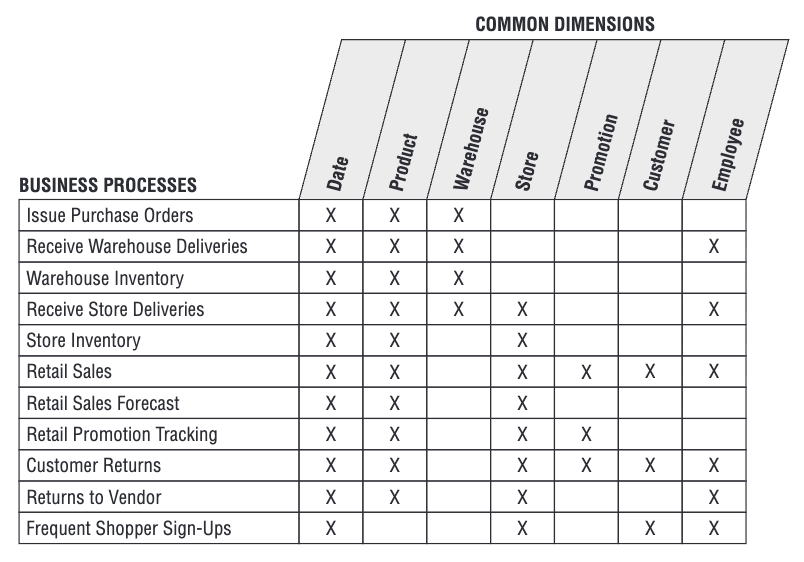

# Integration via Conformed Dimensions

## Conformed Dimensions

Dimension tables được gọi là “conformed” khi các thuộc tính của chúng trong nhiều bảng dimension khác nhau có cùng tên cột và domain contents. Nhờ vậy, dữ liệu từ các fact table khác nhau có thể được gộp vào chung một báo cáo bằng cách dùng các thuộc tính đã được “conform” này.

Khi một thuộc tính conformed được dùng làm “row header” (tức là cột để GROUP BY trong truy vấn SQL), thì kết quả từ các fact table khác nhau sẽ tự canh thẳng hàng với nhau trong một báo cáo dạng drill-across. Đây chính là cốt lõi của việc tích hợp trong hệ thống DW/BI của doanh nghiệp.

Conformed dimensions được định nghĩa một lần duy nhất, thường với sự tham gia của bộ phận business + data governance. Sau đó, chúng được dùng lại cho nhiều fact table. Điều này vừa đảm bảo phân tích nhất quán, vừa giảm chi phí phát triển về sau.


## **Ví dụ: Conformed Dimension – Customer**

Giả sử doanh nghiệp có 2 business process:

* **Sales**: `fact_sales`
* **Support / Ticket:** `fact_support`

Hai quy trình này _đến từ hai hệ thống khác nhau_, mỗi team tự build dimension riêng:

**Version 1 – Không Conformed**

<pre><code><strong>dim_customer_sales
</strong>-------------
| customer_id | name        | segment | ... |
|-------------|-------------|---------|-----|
| 1001        | John Doe    | VIP     | ... |
| 1002        | Mary Smith  | Regular | ... |
</code></pre>

<pre><code><strong>dim_customer_support
</strong>-------------
| customer_id | full_name    | cust_type | ... |
|-------------|--------------|-----------|-----|
| 1001        | Johnathan D. | Premium   | ... |
| 1002        | M. Smith     | Normal    | ... |
</code></pre>

Các bảng này có tên cột khác, giá trị khác nhau nhưng mô tả cùng domain (`VIP` vs `Premium`, `Regular` vs `Normal`) dẫn tới không thể drill-across giữa sales & support.

**Version 2 – Sau khi được Conformed**

<pre><code><strong>dim_customer_conformed
</strong>-------------
| customer_id | customer_name | customer_segment  | ... |
|-------------|----------------|------------------|-----|
| 1001        | John Doe       | VIP              | ... |
| 1002        | Mary Smith     | Regular          | ... |

</code></pre>

<pre><code><strong>dim_customer_support_copy (bản replicate/subset nhưng conformed)
</strong>-------------
| customer_id | customer_name | customer_segment  | ... |
|-------------|----------------|------------------|-----|
| 1001        | John Doe       | VIP              | ... |
| 1002        | Mary Smith     | Regular          | ... |

</code></pre>

**Điểm quan trọng theo Kimball:**

* Không cần phải _1 bảng duy nhất_
* Hai bảng khác nhau vẫn được coi là conformed
* Miễn là cùng key, cùng thuộc tính, cùng domain, cùng meaning

**Bây giờ ta có thể đặt câu hỏi:**

> “VIP customers trong tháng này có mua nhiều hơn số ticket support họ mở không?”

<pre><code><strong>fact_sales
</strong>-------------
| customer_id | sales_amount | month    |
|-------------|--------------|----------|
| 1001        | 5000         | 2024-10  |
| 1002        | 1200         | 2024-10  |
</code></pre>

Và ta sẽ sử dụng truy vấn:

<pre><code><strong>fact_support
</strong>-------------
| customer_id | ticket_count | month    |
|-------------|--------------|----------|
| 1001        | 3            | 2024-10  |
| 1002        | 1            | 2024-10  |
</code></pre>

```sql
-- Pass 1: Sales
SELECT customer_segment, SUM(sales_amount) AS total_sales
FROM fact_sales s
JOIN dim_customer_conformed c USING (customer_id)
GROUP BY customer_segment;

-- Pass 2: Support
SELECT customer_segment, COUNT(*) AS total_tickets
FROM fact_support t
JOIN dim_customer_support_copy c USING (customer_id)
GROUP BY customer_segment;
```

Hai kết quả **align 100%** vì segment giống nhau, đây chính là giá trị của conformed dimension.



## **Conformed Dimension không có nghĩa là một bảng dimension duy nhất được dùng chung bởi nhiều fact.**

Conformed nghĩa là bất kỳ dimension nào, dù nằm trong một bảng hay được nhân bản thành nhiều bảng khác nhau, đều chia sẻ cùng một chuẩn về meaning, cấu trúc thuộc tính và domain giá trị. Khi các fact table join vào những dimension đã được chuẩn hóa này, dữ liệu có thể drill-across và align chính xác. Conformed dimensions có thể tồn tại dưới nhiều dạng như identical copy, shrunken rollup (subset cột), subset hàng, hoặc được replicate vật lý/logic — miễn là các thuộc tính chung giống nhau 100%. Bản chất của conformed dimension là sự thống nhất logic, chứ không phải sự chia sẻ vật lý. Trong các chương sau của cuốn sách, tác giả sẽ đề cập một cách rõ ràng hơn về Conformed Dimension.


<details>

<summary><i class="fa-note">:note:</i> Conformed Dimensions vs Conformed Facts</summary>

Về cơ bản Conformed Dimensions và Conformed Facts đều mô tả về sự thống nhất trên ngữ nghĩa của tên, của giá trị trên các bảng. Tuy nhiên chúng mô tả sự thống nhất trên các phương diện khác nhau.

1.  Conformed Dimension mô tả sự thống nhất về “**cách mô tả thế giới**”:&#x20;

    * Bộ phận Sales gọi khách VIP là “VIP”.
    * Bộ phận Marketing cũng gọi khách VIP là “VIP”.
    * Ai cũng dùng cùng mã `customer_id`.
    * Cùng định nghĩa `customer_segment`.

    Tất cả đều nói cùng một ngôn ngữ mô tả về khách hàng. Để nhiều fact JOIN, DRILL-ACROSS sẽ ăn khớp nhau trên các báo cáo.
2.  Conformed Fact mô tả sự thống nhất về “**cách đo lường**”:&#x20;

    * Sales Online tính doanh thu = price × quantity
    * Sales Store cũng dùng đúng công thức đó
    * Cả hai cùng grain “order\_line”
    * Cùng dimension keys

    Tất cả đều đo lường cùng một định nghĩa sự kiện theo một chuẩn.

</details>

## Shrunken Dimensions

Shrunken dimensions là các conformed dimensions được tạo bằng cách lấy một phần của hàng và/hoặc cột từ dimension gốc. Rút gọn có thể theo:

* cột (column subset),
* hàng (row subset),
* hoặc cả hai.

Nó vẫn là conformed vì các thuộc tính chung giữ nguyên meaning + value, dùng được cho drill-across.

Shrunken dimension xuất hiện khi:

* cần xây aggregate fact table
* hoặc khi business process ở grain cao hơn
* hoặc khi mỗi business unit chỉ cần một phần của product

## Drilling Across

Drilling across đơn giản là việc chạy những truy vấn riêng biệt lên hai hoặc nhiều fact table khác nhau, trong đó row header của mỗi truy vấn đều trên một tập conformed dimensions. Khi đó, kết quả từ các truy vấn sẽ dễ dàng được align và merge lại với nhau dựa trên row header.

<details>

<summary><i class="fa-clipboard-question">:clipboard-question:</i> Tại sao cần Drilling Across?</summary>

Thay vì JOIN trực tiếp nhiều fact table với nhau với hàng tá vấn đề như sai logic, query nặng, tính toán chậm, sai grain, khó maintain,... thì Kimball khuyến khích chuẩn hóa thông qua conformed dimensions. Sau đó query từng fact riêng, GROUP BY cùng conformed dimension attributes và để GROUP BY cùng conformed dimension attributes. Kimball gọi đó là Drilling Across.

</details>

## Value Chain

Value Chain xác định chuỗi các business process diễn ra một cách tự nhiên trong một tổ chức. Mỗi bước trong value chain sẽ tạo ra ít nhất một atomic fact riêng (có thể là transaction hoặc snapshot facts).


## **Ví dụ:**

Retail: Purchasing → Warehousing → Retail Sales

Finance: Budgeting → Commitment → Payment

Fulfillment: Order → Pick → Pack → Ship → Deliver&#x20;


<details>

<summary><i class="fa-clipboard-question">:clipboard-question:</i> Tại sao mỗi business process lại tạo ra ít nhất một atomic fact riêng?</summary>

Theo quy trình 4 bước để xây dựng dimensional model, bước đầu tiên business process sẽ quyết định tất cả. Các business process khác nhau sẽ có grain khác nhau, dimension khác nhau dẫn tới sẽ có những bảng atomic facts khác nhau. KPI và team quản lý thường cũng khác nhau nên những bảng facts phái sinh (snapshot, aggregate) cũng khác nhau.&#x20;

</details>

## Enterprise Data Warehouse Bus Architecture

Enterprise data warehouse bus architecture cung cấp một **incremental approach** để xây dựng hệ thống DW/BI ở cấp doanh nghiệp. Kiến trúc này chia nhỏ quá trình lập kế hoạch DW/BI thành các phần nhỏ dễ quản lý bằng cách tập trung vào _từng business process một_, đồng thời vẫn đảm bảo _tính tích hợp_ nhờ sử dụng conformed dimensions được chuẩn hoá và tái dùng giữa các process.

Bus architecture vừa đưa ra khung kiến trúc tổng thể, vừa chia chương trình triển khai thành các phần độc lập (từng dòng trong bus matrix), giúp các team dễ làm theo cách agile.&#x20;


## Câu hỏi "Enterprise Data Warehouse Bus Architecture là gì?" đã được trả lời ở trên. Còn Nó trông như thế nào? Nó được thiết kế ra sao? Nó hoạt động như thế nào?

Chưa có câu trả lời ở đây :joy:. Tớ thấy mấy chương sau có giải thích nhưng để tớ đọc đã :))) Lúc nào có tớ bổ sung.


## Enterprise Data Warehouse Bus Matrix

Enterprise data warehouse bus matrix là công cụ quan trọng để thiết kế và truyền đạt kiến trúc enterprise data warehouse bus architecture. Nó là một ma trận cho thấy toàn doanh nghiệp có những business process nào và dùng những dimension nào.

<figure><figcaption><p>Ví dụ của một bus matrix</p></figcaption></figure>

Ta có thể sử dụng bus matrix phục vụ nhu cầu design theo hai hướng:

* Quét theo từng hàng (business process) để xác định chính xác business process đó cần những dimension nào, từ đó quyết định chi tiết thiết kế cho các dimension (thuộc tính nào cần, grain nào phù hợp) và cho fact table (facts nào xuất hiện, grain của fact là gì).
* Quét theo từng cột (dimension) để xem dimension đó được nhiều process sử dụng hay không. Nếu có, dimension đó phải được chuẩn hóa thành conformed dimension, tức là thống nhất definition, domain value, khóa, và thuộc tính – để hỗ trợ tích hợp cross-process.

Ngoài yếu tố kỹ thuật, bus matrix còn được dùng để sắp xếp thứ tự ưu tiên các dự án DW/BI, tracking và triển khai tuần tự.

## Detailed Implementation Bus Matrix

Detailed implementation bus matrix là phiên bản chi tiết hơn của bus matrix, trong đó mỗi hàng business process được mở rộng ra thành các fact table hoặc OLAP cube cụ thể. Ở mức chi tiết này, có thể ghi rõ grain và danh sách các facts cho từng fact table.

## Opportunity/Stakeholder Matrix

Sau khi đã xác định được các hàng trong enterprise data warehouse bus matrix, bạn có thể phác thảo một ma trận khác bằng cách thay các cột dimension bằng các chức năng nghiệp vụ (như marketing, sales, finance).

Sau đó, bạn tô đậm các ô để thể hiện bộ phận nghiệp vụ nào quan tâm đến business process nào trong từng hàng của ma trận. Ma trận _opportunity/stakeholder_ này giúp xác định những nhóm nghiệp vụ nào cần được tham gia vào quá trình thiết kế mang cho từng business process.

## My Summary

Về tổng thể, chương này và các chương đầu của cuốn sách chủ yếu giới thiệu ngắn gọn các định nghĩa nền tảng. Do cách tiếp cận top-down, nhiều khái niệm trong giai đoạn này khá trừu tượng và mang tính khái quát, bởi tác giả sẽ giải thích chi tiết hơn ở các chương sau thông qua ví dụ cụ thể.

Về mặt nội dung, chương này muốn đưa ra cái nhìn tổng quan về kiến trúc và cách tiếp cận khi xây dựng một hệ thống Data Warehouse/BI ở cấp doanh nghiệp. Theo Kimball, một DW thực chất là tập hợp của nhiều business process khác nhau, diễn ra tự nhiên theo value chain của tổ chức. Việc xây dựng DW là quá trình triển khai tuần tự dimensional model cho từng business process, mỗi process được mô hình hóa qua các bảng atomic fact, các fact phái sinh và những dimension liên quan.

Để có thể tích hợp được các business process riêng lẻ đó, toàn bộ kiến trúc phải dựa trên một bộ Conformed Dimensions dùng chung. Việc xác định và xây dựng các conformed dimensions đòi hỏi sự phối hợp giữa nhiều bên trong doanh nghiệp và thường là một nỗ lực dài hơi. Kimball đề xuất sử dụng Bus Matrix và Bus Architecture như một framework để xác định các điểm cần chuẩn hóa, ưu tiên thứ tự triển khai, và tạo ra một “hợp đồng chung” cho tất cả các team trong quá trình xây dựng DW.

