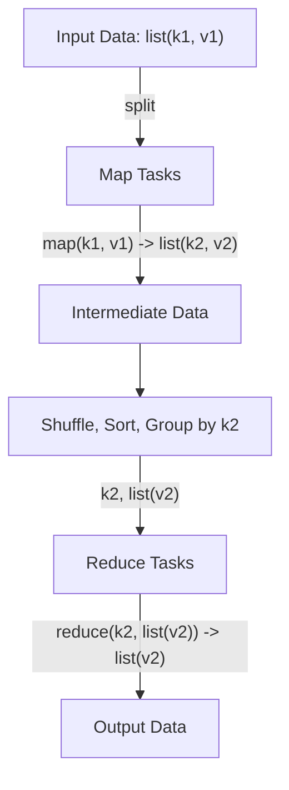
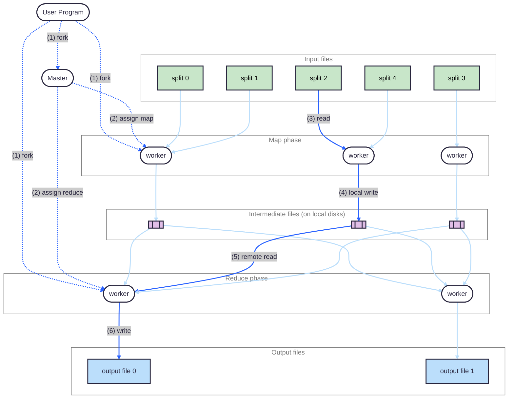
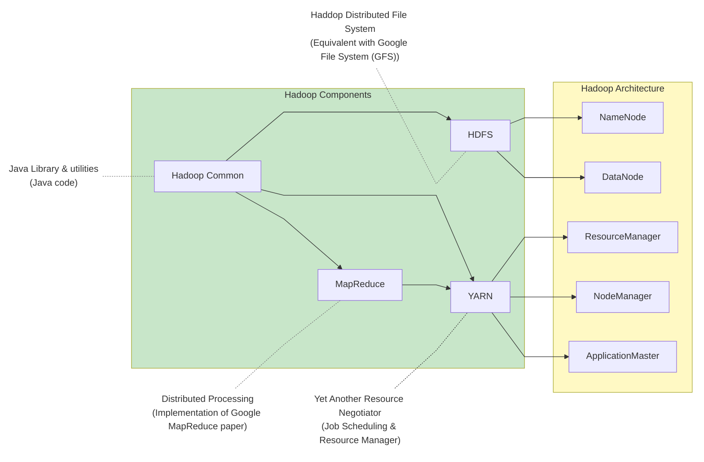
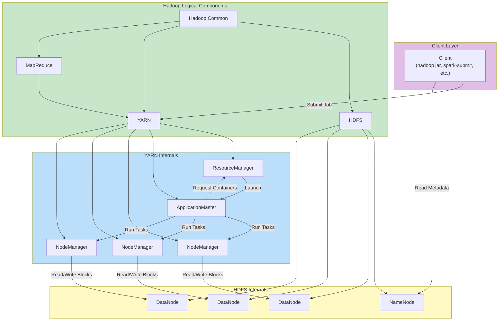
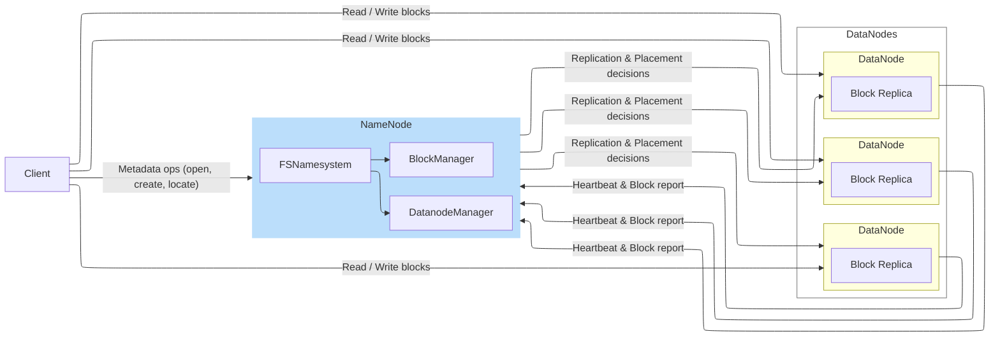
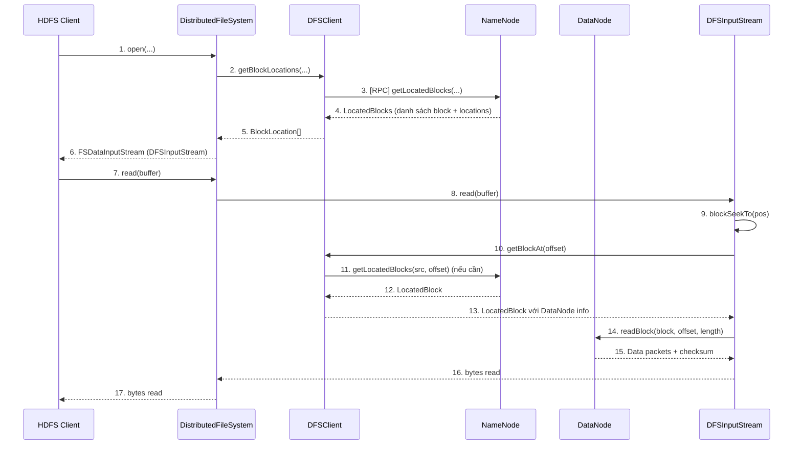
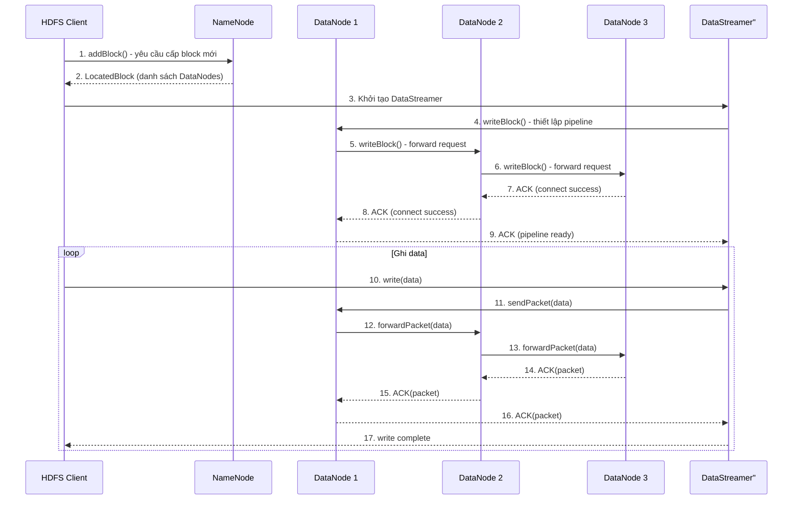
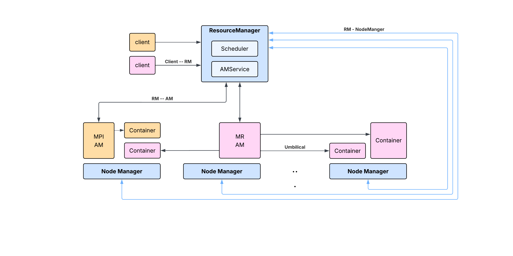

# MapReduce

## Introduction

Trước khi MapReduce ra đời, Google phải chạy rất nhiều chương trình khác nhau như crawl web, xây dựng inverted indies, xử lý graph hay phân tích log. Điểm chung của các chương trình này là dữ liệu quá lớn nên không thể chạy trên một máy, mà buộc phải chia ra chạy trên rất nhiều máy. Vấn đề là dù logic xử lý thường không phức tạp, developer vẫn phải tự lo hàng loạt chuyện khó: chia việc cho nhiều máy, phân phối dữ liệu, xử lý máy chậm hoặc máy chết, và đảm bảo chương trình vẫn chạy xong. Kết quả là phần lớn công sức không nằm ở việc “xử lý dữ liệu như thế nào”, mà nằm ở việc “làm sao cho chương trình phân tán chạy được”.

Từ thực tế đó, Google nhận ra rằng đa số các chương trình này thực ra có cùng một pattern: mỗi lần chỉ xử lý từng bản ghi riêng lẻ, tạo ra kết quả trung gian là một cặp key-value, rồi sau đó gom các kết quả cùng key lại với nhau để tổng hợp. Dựa trên quan sát này, MapReduce được xây dựng như một cách lập trình đơn giản hóa mọi thứ: developer chỉ cần viết hai hàm là `map` và `reduce`.&#x20;

Khi quá trình tính toán bị giới hạn trong khuôn khổ này, hệ thống bên dưới có thể tự lo việc chia việc, phân phối dữ liệu và xử lý lỗi bằng cách chạy lại các phần bị hỏng. Nhờ đó, developer không còn phải trực tiếp đối mặt với sự phức tạp của hệ thống phân tán, mà chỉ tập trung vào việc mô tả dữ liệu được biến đổi như thế nào.

<details>

<summary>Vì sao crawl và inverted index có thể được mô hình hóa theo MapReduce?</summary>

Paper MapReduce không đi sâu vào từng bài toán cụ thể như crawl hay inverted index, nhưng dựa trên những ví dụ được nhắc tới, có thể suy đoán rằng việc xây dựng inverted index gắn chặt với nhu cầu của search engine đời đầu của Google. Ở thời điểm đó, có khả năng bài toán cốt lõi của tìm kiếm là trả lời các truy vấn đơn giản kiểu “từ khóa này xuất hiện ở những trang nào”, thay vì các truy vấn phức tạp hay xếp hạng tinh vi như về sau. Để trả lời nhanh dạng câu hỏi này ở quy mô rất lớn, cách tự nhiên nhất là tổ chức dữ liệu theo keyword, mỗi keyword trỏ tới danh sách các page chứa nó. Nói cách khác, dữ liệu cuối cùng được sắp xếp theo _keyword_, chứ không theo _page_.

Từ góc nhìn đó, có thể hình dung rằng mỗi trang web được xử lý độc lập: nội dung trang được đọc, các từ khóa được trích xuất, và với mỗi từ khóa thì phát ra một cặp liên hệ giữa từ đó và trang chứa nó. Cách xử lý này không cần biết đến các trang khác, cũng không cần giữ trạng thái chung, nên rất dễ chia ra chạy song song. Sau bước này, để tạo inverted index, hệ thống chỉ cần gom tất cả các kết quả liên quan đến cùng một từ khóa lại với nhau và kết hợp chúng thành một danh sách các trang. Việc “gom theo khóa rồi tổng hợp” này trông rất giống với vai trò của reduce.

Theo cách hiểu này, crawl và xây dựng inverted index không phải là những bài toán được thiết kế cho MapReduce ngay từ đầu, mà là những bài toán mà cấu trúc tự nhiên của chúng tình cờ khớp với mô hình map–reduce: xử lý từng record độc lập, sau đó tổ chức lại kết quả theo một khóa chung. Điều này giúp giải thích vì sao Google có thể dùng MapReduce như một abstraction chung cho nhiều loại computation khác nhau, dù paper không mô tả chi tiết từng trường hợp.

Cách tổ chức inverted index không chỉ xuất hiện ở Google thời kỳ đầu, mà sau này vẫn được dùng rộng rãi trong các hệ thống tìm kiếm và cơ sở dữ liệu. Và cá nhân tớ nghĩ nó vẫn đang là một thành phần chính trong search engine hiện tại của Google, mục tiêu là giới hạn lại số lượng candidate một cách nhanh chóng. Ví dụ, các search engine như Elasticsearch cũng dựa trên inverted index để phục vụ full-text search, dù việc xây dựng và cập nhật index ngày nay phức tạp hơn nhiều. Tương tự, PostgreSQL trong các tính năng full-text search cũng sử dụng inverted index, thông qua các loại index như GIN, để ánh xạ từ term sang tập bản ghi liên quan.

</details>

## Programming Model

Quá trình tính toán trong MapReduce nhận vào một tập các cặp key/value đầu vào và tạo ra một tập các cặp key/value đầu ra. Từ góc nhìn của người dùng, MapReduce chỉ yêu cầu mô tả quá trình tính toán thông qua hai hàm: **Map** và **Reduce**.

Hàm `map(k1, v1) → list(k2, v2)` (do người dùng viết) nhận vào một cặp key/value đầu vào và tạo ra một tập các cặp key/value trung gian. Sau đó, thư viện MapReduce sẽ **tự động gom nhóm** tất cả các giá trị trung gian có cùng key lại với nhau và chuyển chúng cho hàm Reduce.

Hàm `reduce(k2, list(v2)) → list(v2)` (cũng do người dùng viết) nhận vào một key trung gian cùng toàn bộ các giá trị tương ứng với key đó, rồi gộp chúng lại để tạo ra kết quả đầu ra (thường nhỏ hơn dữ liệu trung gian). Thông thường, mỗi lần gọi Reduce chỉ sinh ra 0 hoặc 1 giá trị đầu ra. Các giá trị trung gian được truyền vào Reduce thông qua iterator, cho phép xử lý những tập dữ liệu rất lớn mà không cần tải toàn bộ vào bộ nhớ.

Trong MapReduce, hàm Map luôn xử lý từng record một cách độc lập và không giữ bất kỳ trạng thái nào giữa các lần gọi. Nhờ đặc tính này, nếu một task Map bị lỗi, framework có thể chạy lại task đó mà không ảnh hưởng đến các record khác.

Hàm Reduce có thể sử dụng state trong quá trình xử lý, nhưng state này chỉ tồn tại tạm thời trong phạm vi của một key. Reduce xử lý các giá trị tương ứng với cùng một key theo kiểu tuần tự thông qua iterator; khi Reduce hoàn tất cho key đó, state sẽ bị loại bỏ. Nếu Reduce gặp lỗi, nó sẽ được chạy lại từ đầu dựa trên dữ liệu trung gian, thay vì phục hồi state đã tính trước đó.

Framework MapReduce chịu trách nhiệm toàn bộ các công việc phía sau, bao gồm phân phối và retry các task Map và Reduce trên các worker, cũng như các bước trung gian giữa Map và Reduce như group, sort theo key, shuffle dữ liệu qua mạng và phân phối mỗi key về đúng node để xử lý. Nhờ vậy, người dùng gần như không cần quan tâm đến các chi tiết phức tạp của hệ thống phân tán.



Một điểm quan trọng trong mô hình MapReduce là **kiểu (domain) của dữ liệu đầu vào và đầu ra không nhất thiết phải giống nhau**. Cụ thể, các cặp key/value đầu vào của hàm Map có thể thuộc một domain hoàn toàn khác với các cặp key/value đầu ra cuối cùng của hàm Reduce. Hàm Map đóng vai trò chuyển đổi dữ liệu từ domain đầu vào sang một domain mới, thông qua việc phát ra các cặp key/value trung gian.

Ngược lại, **các key/value trung gian do Map tạo ra và các key/value đầu ra của Reduce luôn thuộc cùng một domain**. Reduce chỉ tổng hợp và rút gọn dữ liệu trong domain đó, chứ không tiếp tục chuyển sang domain khác. Ví dụ, trong bài toán word count, Map chuyển dữ liệu từ domain “document” sang domain “word”, còn Reduce chỉ tổng hợp số lần xuất hiện của mỗi word trong cùng domain này. Thiết kế này cho phép framework dễ dàng thực hiện các bước group, sort và shuffle theo key, đồng thời giữ cho vai trò của Map và Reduce được phân tách rõ ràng.

Trong paper gốc, tác giả cũng đề cập rằng implementation bằng C++ sử dụng key và value dưới dạng string để giảm độ phức tạp của runtime. Việc chuyển đổi và diễn giải dữ liệu sang kiểu logic phù hợp được đẩy sang code của người dùng trong Map và Reduce, đánh đổi lại là giảm bớt type safety để đổi lấy một hệ thống đơn giản và dễ mở rộng.

<details>

<summary>Tại sao Paper không lựa chọn định nghĩa function sử dụng <code>Template</code>  mà lại là <code>String</code></summary>

Nothing here... đang tìm câu trả lời hợp lý

</details>

### Examples

Paper đưa ra một số ví dụ nhằm minh họa rằng MapReduce không bị ràng buộc vào một loại bài toán cụ thể, mà có thể biểu diễn nhiều kiểu computation khác nhau thông qua việc thay đổi logic của hai hàm Map và Reduce. Trong nhiều trường hợp, một trong hai hàm có thể rất đơn giản hoặc chỉ đóng vai trò hình thức, trong khi toàn bộ logic chính nằm ở hàm còn lại. Khi Reduce chỉ thực hiện việc phát lại dữ liệu, MapReduce có thể được dùng cho các bài toán lọc, ánh xạ hoặc sắp xếp dữ liệu ở quy mô lớn. Ngược lại, khi Map chỉ tạo ra các key/value trung gian đơn giản, Reduce trở thành nơi thực hiện các phép tổng hợp và xây dựng cấu trúc dữ liệu. Các ví dụ dưới đây được chọn để cho thấy sự linh hoạt đó, đồng thời làm rõ vai trò của framework trong việc tự động group, sort và shuffle dữ liệu giữa Map và Reduce.

#### **Word** Frequency

Để minh họa cách người dùng làm việc với MapReduce, paper đưa ra ví dụ kinh điển là bài toán **đếm số lần xuất hiện của mỗi từ trong một tập tài liệu lớn**.

Trong ví dụ này, mỗi tài liệu được xem như một bản ghi đầu vào, với key là tên tài liệu và value là nội dung của tài liệu. Người dùng định nghĩa hàm `map` sao cho với mỗi từ xuất hiện trong nội dung tài liệu, hàm này phát ra một cặp key/value trung gian gồm từ đó và giá trị `"1"`:

```
map(String key, String value):
  // key: document name
  // value: document contents
  for each word w in value:
    EmitIntermediate(w, "1");
```

Sau khi tất cả các hàm Map hoàn thành, framework MapReduce sẽ tự động gom nhóm tất cả các giá trị trung gian theo từng từ. Hàm `reduce` sau đó được gọi một lần cho mỗi từ, nhận vào từ đó làm key cùng với danh sách các giá trị `"1"` tương ứng, và cộng chúng lại để tạo ra tổng số lần xuất hiện của từ đó trong toàn bộ tập tài liệu:

```
reduce(String key, Iterator values):
  // key: a word
  // values: a list of counts
  int result = 0;
  for each v in values:
    result += ParseInt(v);
  Emit(AsString(result));
```

Trong ví dụ này, hàm Map chỉ chịu trách nhiệm phát hiện sự xuất hiện của từng từ, còn hàm Reduce chịu trách nhiệm tổng hợp các kết quả trung gian theo từ. Người dùng không cần tự xử lý việc phân phối dữ liệu, gom nhóm theo key hay chạy song song; toàn bộ các bước này được framework MapReduce đảm nhiệm.

Ngoài việc định nghĩa hai hàm Map và Reduce, người dùng cần cung cấp thêm một _mapreduce_\
_specification object_, trong đó khai báo tên các file đầu vào, đầu ra và một số tham số tùy chỉnh. Sau đó, chương trình được liên kết với thư viện MapReduce (được hiện thực bằng C++) và framework sẽ tự động thực thi toàn bộ quá trình xử lý phân tán.

#### **Distributed Grep**

Trong bài toán Distributed Grep, mỗi dòng dữ liệu có thể được xử lý độc lập. Hàm Map đọc từng dòng và chỉ lấy ra những dòng khớp với pattern được chỉ định. Hàm Reduce trong trường hợp này không thực hiện tổng hợp nào cả, mà chỉ đơn giản trả lại dữ liệu trung gian như kết quả cuối cùng. Ví dụ này cho thấy MapReduce không chỉ dùng cho aggregation, mà còn phù hợp với các bài toán lọc dữ liệu ở quy mô lớn.

#### **Count of URL Access Frequency**

Bài toán này tương tự như word count, nhưng thay vì đếm từ, hệ thống đếm số lần mỗi URL được truy cập. Hàm Map xử lý log truy cập và với mỗi request ouput ra cặp `<URL,1>`. Framework gom các giá trị theo `URL`, và hàm Reduce cộng tất cả các giá trị tương ứng để tạo ra cặp `<URL, total_access>`. Đây là một ví dụ điển hình của aggregation theo key.

#### **Reverse Web-Link Graph**

Trong ví dụ này, mục tiêu là xây dựng đồ thị liên kết ngược của web. Hàm Map duyệt từng trang nguồn và với mỗi liên kết tới một trang đích, phát ra cặp `<target, source>`. Sau đó, Reduce gom tất cả các `source` tương ứng với cùng một `target` và kết hợp chúng thành danh sách. Kết quả cuối cùng cho biết mỗi trang được trỏ tới từ những trang nào. Ví dụ này có thể là một mảnh ghép nền tảng để xây dựng thuật toán kinh điển của Google là **PageRank**.

#### **Term-Vector per Host**

Ví dụ này mở rộng bài toán xử lý văn bản theo hướng tổng hợp theo host. Hàm Map tạo term vector cho từng document và gắn nó với hostname tương ứng (được trích từ URL). Reduce nhận toàn bộ các term vector của cùng một host, cộng chúng lại và loại bỏ các term xuất hiện không thường xuyên, để tạo ra một term vector đại diện cho toàn bộ host đó. Ví dụ này minh họa MapReduce có thể xử lý các cấu trúc dữ liệu phức tạp hơn là chỉ số đếm đơn giản.

#### **Inverted Index**

Trong bài toán xây dựng inverted index, hàm Map phân tích từng document và phát ra các cặp `<word, documentID>`. Reduce nhận tất cả các `documentID` tương ứng với cùng một `word`, sắp xếp chúng và kết hợp thành danh sách. Tập các cặp `<word, list(documentID)>` tạo thành inverted index, cho phép tra cứu nhanh các document chứa một từ nhất định. Ví dụ này cho thấy cách MapReduce tự nhiên phù hợp với việc tổ chức lại dữ liệu theo keyword.

#### **Distributed Sort**

Bài toán Distributed Sort sử dụng MapReduce để sắp xếp dữ liệu ở quy mô lớn. Hàm Map trích xuất key từ mỗi record và phát ra cặp `<key, record>`. Reduce không thay đổi dữ liệu mà chỉ phát lại các cặp này. Việc dữ liệu đầu ra được sắp xếp đúng thứ tự dựa vào cơ chế partition và ordering do framework MapReduce cung cấp, chứ không nằm trong logic của Reduce. Ví dụ này nhấn mạnh rằng MapReduce không chỉ là một mô hình lập trình, mà còn cung cấp các đảm bảo về phân phối và thứ tự dữ liệu.

## Implementation

Paper cho rằng có thể thực hiện nhiều cách để triển khai khác nhau của MapReduce interface và lựa chọn đúng đắn tùy thuộc vào môi trường (runtime, resources,...) và giới thiệu về môi trường triển khai MapReduce ở Google với một số điểm đáng lưu ý như sau:

* Triển khai trên hằng trăm, hàng ngàn PCs kết nối với nhau qua Ethernet nên việc một vài machine failed là chuyện thường gặp.
* Mỗi machine có ổ đĩa attach trực tiếp vào từng máy riêng và chúng được quản lý thông qua một distributed file system - là GFS (Google File System) được giới thiệu qua một paper khác của Google tại thời điểm đó. File system này sử dụng cơ chế replication để đảm bảo availability và reliability khi có machine fail.
* Users sử dụng một scheduling system để submit jobs. Mỗi jobs này được chia thành tập các tasks và scheduler phân phối chúng tới các máy khả dụng trong cluster.

### Execution Overview

Trong MapReduce, các lời gọi hàm Map được phân tán trên nhiều máy bằng cách **tự động chia dữ liệu đầu vào thành M splits**. Mỗi split có thể được xử lý độc lập, cho phép các hàm Map chạy song song trên những máy khác nhau. Sau khi giai đoạn Map hoàn tất, các lời gọi hàm Reduce được phân phối bằng cách **chia không gian key trung gian thành R partitions**, thông qua một hàm partition (ví dụ: `hash(key) mod R`). Số lượng partition (R) cũng như hàm partition được **cấu hình bởi người dùng**, từ đó quyết định cách dữ liệu trung gian được phân phối tới các worker Reduce.

Quá trình hoạt động được mô tả bởi sơ đồ dưới đây:



1. Khi chương trình MapReduce được khởi động, MapReduce library trong đó trước hết chia input files thành _M_ splits, mỗi split thường có kích thước từ 16MB đến 64MB (có thể điều chỉnh qua tham số cấu hình). Sau đó, nhiều bản sao của chương trình người dùng được khởi chạy trên các máy trong cluster.
2. Trong số các tiến trình bản sao được khởi chạy, một tiến trình được chọn làm **master**, các tiến trình còn lại là **worker**. Master tạo ra **M map task** (tương ứng với M input splits) và **R reduce task** (tương ứng với R partition của key space). Master theo dõi trạng thái của các worker và **gán map task hoặc reduce task cho các worker đang rảnh**, tùy vào giai đoạn thực thi của job.
3. Khi một worker được gán **map task**, nó đọc dữ liệu tương ứng với input split được chỉ định từ distributed file system. Worker phân tích dữ liệu đầu vào thành các cặp key/value và lần lượt truyền từng cặp cho hàm Map do người dùng định nghĩa. Các cặp key/value trung gian do Map sinh ra ban đầu được **buffer trong memory**.
4. Định kỳ, dữ liệu trung gian đang buffer được **ghi ra đĩa cục bộ của worker**, và được **chia thành R partition** theo hàm partition (ví dụ `hash(key) mod R`). Worker báo lại cho master **vị trí các file trung gian** này trên đĩa cục bộ, để master có thể thông báo cho các reduce worker sau đó.
5. Khi một reduce worker được master thông báo về vị trí dữ liệu trung gian mà nó cần xử lý, reduce worker sẽ **kéo dữ liệu từ các map worker thông qua network**, đọc các file trung gian từ đĩa cục bộ của những máy khác. Sau khi đã nhận đủ toàn bộ dữ liệu trung gian, reduce worker **sắp xếp dữ liệu theo key trung gian** để gom tất cả các giá trị cùng key lại với nhau. Nếu dữ liệu quá lớn không thể chứa trong bộ nhớ, reduce worker sử dụng **external sort**.
6. Reduce worker duyệt qua dữ liệu đã được sắp xếp. Với mỗi key trung gian, nó gọi hàm Reduce do người dùng định nghĩa, truyền vào key đó cùng toàn bộ các giá trị tương ứng thông qua iterator. Kết quả của hàm Reduce được **ghi tuần tự vào file output** tương ứng với reduce partition mà worker đang xử lý.
7. Khi tất cả map task và reduce task đều hoàn thành, master thông báo cho chương trình người dùng rằng quá trình MapReduce đã kết thúc. Lúc này, lời gọi MapReduce trong chương trình người dùng trả về.

<details>

<summary>Tớ có khá khá câu hỏi ở chỗ này.</summary>

1. **Vị trí thực thi của MapReduce library:**  Paper nói “MapReduce library chạy trong chương trình của user”. Cụ thể, library này chạy trong process nào ở đâu trong cluster hay ngoài cluster?
2. **Phân phối user code (map / reduce):** Map và Reduce functions của user được phân phối tới worker như thế nào? Mỗi worker có nhận cả hai hàm map và reduce hay chỉ nhận khi được assign task tương ứng? Chương trình user được replicate và khởi chạy trên tất cả worker, hay chỉ đóng vai trò client submit job?
3. **Chia input thành splits:** Việc chia input files thành splits được thực hiện theo cơ chế nào? Làm sao tránh việc split cắt ngang một record (ví dụ cắt giữa một dòng)? Cách chia splits có phụ thuộc vào định dạng file (text, binary, structured) hay không? So với Spark, MapReduce có cơ chế tương đương `InputFormat` / `RecordReader` không?
4. **Quyết định số lượng task:** Số lượng map task và reduce task được xác định ngay từ đầu hay có thể điều chỉnh trong quá trình chạy? Worker có được cố định vai trò (map-only / reduce-only) hay có thể chạy cả map và reduce task ở các thời điểm khác nhau?
5. **Khai thác locality giữa map và reduce:** Framework có cố gắng schedule reduce task trên worker đang giữ dữ liệu trung gian tương ứng để giảm network transfer không?
6. **Thời điểm bắt đầu reduce:** Reduce task có thể bắt đầu xử lý khi dữ liệu trung gian được fetch dần (incremental) hay phải đợi toàn bộ map task hoàn tất? Nếu reduce xử lý dữ liệu theo kiểu streaming (iterator), tại sao framework vẫn cần đợi đủ toàn bộ dữ liệu trung gian trước khi chạy reduce logic?
7. **Cơ chế shuffle dữ liệu:** Reduce worker kéo dữ liệu trung gian từ map worker bằng cơ chế gì? Có sử dụng RPC trực tiếp hay thông qua một giao thức/transport riêng?

</details>

Kết quả cuối cùng của job là **R file output**, mỗi file tương ứng với một reduce task. Thông thường, các file output này không cần được gộp lại mà sẽ được sử dụng trực tiếp làm đầu vào cho một MapReduce job khác hoặc cho các ứng dụng phân tán khác.

### Master Data Structures

Master duy trì một tập các cấu trúc dữ liệu dùng để theo dõi trạng thái của toàn bộ quá trình thực thi MapReduce. Trước hết, với mỗi map task và reduce task, master lưu trữ trạng thái thực thi của task đó (_idle_, _in-progress_, hoặc _completed_), kèm theo thông tin về worker đang được gán task trong trường hợp task đang chạy. Các cấu trúc dữ liệu này cho phép master nắm được bức tranh tổng thể về tiến độ của job và đưa ra quyết định phân phối lại task khi cần thiết.

Ngoài trạng thái của task, master còn lưu metadata về dữ liệu trung gian được tạo ra trong giai đoạn Map. Cụ thể, với mỗi map task đã hoàn thành, master ghi nhận vị trí và kích thước của **R partition dữ liệu trung gian** do map task đó sinh ra. Các thông tin này không chứa dữ liệu thực tế, mà chỉ mô tả nơi dữ liệu được lưu trữ trên các worker.

Metadata về dữ liệu trung gian được cập nhật ngay khi từng map task hoàn tất và được **incrementally push** tới các reduce worker đang ở trạng thái in-progress. Nhờ đó, reduce worker có thể biết chính xác cần lấy những partition nào và từ những worker nào, trong khi master chỉ đóng vai trò quản lý và phân phối metadata thay vì trực tiếp tham gia vào luồng dữ liệu.

### Fault Tolerance

Như tác giả có trình bày hình MapReduce hoạt động trên hàng trăm máy khác nhau, nên việc phải xử lý và kiểm soát việc một vài máy bị lỗi là điều hiển nhiên.

#### **Worker Failure**

Trong MapReduce, master theo dõi trạng thái của các worker thông qua cơ chế **heartbeat**. Master định kỳ gửi tín hiệu tới từng worker; nếu một worker không phản hồi trong một khoảng thời gian nhất định, worker đó sẽ bị đánh dấu là đã bị lỗi (failed).

Khi một worker bị lỗi, mọi task liên quan đến worker đó đều được xử lý lại theo cùng một nguyên tắc. Các map task hoặc reduce task đang chạy trên worker bị lỗi sẽ được đưa trở lại trạng thái _idle_ và sẵn sàng để được phân phối lại cho các worker khác. Đối với các map task đã hoàn thành trước đó trên worker bị lỗi, master cũng đặt lại trạng thái của chúng về _idle_ để đảm bảo chúng được thực thi lại.

Lý do các map task đã hoàn thành vẫn phải chạy lại là vì output của map task chỉ được lưu trên **local file system của worker**. Khi worker bị lỗi, các dữ liệu trung gian này không còn truy cập được nữa. Ngược lại, các reduce task đã hoàn thành **không cần phải chạy lại**, bởi vì output của reduce task đã được ghi vào **global file system**, nơi đảm bảo tính sẵn sàng và bền vững của dữ liệu.

Trong trường hợp một map task ban đầu được thực thi bởi worker A, sau đó phải được thực thi lại bởi worker B do worker A bị lỗi, master sẽ thông báo cho tất cả các reduce worker đang chạy. Mỗi reduce worker sẽ đảm bảo rằng nó đọc dữ liệu trung gian từ worker mới nhất thực thi map task. Bất kỳ reduce task nào chưa đọc dữ liệu từ worker A sẽ đọc dữ liệu tương ứng từ worker B thay thế.

Nhờ cơ chế chạy lại task đơn giản này, MapReduce có khả năng chịu đựng các sự cố ở quy mô lớn. Paper đưa ra ví dụ về một MapReduce operation trong đó việc bảo trì mạng khiến nhóm khoảng 80 máy trong cluster trở nên không thể truy cập trong vài phút. Trong tình huống đó, master chỉ cần thực thi lại các task trên những worker không truy cập được và tiếp tục tiến trình xử lý, cuối cùng hoàn thành toàn bộ MapReduce operation.

<details>

<summary>Tại sao cần thực thi lại toàn bộ reduce tasks đang chạy khi chỉ có 1 map task bị failed? Như thế có hiệu quả hay không?</summary>

Nothing herer... đang đi tìm câu trả lời.

</details>

#### Master Failure

Paper chỉ ra rằng về mặt kỹ thuật, việc tăng khả năng recovery khi master gặp lỗi là tương đối đơn giản: master có thể định kỳ ghi lại các checkpoint chứa toàn bộ các data structure mà nó quản lý (trạng thái task, metadata của dữ liệu trung gian, v.v.). Khi master bị lỗi, một bản sao mới có thể được khởi động và tiếp tục quá trình thực thi từ checkpoint gần nhất.

Tuy nhiên, trong implementation tại thời điểm viết paper, MapReduce **không tự động áp dụng cơ chế này**. Lý do là vì hệ thống chỉ có một master duy nhất và tác giả cho rằng xác suất master bị lỗi là thấp hơn nhiều so với worker. Do đó, để giữ cho hệ thống đơn giản, khi master bị lỗi, MapReduce sẽ **hủy toàn bộ quá trình tính toán và trả về lỗi**.

Trong trường hợp này, client (người dùng hoặc hệ thống gọi MapReduce) có thể phát hiện việc computation bị abort và **chủ động retry lại toàn bộ MapReduce job** nếu cần thiết. Đây là một lựa chọn thiết kế thể hiện rõ triết lý của MapReduce: ưu tiên đơn giản hóa execution và fault handling, chấp nhận việc retry ở mức coarse-grained thay vì xây dựng cơ chế recovery phức tạp cho master.

#### Semantics in the Presence of Failures

MapReduce cho phép các map và reduce task được thực thi lại nhiều lần do failure hoặc speculative execution. Để đảm bảo tính đúng đắn của kết quả, framework dựa trên hai giả định chính: (1) mỗi task có input và output độc lập, và (2) các hàm map và reduce do người dùng định nghĩa là deterministic.

Mỗi task ghi output của mình vào các file tạm riêng biệt. Kết quả chỉ được công nhận khi task hoàn tất và output được commit một cách atomic (thông qua thao tác rename trên file system). Do đó, dù cùng một task có thể được chạy lại nhiều lần trên các worker khác nhau, trạng thái cuối cùng của file system chỉ phản ánh kết quả của đúng một lần thực thi.

Khi map và reduce là deterministic, toàn bộ MapReduce job cho ra kết quả tương đương với một lần thực thi tuần tự không lỗi của chương trình. Trong trường hợp các hàm không deterministic, framework chỉ đảm bảo rằng output của mỗi reduce task tương ứng với kết quả của một execution tuần tự nào đó, nhưng các reduce task khác nhau có thể quan sát output từ những execution khác nhau của cùng một map task.

Thiết kế này cho phép MapReduce xử lý lỗi bằng cách retry và re-assign task một cách đơn giản, đánh đổi sự linh hoạt của user code để đạt được khả năng chịu lỗi ở mức coarse-grained.

### Locality

Network bandwidth là tài nguyên khan hiếm trong môi trường cluster của Google. Do dữ liệu đầu vào được lưu trữ trong GFS và được replicate trên nhiều máy, MapReduce cố gắng tối đa hóa việc đọc dữ liệu cục bộ. Master ưu tiên schedule map task trên worker đang chứa replica của input split tương ứng; nếu không thể, nó sẽ chọn worker nằm gần replica đó trong topology mạng. Nhờ tối ưu locality này, khi chạy các job lớn trên phần lớn cluster, đa số dữ liệu đầu vào được đọc trực tiếp từ disk local và gần như không tiêu tốn băng thông mạng.

### Task Granularity

MapReduce chia pha Map thành `M` task và pha Reduce thành `R` task, với mục tiêu để `M` và `R` lớn hơn nhiều so với số worker. Việc mỗi worker thực thi nhiều task nhỏ giúp cải thiện load balancing động và tăng tốc recovery khi có worker bị lỗi, vì các task đã hoàn thành có thể dễ dàng phân phối lại cho các worker khác.

Tuy nhiên, kích thước của `M` và `R` bị giới hạn thực tế bởi chi phí quản lý của master, vốn phải duy trì trạng thái `O(M + R)` cho scheduling và `O(M × R)` metadata cho dữ liệu trung gian. Trong thực tế, `M` thường được chọn sao cho mỗi map task xử lý khoảng 16–64 MB dữ liệu để tối ưu locality, còn `R` thường là một bội số nhỏ của số worker nhằm cân bằng giữa song song và số lượng file output. Các job lớn trong thực tế có thể sử dụng hàng trăm nghìn map task và hàng nghìn reduce task.

### Backup Tasks

Một nguyên nhân phổ biến làm kéo dài thời gian hoàn thành MapReduce job là sự xuất hiện của các “straggler” - những worker xử lý chậm bất thường ở giai đoạn cuối. Các straggler có thể xuất phát từ lỗi phần cứng, contention tài nguyên, hoặc lỗi cấu hình hệ thống.

Để giảm tác động này, khi job gần hoàn tất, master sẽ khởi chạy các bản sao dự phòng (backup execution) cho những task vẫn đang chạy. Một task được coi là hoàn thành khi bất kỳ execution nào (primary hoặc backup) kết thúc trước. Cơ chế này chỉ làm tăng mức sử dụng tài nguyên thêm một vài phần trăm nhưng giúp giảm đáng kể tail latency của job. Thực nghiệm cho thấy việc tắt backup task có thể làm thời gian chạy tăng lên đáng kể đối với các job lớn.

### **Status Information**

MapReduce master chạy một HTTP server nội bộ và cung cấp các trang trạng thái (status pages) dành cho người vận hành và developer theo dõi quá trình thực thi job. Các trang này hiển thị tiến độ tổng thể của computation, bao gồm số lượng task đã hoàn thành, đang chạy, lượng dữ liệu input, intermediate và output đã xử lý, cũng như các chỉ số throughput theo thời gian.

Ngoài các chỉ số tổng hợp, status pages còn cung cấp liên kết tới standard output và standard error của từng map và reduce task. Nhờ đó, người dùng có thể ước lượng thời gian job còn lại, đánh giá liệu có cần bổ sung thêm tài nguyên hay không, và phát hiện sớm các bất thường khi job chạy chậm hơn kỳ vọng.

Trang trạng thái cấp cao nhất cũng hiển thị danh sách các worker đã bị lỗi, cùng với các map hoặc reduce task mà chúng đang xử lý tại thời điểm xảy ra lỗi. Thông tin này đặc biệt hữu ích cho việc debug, giúp phân biệt giữa các vấn đề do hạ tầng (machine failure, straggler) và các lỗi logic trong user code.

### **Counters**

MapReduce cung cấp cơ chế counter để người dùng theo dõi các thống kê đơn giản trong quá trình thực thi job, chẳng hạn như số lượng record đã xử lý, số từ in hoa, hay số document thuộc một ngôn ngữ nhất định. Counter được khai báo và increment trực tiếp trong code Map hoặc Reduce.

Các counter từ từng worker được định kỳ gửi về master (thông qua heartbeat). Master chỉ aggregate counter từ những task được coi là hoàn thành hợp lệ, và loại bỏ ảnh hưởng của các lần chạy lặp (do retry hoặc backup task) để tránh double counting. Counter vừa được trả về cho user khi job kết thúc, vừa được hiển thị realtime trên master status page.

Counter không tham gia vào logic tính toán chính, nhưng rất hữu ích cho việc sanity check, debug và quan sát tiến độ job trong thực tế.

## **Performance Overview**

Paper đánh giá hiệu năng MapReduce thông qua hai workload tiêu biểu: distributed grep và distributed sort trên tập dữ liệu khoảng 1 TB, chạy trên cluster \~1800 máy. Mục tiêu của phần này không phải chứng minh MapReduce là nhanh nhất có thể, mà là cho thấy hệ thống có thể tận dụng tốt tài nguyên cluster và duy trì throughput cao ngay cả khi có failure và straggler.

Kết quả cho thấy:

* MapReduce đạt throughput đọc dữ liệu rất cao nhờ locality optimization (đa số dữ liệu được đọc từ disk local).
* Giai đoạn shuffle bị giới hạn bởi network bandwidth, trong khi giai đoạn output chịu ảnh hưởng bởi chính sách replication của GFS.
* Backup tasks giúp giảm đáng kể tail latency; khi tắt backup task, thời gian hoàn thành job có thể tăng lên hơn 40%.
* Hệ thống chịu lỗi tốt: việc kill hàng trăm worker giữa chừng chỉ làm tăng thời gian chạy thêm một tỷ lệ nhỏ.

Các kết quả này củng cố luận điểm rằng thiết kế đơn giản nhưng có retry và speculative execution giúp MapReduce vận hành ổn định ở quy mô lớn.

## **Experience at Google**

MapReduce nhanh chóng được áp dụng rộng rãi trong nội bộ Google cho nhiều loại workload khác nhau: indexing, data mining, machine learning, log analysis và graph computation. Số lượng chương trình MapReduce tăng nhanh trong thời gian ngắn, cho thấy abstraction này phù hợp với thực tế sử dụng của engineer.

Một trường hợp tiêu biểu là việc rewrite toàn bộ hệ thống indexing của Google bằng MapReduce. So với hệ thống phân tán thủ công trước đó, code trở nên ngắn gọn và dễ hiểu hơn đáng kể, thời gian phát triển tính năng mới giảm mạnh, và vận hành hệ thống trở nên đơn giản hơn nhờ việc framework tự xử lý failure và slow machine.

Điều này cho thấy giá trị chính của MapReduce không nằm ở thuật toán mới, mà ở việc giảm chi phí phát triển và vận hành các hệ thống xử lý dữ liệu lớn.

## **Related Work**

MapReduce không phải là hệ thống song song đầu tiên, nhưng khác biệt ở chỗ nó khai thác một mô hình lập trình bị giới hạn để tự động hóa song song hóa và fault tolerance. So với MPI, BSP hay các hệ thống song song trước đó, MapReduce đánh đổi tính linh hoạt để đổi lấy khả năng scale lớn và xử lý failure một cách trong suốt với người dùng.

Các kỹ thuật như locality-aware scheduling và redundant execution có liên hệ với nhiều hệ thống trước đó, nhưng MapReduce là một trong những hệ thống đầu tiên đưa chúng vào thực tế ở quy mô hàng nghìn máy, với chi phí lập trình thấp cho developer.

## **Conclusion**

Paper kết luận rằng việc hạn chế mô hình lập trình là chìa khóa để đơn giản hóa parallelization, fault tolerance và load balancing. MapReduce thể hiện rõ triết lý: chấp nhận các constraint ở phía người dùng để hệ thống có thể xử lý failure bằng cách retry thay vì coordination phức tạp. Đây là một abstraction mang tính thực dụng, được thiết kế để giải quyết các bài toán dữ liệu lớn trong môi trường nhiều lỗi và tài nguyên không đồng nhất.

## Hadoop MapReduce

### Motivation

Khi đọc MapReduce paper, tớ nhận thấy vẫn còn khá nhiều điểm chưa được làm rõ và còn nhiều câu hỏi mà paper chưa trực tiếp trả lời. Do đó, thay vì dừng lại ở mức abstraction, tớ muốn tìm hiểu sâu hơn về cách hệ thống thực sự vận hành ở mức implementation. Vì lý do này, tớ chọn tiếp cận MapReduce thông qua Hadoop - một implementation phổ biến của MapReduce - nhằm có được cái nhìn cụ thể hơn về cách các ý tưởng trong paper được chuyển hóa thành một hệ thống chạy thực tế.&#x20;

Trước tiên, việc nắm được bức tranh tổng quan về Hadoop sẽ giúp việc đi sâu vào các chi tiết triển khai sau đó trở nên rõ ràng và có hệ thống hơn.

### Hadoop Overview

Apache Hadoop là một framework mã nguồn mở dùng để **lưu trữ và xử lý dữ liệu lớn trên một cụm máy phân tán**. Có thể hiểu đơn giản, Hadoop là một **implementation của các ý tưởng cốt lõi trong MapReduce và Google File System (GFS)**, được cộng đồng phát triển và mở rộng dựa trên những thiết kế mà Google đã công bố trong các paper gốc.

Thay vì chỉ hiện thực riêng lẻ một mô hình xử lý hay một hệ thống lưu trữ, Hadoop cung cấp một hệ sinh thái hoàn chỉnh, bao gồm các thành phần cho lưu trữ phân tán, xử lý dữ liệu song song, quản lý tài nguyên và các thư viện dùng chung. Những thành phần này phối hợp với nhau để cho phép các job dữ liệu lớn được thực thi hiệu quả và chịu lỗi trên hạ tầng commodity hardware.

#### Các thành phần chính



1. **HDFS** là hệ thống file phân tán của Hadoop, gồm **NameNode** quản lý metadata và **DataNode** lưu trữ dữ liệu thực tế trên các node trong cluster.
2. **YARN** chịu trách nhiệm quản lý tài nguyên và lập lịch thực thi, bao gồm **ResourceManager**, **NodeManager** và **ApplicationMaster**.
3. **MapReduce** là mô hình lập trình xử lý dữ liệu song song, được triển khai như một framework chạy trên **YARN** thông qua các container.
4. **Hadoop Common** cung cấp các thư viện và tiện ích dùng chung cho toàn bộ hệ sinh thái Hadoop.

Hadoop được design để đồng thời giải quyết cả 2 bài toán **lưu trữ dữ liệu lớn (HDFS)** và **xử lý phân tán (YARN + MapReduce)**. Trong kiến trúc này, compute và storage **không tách rời hoàn toàn**, mà thường **overlap trên cùng một node.** Ví dụ một máy vừa có thể chạy DataNode (lưu trữ block dữ liệu) vừa chạy NodeManager (quản lý tài nguyên tính toán).&#x20;

Trong đó, **HDFS** chịu trách nhiệm về lưu trữ dữ liệu, **YARN** đảm nhiệm quản lý và phân phối tài nguyên tính toán, còn **MapReduce** là framework chạy trên YARN, cung cấp mô hình lập trình để user thực hiện các tác vụ xử lý dữ liệu trên cluster.




## Tách riêng compute và storage trong kiến trúc hiện đại.

Ngày nay, nhờ sự phát triển của phần cứng, mạng và hạ tầng cloud, compute và storage thường được **tách rời** thay vì gắn chặt như trong các hệ thống đời đầu. Thay vì một cluster vừa lưu trữ vừa xử lý, các hệ thống hiện đại có xu hướng chuyên biệt hóa vai trò: **object storage** như S3, GCS, ADLS đảm nhiệm lưu trữ dữ liệu, trong khi các **engine compute** như Spark, Flink hay các workload chạy trên Kubernetes đảm nhiệm xử lý.

Cách tiếp cận này cho phép scale compute và storage độc lập, tăng tính linh hoạt và tối ưu chi phí vận hành. Trong bối cảnh đó, Hadoop không còn giữ vai trò trung tâm như trước, nhưng các thành phần của nó - đặc biệt là **HDFS** - vẫn được sử dụng riêng trong những môi trường on-premise.


#### So sánh với các paper gốc của Google

| Thành phần Hadoop | Paper gốc của Google      | Mô tả                                                                                                                                          |
| ----------------- | ------------------------- | ---------------------------------------------------------------------------------------------------------------------------------------------- |
| **HDFS**          | Google File System (GFS)  | HDFS được xây dựng dựa trên các nguyên lý thiết kế của GFS, cung cấp lưu trữ phân tán chịu lỗi cho dữ liệu dung lượng lớn.                     |
| **MapReduce**     | Google MapReduce          | Hadoop MapReduce là hiện thực của mô hình MapReduce do Google đề xuất, dùng để xử lý dữ liệu song song ở quy mô lớn.                           |
| **YARN**          | Google Internal Scheduler | YARN đảm nhiệm quản lý tài nguyên và lập lịch thực thi, tách rời scheduling khỏi mô hình xử lý, tương tự hệ thống scheduler nội bộ của Google. |
| **Common**        | -                         | Hadoop Common cung cấp các thư viện và tiện ích dùng chung, không được mô tả như một thành phần riêng trong các paper gốc của Google.          |

### Hadoop Distributed File System (HDFS)

HDFS (Hadoop Distributed File System) là một distributed, block-based file system được thiết kế để lưu trữ và xử lý dữ liệu rất lớn trên cụm máy commodity hardware.&#x20;

HDFS lấy cảm hứng từ mô hình filesystem quen thuộc của POSIX (cây thư mục, file, path, permission), nhưng không nhằm mục tiêu tuân thủ đầy đủ POSIX semantics. Thay vào đó, HDFS đánh đổi một số đặc tính như [random write](#user-content-fn-1)[^1], [concurrent write](#user-content-fn-2)[^2] và [strong consistency](#user-content-fn-3)[^3] theo kiểu local filesystem để đạt được khả năng scale lớn, throughput cao và fault tolerance.&#x20;


## Portable Operating System Interface - POSIX

POSIX (Portable Operating System Interface) là một bộ tiêu chuẩn định nghĩa cách hệ điều hành và filesystem cung cấp giao diện và semantics cho việc làm việc với file, process và tài nguyên hệ thống. POSIX không phải là một implementation cụ thể, mà là tập hợp các quy ước về API, hành vi đọc/ghi, visibility của dữ liệu, atomicity, locking và ordering, nhằm đảm bảo chương trình có thể hoạt động nhất quán trên các hệ thống tương thích Unix. Thông qua các cơ chế như atomic operations và file locking, POSIX cung cấp nền tảng để lập trình viên xây dựng chương trình an toàn và tránh race condition.


Dữ liệu trong HDFS được chia thành các block kích thước lớn và phân tán trên nhiều node, trong khi metadata của filesystem được quản lý tập trung. Thiết kế này khiến HDFS đặc biệt phù hợp với các workload batch, append-only và read-heavy, nhưng không phù hợp cho các bài toán yêu cầu tương tác thời gian thực hoặc POSIX consistency đầy đủ.

#### Block

Như đã mô tả ở trên, HDFS là block storage, nó chia file thành các **block** với kích thước tối đa mặc định là **128 MB**. Một file sẽ được chia thành **ít nhất một block** nếu kích thước nhỏ hơn block size, và thành **n block** nếu kích thước lớn hơn block size.

Các block này được phân phối trên nhiều **DataNode** và được **replicate** (mặc định 3 bản sao) để đảm bảo khả năng chịu lỗi. Từ góc nhìn của client, việc truy cập dữ liệu vẫn thông qua một interface tương tự filesystem truyền thống; client không cần trực tiếp quan tâm đến các block bên dưới. **NameNode** chịu trách nhiệm quản lý metadata của filesystem, bao gồm danh sách block của mỗi file và vị trí các block trên các DataNode, đồng thời expose thông tin này cho client.

HDFS sử dụng **rack-aware block placement policy** để cân bằng giữa hiệu năng và fault tolerance. Ví dụ với replication factor bằng 3, replica đầu tiên thường được đặt trên node đang ghi dữ liệu (nếu có) nhằm giảm network I/O. Replica thứ hai được đặt trên một rack khác để đảm bảo dữ liệu vẫn tồn tại khi xảy ra sự cố ở mức rack. Replica thứ ba được đặt cùng rack với replica thứ hai nhưng trên một node khác, giúp giảm lưu lượng cross-rack trong khi vẫn duy trì khả năng chịu lỗi ở mức rack. Thiết kế này cho phép HDFS vừa tối ưu băng thông mạng, vừa bảo vệ dữ liệu trước các sự cố phần cứng quy mô lớn.

Một điểm quan trọng là **HDFS không quan tâm đến file type hay cấu trúc logic của dữ liệu**. Ở tầng lưu trữ, HDFS chỉ xem file như một dãy byte và chia chúng thành các block kích thước cố định, kể cả khi việc chia này cắt ngang một record hay một đơn vị thông tin logic (ví dụ như một dòng trong file text).

Việc **ghép các block lại thành luồng nội dung file liên tục** được thực hiện ở phía client. Client sử dụng metadata từ NameNode để xác định thứ tự các block và đọc dữ liệu từ các DataNode tương ứng, sau đó stream chúng lại thành nội dung file hoàn chỉnh. Do đó, các concern liên quan đến record boundary hay định dạng dữ liệu không thuộc trách nhiệm của HDFS, mà được xử lý ở tầng compute (ví dụ như InputFormat và RecordReader trong MapReduce).


## Replication cost trade-off

HDFS đảm bảo fault tolerance bằng cách **replicate toàn bộ block dữ liệu**, với replication factor mặc định là 3. Điều này đồng nghĩa với việc mỗi file dữ liệu sẽ tiêu tốn khoảng **3× dung lượng lưu trữ thực tế**. Cách tiếp cận này đơn giản, dễ triển khai và phù hợp với môi trường on-premise, nơi chi phí lưu trữ và băng thông được kiểm soát trực tiếp.

Ngược lại, các **object storage** ra đời sau như **S3** không đi theo cách replicate nguyên khối dữ liệu với hệ số cố định như HDFS (thường là 3×). Thay vào đó, chúng sử dụng những cơ chế lưu trữ và phân tán dữ liệu tinh vi hơn để đạt được độ bền và khả năng chịu lỗi tương đương, trong khi chi phí lưu trữ hiệu quả hơn, với overhead thường chỉ khoảng **1.3–1.5×** so với dung lượng dữ liệu gốc.

Sự khác biệt này phản ánh rõ bối cảnh và triết lý thiết kế: HDFS ưu tiên sự đơn giản và throughput cho batch processing trên hạ tầng tự quản lý, còn các object storage hiện đại ưu tiên tối ưu chi phí và độ bền dữ liệu ở quy mô rất lớn trong môi trường cloud.


#### Architecture

HDFS được thiết kế theo mô hình **master–worker (master–slave)** với hai thành phần chính là **NameNode** và **DataNode**. Kiến trúc này tách biệt rõ ràng giữa **metadata management** và **data storage**, giúp hệ thống vừa đơn giản, vừa dễ mở rộng.

**NameNode** đóng vai trò master, chịu trách nhiệm quản lý toàn bộ metadata của filesystem. Cụ thể, NameNode duy trì namespace (cây thư mục, file, permission) và ánh xạ từ **file → danh sách block**, cũng như từ **block → danh sách DataNode** đang lưu trữ các replica tương ứng. Metadata này được lưu bền vững trên disk và được cập nhật thông qua các cơ chế log và snapshot.

**DataNode** là các worker node trực tiếp lưu trữ dữ liệu dưới dạng block trên local disk. Mỗi DataNode định kỳ gửi **heartbeat** và **block report** về NameNode để thông báo trạng thái sống/chết cũng như danh sách block mà nó đang nắm giữ. Dựa trên các báo cáo này, NameNode có thể phát hiện failure và kích hoạt cơ chế replication để đảm bảo độ bền dữ liệu.

Bên trong NameNode, **FSNamesystem** là thành phần trung tâm quản lý toàn bộ trạng thái của filesystem trong bộ nhớ. FSNamesystem phối hợp với các module như **BlockManager** và **DatanodeManager** để theo dõi block placement, replication factor và tình trạng của các DataNode. Việc tách logic quản lý metadata khỏi việc lưu trữ dữ liệu thực tế cho phép HDFS mở rộng dung lượng và throughput bằng cách đơn giản là thêm DataNode mới vào cluster.




## Tại một thời điểm HDFS chỉ có 1 active NameNode.

Việc tại mỗi thời điểm chỉ có **một Active NameNode** là một lựa chọn thiết kế có chủ đích nhằm **đảm bảo tính nhất quán (consistency) của metadata** trong HDFS. NameNode quản lý các metadata nhạy cảm như namespace, block mapping và trạng thái replica; các thông tin này liên tục thay đổi theo các thao tác tạo file, ghi dữ liệu, replication và failure recovery.

Nếu cho phép nhiều NameNode đồng thời xử lý metadata operation, hệ thống sẽ phải giải quyết bài toán **distributed consensus** để đồng bộ trạng thái giữa các NameNode, làm tăng đáng kể độ phức tạp và chi phí coordination. Thay vì đi theo hướng này, HDFS chọn mô hình **single metadata authority**, trong đó chỉ một Active NameNode có quyền ghi và cập nhật metadata tại mọi thời điểm, nhằm tránh split-brain và đảm bảo trạng thái filesystem luôn nhất quán.

Mô hình **Active/Standby NameNode** kết hợp với **ZooKeeper** được sử dụng để đảm bảo **high availability**, nhưng không làm thay đổi nguyên tắc cốt lõi trên: tại một thời điểm, chỉ có một Active NameNode chịu trách nhiệm xử lý toàn bộ metadata operation của filesystem.

Do NameNode phải duy trì toàn bộ metadata (file namespace và block mapping) trong bộ nhớ, nên khi số lượng block tăng quá lớn - thường do **small files** hoặc **partition strategy không hợp lý** - NameNode có thể trở thành bottleneck của hệ thống, ảnh hưởng trực tiếp đến khả năng mở rộng và độ ổn định của HDFS.


#### HDFS File Access Flow

**Read Path**

1. **Client mở file và lấy block locations:** Client bắt đầu bằng việc mở file trên HDFS. Ở bước này, client chưa đọc dữ liệu ngay mà chỉ yêu cầu **thông tin metadata** để biết file được chia thành những block nào.
2. **NameNode trả về metadata của file:** Client gửi yêu cầu tới NameNode để lấy metadata của file. NameNode trả về kích thước file, danh sách các block, với mỗi block là vị trí các DataNode đang lưu replica. NameNode **chỉ trả về metadata**, không tham gia vào việc truyền dữ liệu.
3. **Client đọc dữ liệu trực tiếp từ DataNode:** Sau khi có block locations, client **kết nối trực tiếp tới DataNode** tương ứng để đọc dữ liệu. Client xác định block cần đọc dựa trên offset hiện tại trong file và chọn một DataNode phù hợp.
4. **DataNode phục vụ yêu cầu đọc:** DataNode nhận yêu cầu đọc block và gửi dữ liệu về cho client theo từng gói (packet). Mỗi gói dữ liệu đi kèm checksum để client có thể kiểm tra tính toàn vẹn trong quá trình đọc. Về cơ chế đọc file phía client, Hadoop implement các class (ví dụ `DFSInputStream`) với các interface tương tự Local File System.
5. **Chuyển block hoặc replica khi cần:** Khi client đọc hết một block, hoặc nếu DataNode đang đọc gặp lỗi, client có thể **chuyển sang block tiếp theo hoặc replica khác** của cùng block mà không cần NameNode can thiệp thêm, trừ khi cần lấy lại metadata mới.



**Write Path**

1. **Client yêu cầu cấp phát block từ NameNode:** Khi ghi dữ liệu mới, client trước hết gửi yêu cầu tới NameNode để xin **cấp phát block** và nhận về danh sách các DataNode sẽ tham gia lưu trữ block đó (theo replication policy).
2. **Khởi tạo pipeline ghi dữ liệu:** Dựa trên danh sách DataNode được trả về, client thiết lập một **pipeline ghi dữ liệu**, trong đó dữ liệu sẽ được truyền tuần tự qua các DataNode theo thứ tự xác định.
3. **Thiết lập kết nối giữa các DataNode:** Client kết nối tới DataNode đầu tiên trong pipeline. DataNode này tiếp tục thiết lập kết nối tới DataNode kế tiếp, tạo thành một chuỗi truyền dữ liệu liên tục giữa các node lưu trữ.
4. **Ghi dữ liệu theo dạng streaming:** Client chia dữ liệu thành các gói nhỏ và gửi vào pipeline. Dữ liệu được truyền từ DataNode đầu tiên sang các DataNode phía sau, đồng thời mỗi DataNode ghi dữ liệu xuống local disk của mình.
5. **Acknowledgment response pipeline:** Sau khi một gói dữ liệu được ghi thành công, tín hiệu xác nhận (acknowledgment) được gửi ngược chiều pipeline, từ DataNode cuối cùng về client. Client chỉ coi dữ liệu đã ghi thành công khi nhận đủ acknowledgment từ tất cả các replica.
6. &#x20;**Xử lý lỗi và phục hồi pipeline:** Nếu một DataNode trong pipeline gặp lỗi trong quá trình ghi, client sẽ tái thiết lập pipeline mới với các DataNode còn khả dụng, và tiếp tục quá trình ghi mà không cần hủy toàn bộ thao tác ghi trước đó.

Mặc dù mục tiêu đảm bảo atomicity khi tạo file trong HDFS tương đồng với mô hình được mô tả sơ bộ trong paper, cơ chế thực hiện có sự khác biệt quan trọng.

Trong paper, atomicity thường được giải thích thông qua thao tác rename file, trong đó file chỉ trở nên visible sau khi dữ liệu đã được ghi hoàn chỉnh và rename thành công.

Ngược lại, trong HDFS, tính atomic không dựa vào rename dữ liệu trên DataNode, mà nằm ở việc commit metadata tại NameNode. Trong suốt quá trình ghi, dữ liệu có thể đã tồn tại vật lý trên các DataNode, nhưng file chỉ được coi là tồn tại trong filesystem khi client gọi `close()` và DataNode tiến hành move các block về đúng directory, NameNode cập nhật namespace tương ứng.

Cách tiếp cận này giúp HDFS đạt được atomic file creation bằng cách tập trung kiểm soát trạng thái tại metadata layer, đồng thời tránh phải hỗ trợ các filesystem semantics phức tạp như random write hay in-place update, qua đó tối ưu cho workload ghi tuần tự và throughput cao.



### Yet Another Resource Negotiator (YARN)

#### YARN Introduction

Trong paper MapReduce, tác giả có đề cập đến việc user submit application của họ thông qua một scheduling system. Scheduler này không được mô tả chi tiết, chỉ được nhắc đến như một thành phần nằm bên ngoài MapReduce runtime.&#x20;

Trong Hadoop, YARN chính là hệ thống scheduler và resource manager mà paper đã lướt qua. **YARN** đóng vai trò là một **compute cluster và workload/resource manager** chạy trên nền Hadoop cluster. YARN chịu trách nhiệm quản lý tài nguyên (CPU, memory) của toàn cluster và phân phối các tài nguyên này cho các application khác nhau thông qua cơ chế container. Nhưng YARN không chỉ dành cho MapReduce mà nó còn có thể được sử dụng mới những thành phần khác trong Hadoop ecosystem như Spark, Flink, Strorm, Tez, etc.

Từ paper [Apache Hadoop YARN: Yet Another Resource Negotiator](https://www.cse.ust.hk/~weiwa/teaching/Fall15-COMP6611B/reading_list/YARN.pdf), người ta giới thiệu YARN ra đời nhằm khắc phục hạn chế của **MapReduce 1.0**, nơi việc quản lý tài nguyên và lập lịch bị gắn chặt vào MapReduce framework. Trong mô hình cũ, mỗi job MapReduce chiếm toàn bộ cluster trong suốt vòng đời của nó, khiến việc **chia sẻ tài nguyên giữa nhiều application** trở nên kém hiệu quả và khó mở rộng. Bằng cách tách resource management ra khỏi MapReduce, YARN cho phép nhiều MapReduce job - cũng như các framework khác - **chạy đồng thời và chia sẻ tài nguyên chung trên cùng một cluster**.

<details>

<summary><a href="mapreduce.md#to-co-kha-kha-cau-hoi-o-cho-nay">[4].</a> "Worker có được cố định vai trò (map-only / reduce-only) hay có thể chạy cả map và reduce task ở các thời điểm khác nhau?"</summary>

Việc worker có bị cố định vai trò (map-only hay reduce-only) **không thuộc về abstraction của MapReduce**, mà phụ thuộc vào **implementation cụ thể**. Trong MapReduce paper gốc của Google, tác giả không định nghĩa worker theo vai trò cố định. Paper chỉ mô tả rằng có map tasks và reduce tasks, và master sẽ gán các task này cho những worker đang rảnh. Không có khái niệm slot hay role cố định trên worker, nên từ paper **không thể suy ra** rằng worker bị ràng buộc chỉ chạy map hoặc reduce. Abstraction được cố tình giữ ở mức cao và để ngỏ cho các cách triển khai khác nhau.

Trong Hadoop MapReduce 1.x (trước YARN), việc cố định vai trò xuất hiện như một **chi tiết implementation**. Worker (TaskTracker) được cấu hình với số lượng map slots và reduce slots riêng biệt, mỗi slot chỉ chạy được một loại task và không thể dùng lại cho loại khác. Điều này dẫn đến hệ quả là khi workload lệch pha (ví dụ hết map task nhưng còn reduce slot), tài nguyên bị idle và utilization kém. Lưu ý rằng role không bị cố định theo node, nhưng lại **bị cố định theo slot**.

Từ Hadoop 2.x trở đi với YARN, mô hình này được thay thế hoàn toàn. Không còn khái niệm map slot hay reduce slot; NodeManager chỉ cung cấp tài nguyên tổng quát (CPU, memory), và task chạy trong các container không gắn role cố định. Một container có thể chạy map task, reduce task hoặc thậm chí các workload khác như Spark hay Flink. Việc task là map hay reduce được quyết định bởi ApplicationMaster của MapReduce, chứ không phải bởi worker hay container. Nhờ đó, tài nguyên được tái sử dụng linh hoạt theo thời điểm, và worker không còn bị ràng buộc vai trò cố định.

</details>

#### YARN Components

YARN sử dụng kiến trúc master–worker, gồm bốn thành phần chính, mỗi thành phần đảm nhiệm một vai trò rõ ràng trong việc quản lý và phân phối tài nguyên cho cluster.

<figure><figcaption></figcaption></figure>

* **ResourceManager (RM)** là daemon master chạy trên một node trung tâm, chịu trách nhiệm quản lý tài nguyên toàn cluster. RM quyết định _ai được dùng bao nhiêu tài nguyên_, nhưng không trực tiếp chạy task. RM bao gồm:
  * **Scheduler**: phân bổ tài nguyên cho các application dựa trên các policy như FIFO, Capacity hoặc Fair Scheduler.
  * **ApplicationsManager**: tiếp nhận application submission, khởi động ApplicationMaster đầu tiên và xử lý việc restart AM khi xảy ra lỗi.
* **NodeManager (NM)** là daemon worker chạy trên mỗi node trong cluster. NM chịu trách nhiệm quản lý tài nguyên cục bộ của node đó, bao gồm việc:
  * khởi chạy và theo dõi vòng đời của container,
  * giám sát việc sử dụng CPU, memory, disk,
  * gửi heartbeat định kỳ về ResourceManager để báo cáo trạng thái.
* **ApplicationMaster (AM)** là tiến trình đại diện cho _một application cụ thể_. AM được khởi động trong một container do RM cấp phát, và tồn tại trong suốt vòng đời của application. AM chịu trách nhiệm:
  * đàm phán tài nguyên với RM,
  * yêu cầu NM khởi chạy các container,
  * quản lý luồng thực thi, xử lý lỗi và tối ưu cho application của mình. Mỗi application có một ApplicationMaster riêng.
* **Container** là đơn vị phân bổ tài nguyên cơ bản trong YARN. Một container đại diện cho một gói tài nguyên (CPU, memory, v.v.) trên một node cụ thể, và được dùng để chạy một tiến trình ứng dụng. Container không gắn với vai trò cố định (map, reduce hay framework nào), mà chỉ là lớp trừu tượng để YARN áp đặt giới hạn tài nguyên khi thực thi workload.

#### Application lifecycle

<i class="fa-wand-sparkles">:wand-sparkles:</i>

#### Scheduling model

<i class="fa-watch">:watch:</i>

#### Failure model

<i class="fa-typewriter">:typewriter:</i>

### Hadoop MapReduce Implementation

<i class="fa-timer">:timer:</i>

### My Summary

Khi đọc paper này, cảm giác rõ nhất của tớ là mọi thứ đều xoay quanh một chữ: **đơn giản**. Tác giả cố tình bó hẹp mô hình tính toán vào Map và Reduce để phần hệ thống phía dưới có thể xử lý các vấn đề phức tạp như phân tán, retry hay machine failure. Nhìn ở góc độ thiết kế, điều này khá hợp lý, nhưng khi đọc với tâm thế của một engineer muốn hiểu “nó chạy thật sự như thế nào”, tớ lại thấy hơi hụt.

Paper có nói MapReduce là một mô hình linh hoạt, tớ công nhận điều đó nhưng dù sao thì theo góc nhìn cá nhân thì nó vẫn đang chỉ mô hình hoá được một số lượng bài toán (không rõ nếu tớ thực sự sử dụng framework thì tớ còn có định kiến này hay không, nhưng giờ cũng khá khó có cơ hội để làm điều đó). Nhiều quyết định thiết kế dường như được đưa ra chỉ để giữ cho implementation đơn giản, kể cả khi điều đó đồng nghĩa với việc đẩy các chi tiết phức tạp hơn (failure nuance, execution detail, edge case) ra ngoài abstraction. Điều này làm tớ có cảm giác là paper đang “né” khá nhiều câu hỏi mà một người đọc quan tâm đến runtime và mechanics tự nhiên sẽ đặt ra.

Ngoài ra, cách trình bày của paper thiên nhiều về abstraction và ý tưởng tổng quát hơn là mô tả cụ thể quá trình thực thi. Có lẽ paper được viết cho những người cần nắm tư duy thiết kế hơn là những người muốn lần theo từng bước execution. Vì vậy, khi đọc với mindset muốn hiểu sâu execution detail, cảm giác thiếu rõ ràng và hơi khó chịu là điều khó tránh khỏi.

## Tài liệu tham khảo

1. [MapReduce: Simplified Data Processing on Large Clusters](https://research.google.com/archive/mapreduce-osdi04.pdf)
2. [Hadoop MapReduce](https://hadoop.apache.org/docs/r1.2.1/mapred_tutorial.html)
3. [Hadoop Code Repository](https://github.com/apache/hadoop)
4. [The Hadoop Distributed File System](https://pages.cs.wisc.edu/~akella/CS838/F15/838-CloudPapers/hdfs.pdf)
5. [Apache Hadoop YARN: Yet Another Resource Negotiator](https://www.cse.ust.hk/~weiwa/teaching/Fall15-COMP6611B/reading_list/YARN.pdf)

[^1]: Ghi dữ liệu vào **bất kỳ offset nào trong file** (ví dụ sửa byte ở giữa file). Local FS hỗ trợ, nhưng HDFS **không hỗ trợ** vì sẽ phá vỡ mô hình ghi tuần tự theo block và làm phức tạp replication.

[^2]: **Nhiều client cùng lúc ghi vào cùng một file**.  Trong filesystem truyền thống cần locking/coordination rất phức tạp. HDFS **chủ động cấm** để tránh race condition và metadata inconsistency.

[^3]: Mọi client **luôn thấy ngay trạng thái mới nhất** của file sau mỗi thao tác ghi. Đòi hỏi coordination chặt chẽ giữa các node. HDFS **không đảm bảo kiểu này**, thay vào đó dùng mô hình: _file chỉ “visible & consistent” sau khi ghi xong và close()_.
